# Laporan Praktikum #10 - Polimorfisme

## Kompetensi

Setelah melakukan percobaan pada jobsheet ini, diharapkan mahasiswa mampu: 
a. Memahami konsep dan bentuk dasar polimorfisme 
b. Memahami konsep virtual method invication 
c. Menerapkan polimorfisme pada pembuatan heterogeneous collection d. Menerapkan polimorfisme pada parameter/argument method 
e. Menerapkan object casting untuk meng-ubah bentuk objek 

## Ringkasan Materi
Polimorfisme merupakan kemampuan suatu objek untuk memiliki banyak bentuk. Penggunaan polimorfisme yang paling umum dalam OOP terjadi ketika ada referensi super class yang digunakan untuk merujuk ke objek dari sub class. Dengan kata lain, ketika ada suatu objek yang dideklarasikan dari super class, maka objek tersebut bisa diinstansiasi sebagai objek dari sub class. Dari uraian tersebut bisa dilihat bahwa konsep polimorfisme bisa diterapkan pada class-class yang memiliki relasi inheritance (relasi generalisasi atau IS-A). 

Selain pada class-class yang memiliki relasi inheritance, polimorfisme juga bisa diterapkan pada interface. Ketika ada objek yang dideklarasikan dari suatu interface, maka ia bisa digunakan untuk mereferensi ke objek dari class-class yang implements ke interface tersebut. 

* Virtual method Invocation 
Virtual method invocation terjadi ketika ada pemanggilan overriding method dari suatu objek polimorfisme.

* Heterogeneous Collection 
Dengan adanya konsep polimorfisme, maka variabel array bisa dibuat heterogen

* Polymorphic Argument 
Polimorfisme juga bisa diterapkan pada argument suatu method. Tujuannya agar method tersebut bisa menerima nilai argument dari berbagai bentuk objek

* Operator instanceof 
Operator instanceof bisa digunakan untuk mengecek apakah suatu objek merupakan hasil instansiasi dari suatu class tertentu. Hasil dari instanceof berupa nilai boolean. 

* Object Casting 
Casting objek digunakan untuk mengubah tipe dari suatu objek. Jika ada suatu objek dari subclass kemudian tipenya diubah ke superclass, maka hal ini termasuk ke upcasting

## <h2>Percobaan</h2>

### PERCOBAAN 1 (Bentuk dasar polimorfisme)

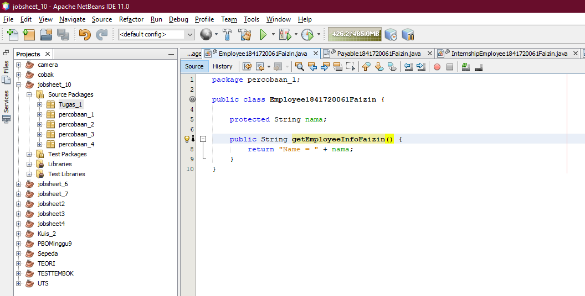
ini adalah contoh untuk membuat class employee 
[ini adalah link ke employee](../../src/10_Polimorfisme/Employee1841720061Faizin.java)

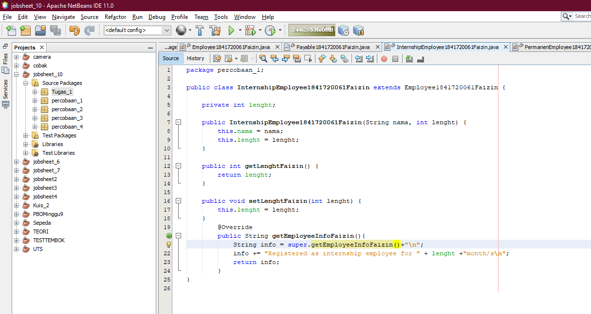
ini adalah contoh untuk membuat class IntershipEmployeer 
[ini adalah link ke intershipEmployee](../../src/10_Polimorfisme/IntershipEmployee1841720061Faizin.java)

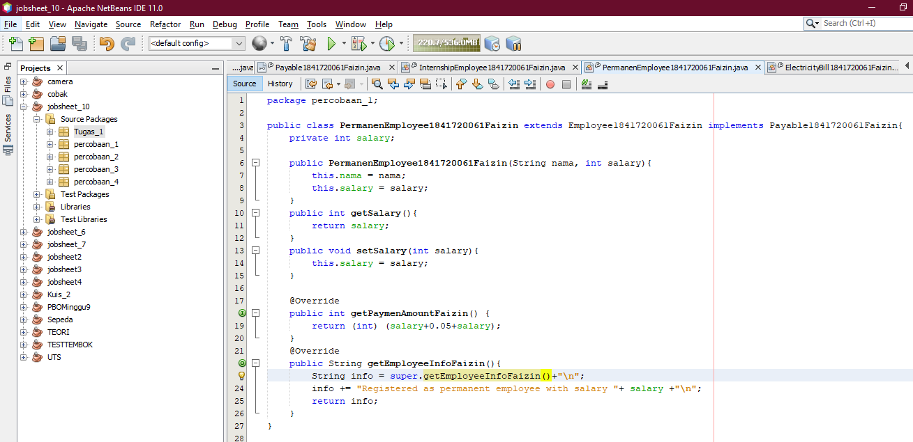
ini adalah contoh untuk membuat class permanenEmployee 
[ini adalah link ke permanenEmployee](../../src/10_Polimorfisme/PermanenEmployee1841720061Faizin.java)

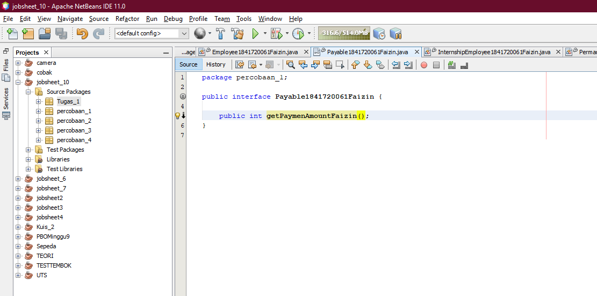
ini adalah contoh untuk membuat payable 
[ini adalah link ke payable](../../src/10_Polimorfisme/Payable1841720061Faizin.java)

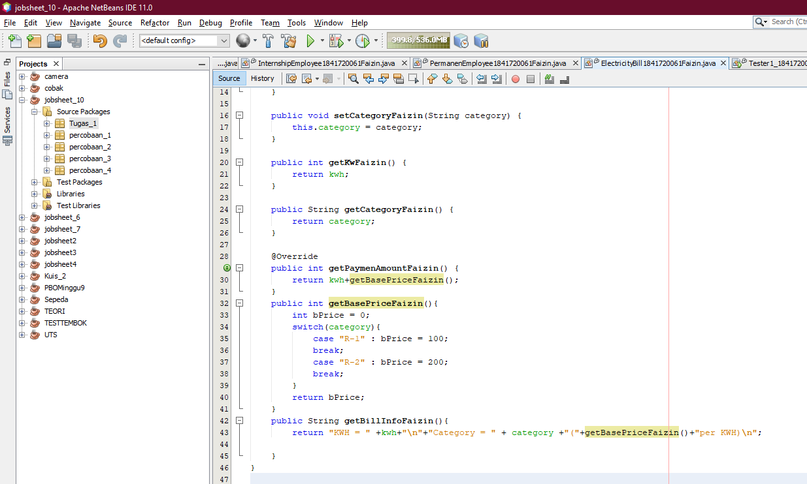
ini adalah contoh untuk membuat electricityBill 
[ini adalah link ke electricityBill](../../src/10_Polimorfisme/ElectricityBill1841720061Faizin.java)

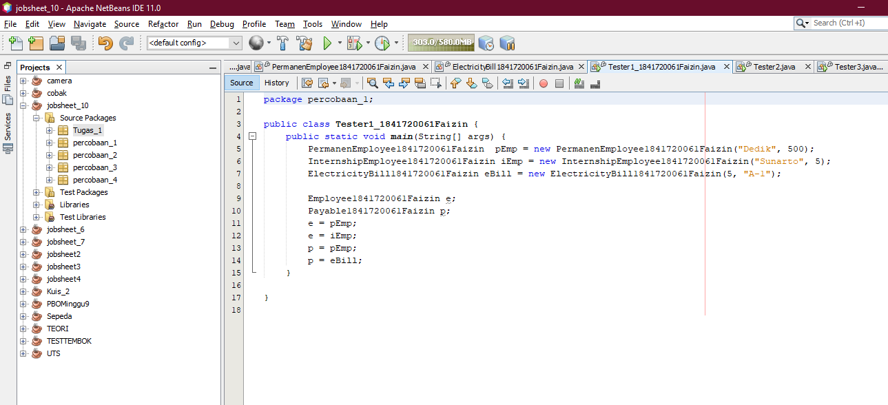
ini adalah contoh untuk membuat tester1 
[ini adalah link ke tester1](../../src/10_Polimorfisme/Tester1_1841720061Faizin.java)

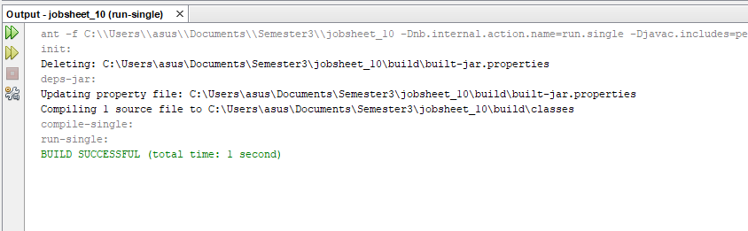
ini adalah contoh untuk hasil dari percobaan 1 

## Pertanyaan
 1. Class apa sajakah yang merupakan turunan dari class Employee?
    Jawaban : Class InternshipEmployee dan class PermanentEmployee 

 2. Class apa sajakah yang implements ke interface Payable? 
    Jawaban : Class PermanentEmployee dan class ElectricityBill 

 3. Perhatikan class Tester1, baris ke-10 dan 11. Mengapa e, bisa diisi dengan objek pEmp (merupakan objek dari class PermanentEmployee) dan objek iEmp (merupakan objek dari class InternshipEmploye) ?  
    Jawaban :  karena class Employee merupakan superclass dari class PermanentEmployee dan InternshipEmployee. e merupakan objek yang dideklarasikan pada superclass. Jadi objek tersebut pun bisa diinstansiasi sebagai objek dari subclass, yaitu pEmp dan iEmp.  

 4. Perhatikan class Tester1, baris ke-12 dan 13. Mengapa p, bisa diisi dengan objek pEmp (merupakan objek dari class PermanentEmployee) dan objek eBill (merupakan objek dari class ElectricityBill) ? 
    Jawaban : karena pada class PermanentEmployee dan ElectricityBill merupakan implements ke interface Payable. Jadi objek p yang dideklarasikan pada interface Payable bisa diisi dengan objek pEmp dan objek eBill. Karena mereka memiliki relasi yaitu Realization 
 
 5. Coba tambahkan sintaks: p = iEmp;      e = eBill; pada baris 14 dan 15 (baris terakhir dalam method main) ! Apa yang menyebabkan error? 6. Ambil kesimpulan tentang konsep/bentuk dasar polimorfisme! 
    Jawaban :
    Terjadi error karena : 
a.	Objek p adalah objek dari interface Payable, objek tersebut diisi dengan objek iEmp (Objek dari class InternshipEmployee ). Maka akan terjadi error, karena antara Payable dengan class InternshipEmployee tidak memiliki relasi apapun, baik relasi inheritance maupun interface.  
b.	Objek e adalah objek dari class Employee, objek tersebut diisi dengan objek eBill (Objek dari class ElectricityBill). Maka akan terjadi error, karena class Employee dan ElectricityBill juga tidak memiliki relasi apapun, , baik relasi inheritance maupun interface. 

6.	Ambil kesimpulan tentang konsep/bentuk dasar polimorfisme! 
    Jawaban : Jadi kesimpulannya, penerapan konsep polymorphism dalam pemrograman Java tidak terlepas dari konsep inheritance (turunan). Dalam konsep inheritance, ketika objek dari sub class dikonstruksi, objek dari super class juga ikut dikonstruksi. Jadi, instance dari sub class merupakan instance dari super class juga. 
    Selain pada class-class yang memiliki relasi inheritance, polimorfisme juga bisa diterapkan pada interface. Ketika ada objek yang dideklarasikan dari suatu interface, maka ia bisa digunakan untuk mereferensi ke objek dari classclass yang implements ke interface tersebut. 

### PERCOBAAN 2 (Viritual method invocation)

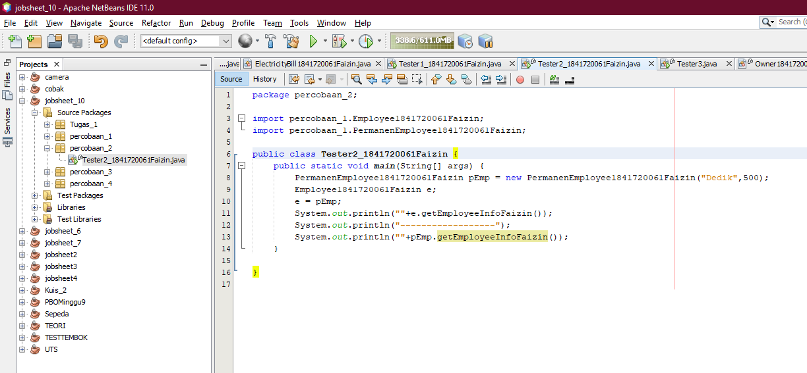
ini adalah contoh untuk membuat tester2 
[ini adalah link ke tester2](../../src/10_Polimorfisme/Tester2_1841720061Faizin.java)

ini adalah contoh untuk hasil dari percobaan 2 

## Pertanyaan 
1. Perhatikan class Tester2 di atas, mengapa pemanggilan e.getEmployeeInfo() pada baris 8 dan pEmp.getEmployeeInfo() pada baris 10 menghasilkan hasil sama? 
    Jawaban : karena sudah terdapat polimorfisme yaitu dari objek e (Bertipe Employee), menggunakan referensi ke objek pEmp ( Objek dari class PermanentEmployee). Di dalam nya terdapat method getEmployeeInfo yang merupakan method hasil Overriding. Jadi ketika di panggi dengan menggunakan objek e maupun pEmp, akan menghasilkan hasil yang sama  

2. Mengapa pemanggilan method e.getEmployeeInfo() disebut sebagai pemanggilan method virtual (virtual method invication), sedangkan pEmp.getEmployeeInfo() tidak?
    Jawaban : karena pada saat compile time, compiler akan mengenali method getEmployeeInfo() yang akan dipanggil adalah method getEmployeeInfo() yang ada di class Employee, karena objek e bertipe Employee. Tetapi saat dijalankan (run time), maka yang dijalankan oleh JVM justru method getEmployeeInfo() yang ada di class PermanentEmployee. Karena itulah e.getEmployeeInfo() disebut sebagai pemanggilan method virtual (virtual method invication) 

3. Jadi apakah yang dimaksud dari virtual method invocation? Mengapa disebut virtual?
    Jawaban : Jadi Virtual method invocation terjadi ketika ada pemanggilan overriding method dari suatu objek polimorfisme. Disebut virtual karena antara method yang dikenali oleh compiler dan method yang dijalankan oleh JVM berbeda. 

### PERCOBAAN 3 (Heterogenous Collection)

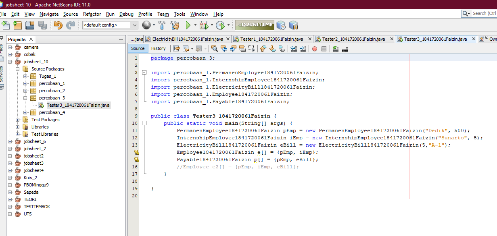
ini adalah contoh untuk membuat tester3 
[ini adalah link ke tester3](../../src/10_Polimorfisme/Tester2_1841720061Faizin.java)

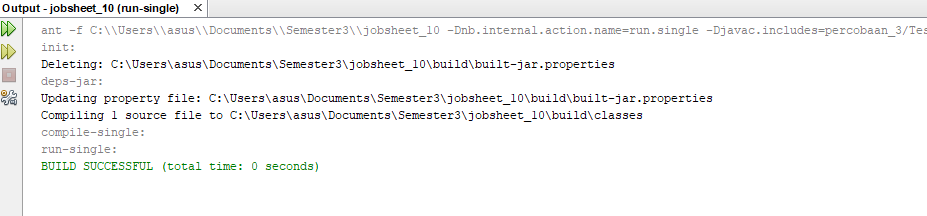
ini adalah contoh untuk hasil dari percobaan 3 

## Pertanyaan

1. Perhatikan array e pada baris ke-8, mengapa ia bisa diisi dengan objek-objek dengan tipe yang berbeda, yaitu objek pEmp (objek dari PermanentEmployee) dan objek iEmp (objek dari InternshipEmployee) ?
    Jawaban : karena array e[] merupakan deklarasi dari class Employee, dan class Employee tersebut merupakan super class dari 2 class yaitu => Class PermanentEmployee dan class InternshipEmployee. 

2. Perhatikan juga baris ke-9, mengapa array p juga biisi dengan objekobjek dengan tipe yang berbeda, yaitu objek pEmp (objek dari PermanentEmployee) dan objek eBill (objek dari ElectricityBilling) ?
    class PermanentEmployee dan ElectricityBill merupakan class implementasi ke interface Payable. 

3. Perhatikan baris ke-10, mengapa terjadi error?
    Jawaban : terjadi error karena class ElectricityBill tidak mempunyai relasi dengan class Employe, baik relasi inheritance maupun implement interface 

### PERCOBAAN 4 (Argumen polimorfisme, instanceod dan casting objek )

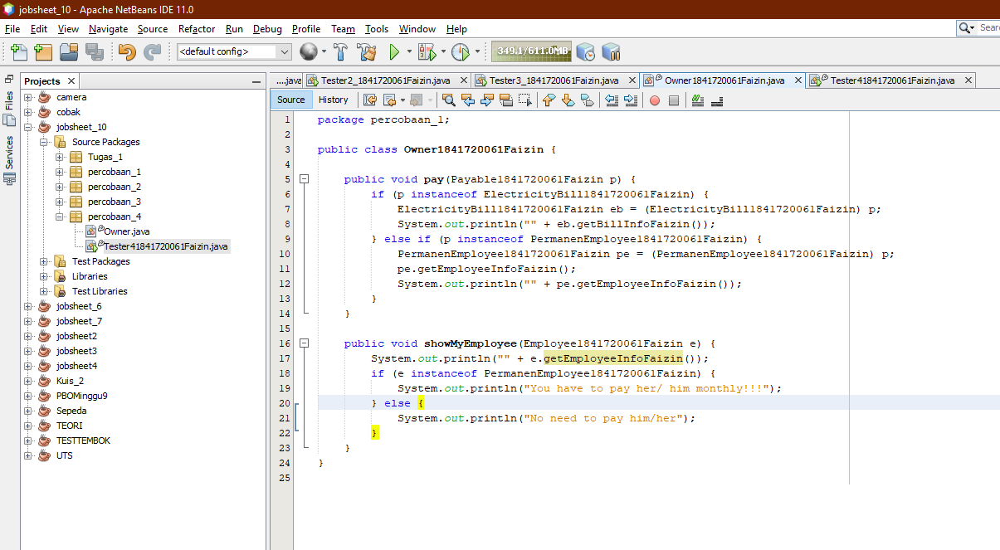
ini adalah contoh untuk membuat owner 
[ini adalah link ke owner](../../src/10_Polimorfisme/Owner1841720061Faizin.java)

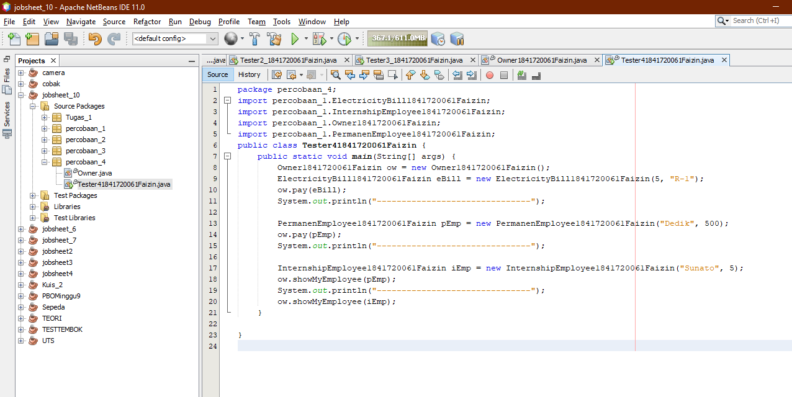
ini adalah contoh untuk membuat tester4 
[ini adalah link ke tester4](../../src/10_Polimorfisme/Tester4_1841720061Faizin.java)

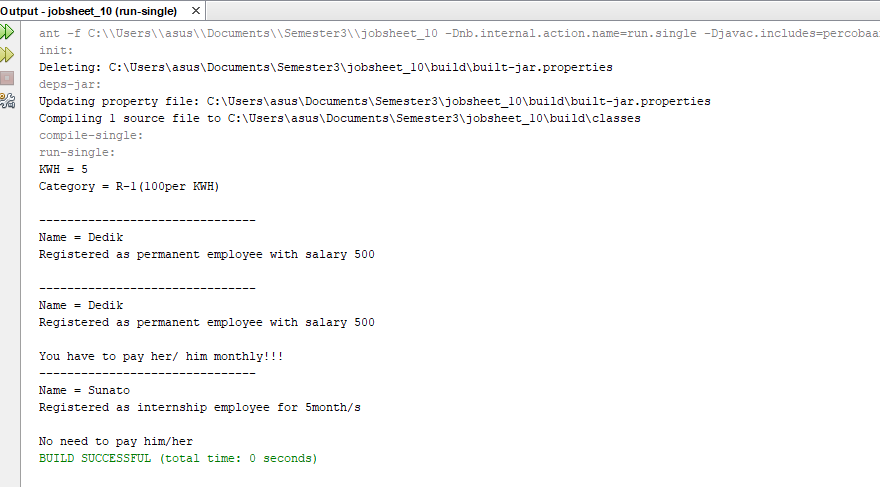
ini adalah contoh untuk hasil dari percobaan 4 

## Pertanyaan

 1. Perhatikan class Tester4 baris ke-7 dan baris ke-11, mengapa pemanggilan ow.pay(eBill) dan ow.pay(pEmp) bisa dilakukan, padahal jika diperhatikan method pay() yang ada di dalam class Owner memiliki argument/parameter bertipe Payable? Jika diperhatikan lebih detil eBill merupakan objek dari 
ElectricityBill dan pEmp merupakan objek dari PermanentEmployee? 
    Jawaban : Karena class ElectricityBill dan class PermanentEmployee merupakan implements ke interface Payable 

2. Jadi apakah tujuan membuat argument bertipe Payable pada method pay() yang ada di dalam class Owner? 
    Jawaban : Tujuannya adalah agar method pay() yang ada di dalam class Owner bisa mengakses/menerima argument objek eBill (Objek dari class ElectricityBill) dan pEmp ( Objek dari class PermanentEmployee). Karena kedua class tersebut merupakan implements ke interface Payable 

3. Coba pada baris terakhir method main() yang ada di dalam class Tester4 ditambahkan perintah ow.pay(iEmp); 
Mengapa terjadi error? 
    Jawaban : karena iEmp merupakan objek dari class InternshipEmplooye, sedangkan class tersebut tidak implements ke interface Payable. 
    
4. Perhatikan class Owner, diperlukan untuk apakah sintaks p instanceof ElectricityBill pada baris ke-6 ? 
    Jawaban : sintaks p diperlukan untuk mengecek apakah p merupakan objek hasil instansiasi dari class ElectricityBill. Jika ya, akan dijalankan program di dalamnya. Jika tidak, ke kondisi berikutnya. 

5. Perhatikan kembali class Owner baris ke-7, untuk apakah casting objek disana (ElectricityBill eb = (ElectricityBill) p) diperlukan ? Mengapa objek p yang bertipe Payable harus di-casting ke dalam objek eb yang bertipe ElectricityBill ? 
    Jawaban : Casting diperlukan karena untuk mengakses method (behaviour) spesifik dari suatu subtype yaitu ElectricityBill yang merupakan implements dari interface Payable.  

### Tugas

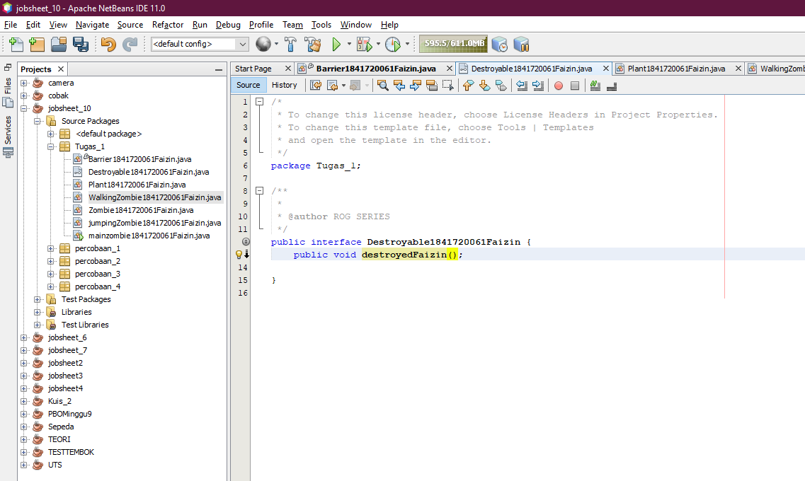
ini adalah contoh untuk membuat class destroyable 
[ini adalah link ke destroyable](../../src/10_Polimorfisme/Destroyable1841720061Faizin.java)

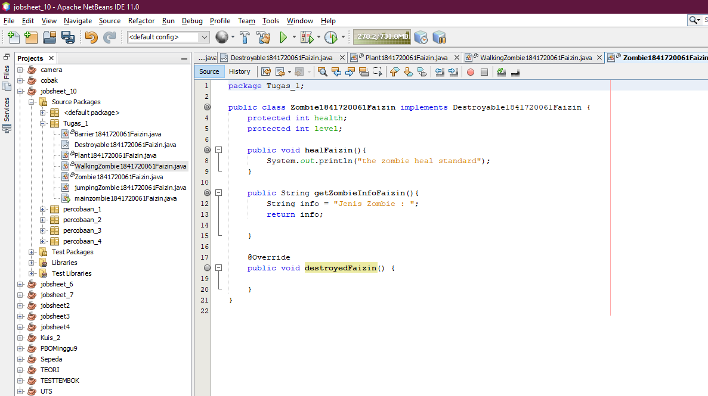
ini adalah contoh untuk membuat class zombie 
[ini adalah link ke zombie](../../src/10_Polimorfisme/Zombie1841720061Faizin.java)

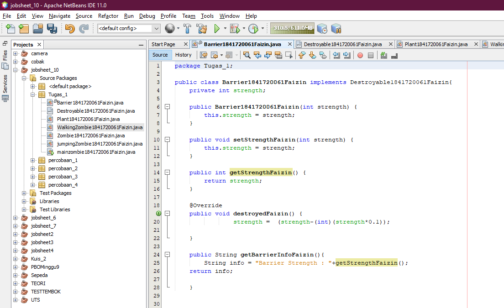
ini adalah contoh untuk membuat class barier 
[ini adalah link ke barier](../../src/10_Polimorfisme/Barrier1841720061Faizin.java)

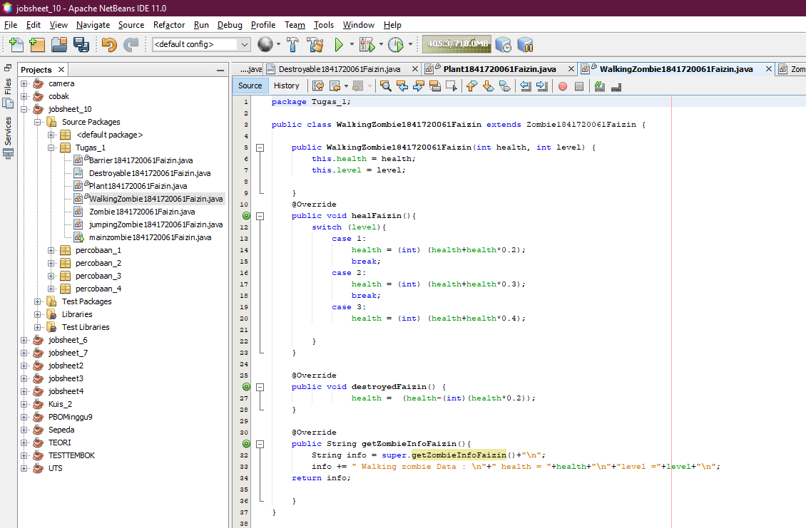
ini adalah contoh untuk membuat walking 
[ini adalah link ke walking](../../src/10_Polimorfisme/WalkingZombie1841720061Faizin.java)

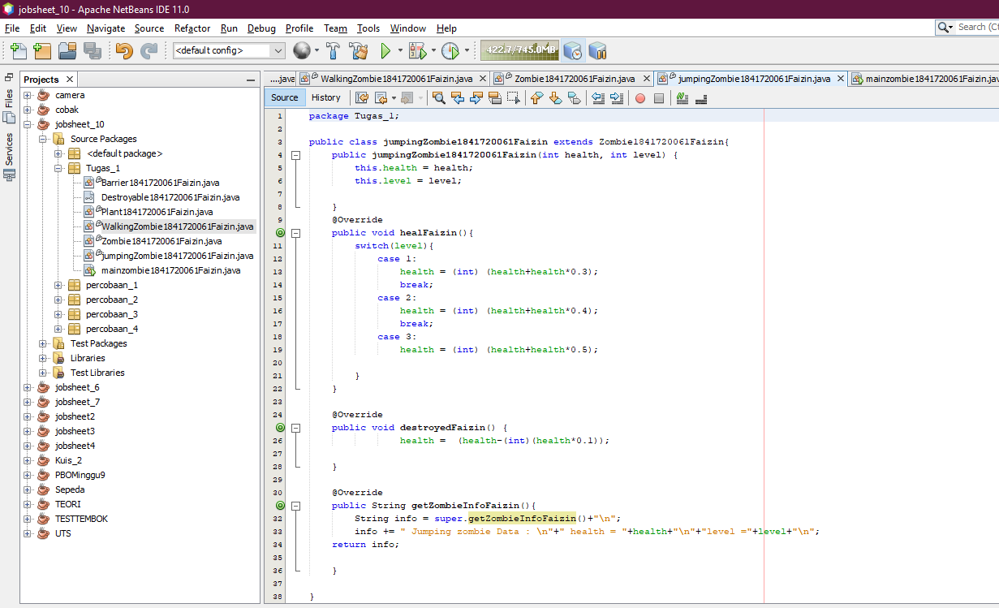
ini adalah contoh untuk membuat jumping 
[ini adalah link ke jumping](../../src/10_Polimorfisme/jumpingZombie1841720061Faizin.java)

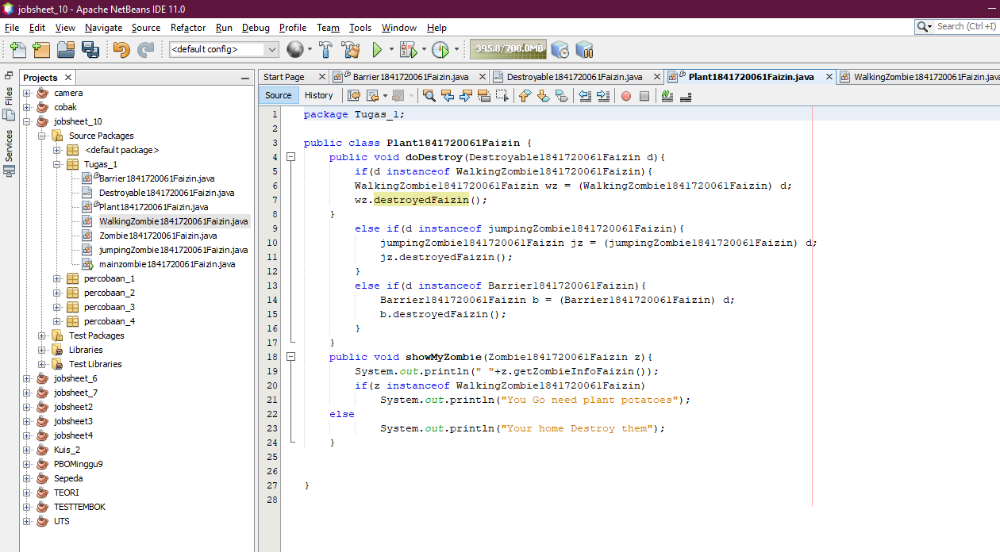
ini adalah contoh untuk membuat plant 
[ini adalah link ke plant](../../src/10_Polimorfisme/Plant1841720061Faizin.java)

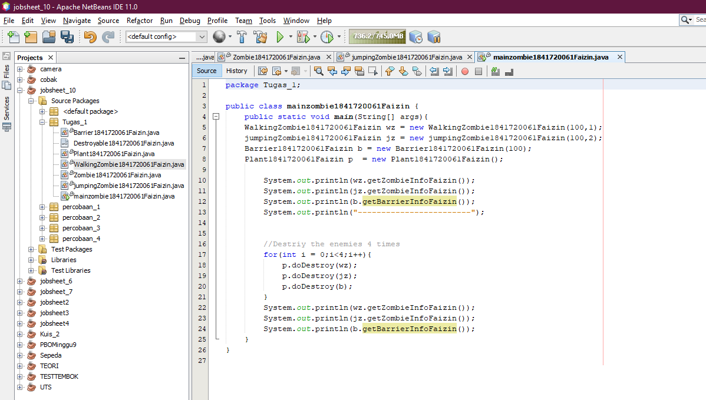
ini adalah contoh untuk membuat main 
[ini adalah link ke main](../../src/10_Polimorfisme/mainzombie1841720061Faizin.java)

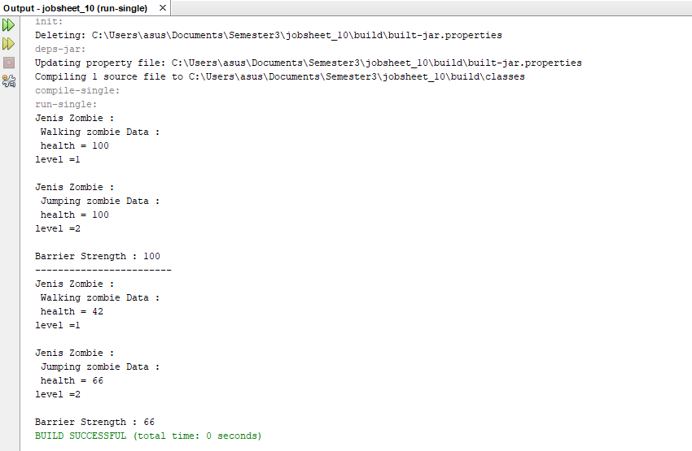
ini adalah contoh untuk hasil dari Tugas 

### Kesimpulan 

 * Virtual method Invocation 
Virtual method invocation terjadi ketika ada pemanggilan overriding method dari suatu objek polimorfisme.

* Heterogeneous Collection 
Dengan adanya konsep polimorfisme, maka variabel array bisa dibuat heterogen

* Polymorphic Argument 
Polimorfisme juga bisa diterapkan pada argument suatu method. Tujuannya agar method tersebut bisa menerima nilai argument dari berbagai bentuk objek

* Operator instanceof 
Operator instanceof bisa digunakan untuk mengecek apakah suatu objek merupakan hasil instansiasi dari suatu class tertentu. Hasil dari instanceof berupa nilai boolean. 

* Object Casting 
Casting objek digunakan untuk mengubah tipe dari suatu objek. Jika ada suatu objek dari subclass kemudian tipenya diubah ke superclass, maka hal ini termasuk ke upcasting

## Pernyataan Diri

Saya menyatakan isi tugas, kode program, dan laporan praktikum ini dibuat oleh saya sendiri. Saya tidak melakukan plagiasi, kecurangan, menyalin/menggandakan milik orang lain.

Jika saya melakukan plagiasi, kecurangan, atau melanggar hak kekayaan intelektual, saya siap untuk mendapat sanksi atau hukuman sesuai peraturan perundang-undangan yang berlaku.

Ttd,

***(MUHAMMAD NUR FAIZIN)***
