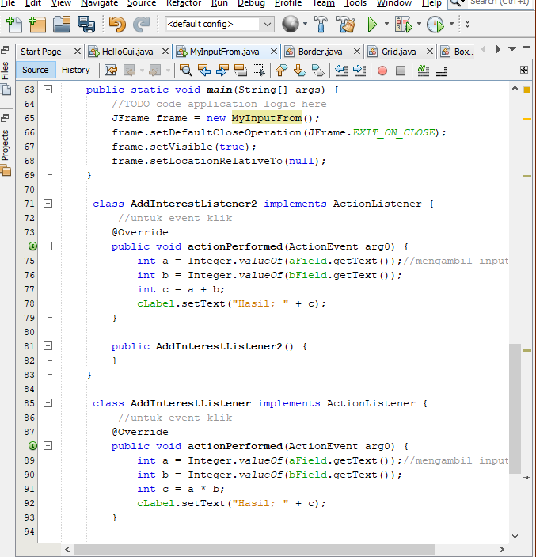
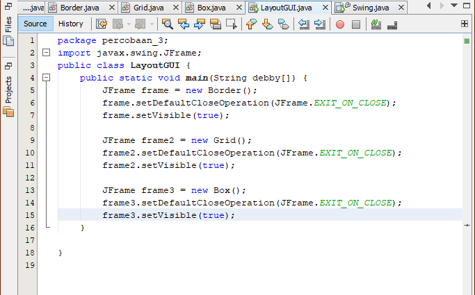

# Laporan Praktikum #11 - GUI
  

**JOBSHEET 11 - GUI**

**I. Kompetensi** 

Setelah menyelesaikan lembar kerja ini mahasiswa diharapkan mampu: 

1. Membuat aplikasi Graphical User Interface sederhana dengan bahasa pemrograman java; 

2. Mengenal komponen GUI seperti frame, label, textfield, combobox, radiobutton, checkbox, textarea, menu, serta table; 

3. Menambahkan event handling pada aplikasi GUI. 
 
**II. Pendahuluan** 

**GUI** 

Pada bab-bab sebelumnya interaksi antara user dengan program hanya berbasis console editor dengan tampilan dos yang membosankan, maka agar interaksi antara user dengan program tidak membosankan diperlukanlah sebuah interface yang menghubungkan antara user dengan  program dengan tampilan grafis, interface ini dinamakan dengan GUI(Graphical User Interface). Dalam pemrograman GUI terdapat beberapa bagian yang harus dilakukan yaitu: 

1. Membuat windows utama  

2. Menentukan komponen-komponen pendukung program  

3. Menentukan tata letak layout agar nantinya semua komponen – komponen yang sudah dipersiapkan bisa diaatur sedemikian rupa  

4. Event Handling dari sebuah aktivitas, seperti penekanan button, check box dan lain-lain Java Swing merupakan bagian dari JFC (Java Foundation Classes) yang menyediakan API untuk menangani hal yang berkaitan dengan GUI bagi program Java.  Kita bisa membedakan komponen Swing dengan komponen AWT, di mana pada umumnya kelas-kelas yang berada dalam komponen Swing diawali dengan huruf J, misal: JButton, JLabel, JTextField, JRadioButton. 
 
**III. Praktikum** 

**Percobaan 1: JFrame HelloGUI**

Untuk membuat aplikasi Java berbasis GUI, kita butuh sebuah frame atau applet untuk media eksekusi aplikasi GUI. Pada Java sebuah frame dapat diwakili oleh sebuah kelas, yaitu JFrame. Melalui kelas JFrame kita bisa mendesain tampilan Java GUI sesuai kebutuhan. Beberapa method yang penting dan sering dipakai yaitu: 

a. setSize() : menentukan ukuran frame  

b. setLocation() : menentukan lokasi frame pada bagian pojok kiri atas  

c. setVisible() : menampilkan frame  

d. setDefaultCloseOperation() : menentukan operasi ketika frame ditutup  

e. setLocationRelativeTo() : menentukan lokasi frame relatif terhadap parameter komponen yang diinputkan  

f. Pack() : menentukan secara otomatis ukuran frame sesuai komponen yang dimasukkan 
 
**Langkah-Langkah Praktikum**

1. Buatlah sebuah project baru di NetBeans dengan nama **HelloGui** 

2. Tambahkan paket Java ke dalam kode program, **import javax.swing.*;**

3. Pada program utama main(), tuliskan script code berikut 


**hasil Percobaan 1**


  [ini link ke kode program helloGUI](../../src/11_GUI/Percobaan1/helloGUI.java)


**Percobaan 2: Menangani Input Pada GUI** 

 Selanjutnya adalah bagaimana memanfaatkan komponen-komponen GUI pada Java untuk menangani inputan, dengan memanfaatkan JFrame, JButton, JLabel, JTextField, JPanel dsb 
 
1. Buatlah project baru dengan nama MyInputForm 

2. Pada kelas MyInputForm tambahkan beberapa library berikut 
 
     ```java
     import java.awt.event.ActionEvent;
     import java.awt.event.ActionListener;
     import javax.swing.*;
      ```
3. Jadikan kelas MyInputForm sebagai turunan dari kelas JFrame

     ```java
     public class MyInputForm1841720146Bagus extends JFrame {
     ```
4. Pada kelas MyInputForm tambahkan beberapa variable berikut 

      ```java
     private static final int FRAME_WIDTH = 600;
     private static final int FRAME_HEIGHT = 200;
     private JLabel aLabel;
     private JLabel bLabel;
     private JLabel cLabel;
     private JTextField aField;
     private JTextField bField;
     private JButton button;
     private JButton button2;
     private JPanel panel;
     ```
5. Buatlah konstruktor dengan nama MyInputForm() dan tambahkan script berikut

     ```java
     public MyInputForm1841720146Bagus() {
     createTextField();
     createButton();
     createPanel();
     setSize(FRAME_WIDTH, FRAME_HEIGHT);
     }
     ```

6. Buatlah method createTextField() dan tambahkan script berikut untuk menampilkan Text ***field*** sebagai inputan maupun output pada window 

    ```java
        private void createTextField() {
        aLabel = new JLabel("Nilai A : ");
        bLabel = new JLabel("Nilai C : ");
        cLabel = new JLabel("Hasil   : ");

        final int FIELD_WIDTH = 10;
        aField = new JTextField(FIELD_WIDTH);
        aField.setText("0");
        bField = new JTextField(FIELD_WIDTH);
        bField.setText("0");
     }
    ```

7. Tambahkan method createButton() untuk membuat tampilan ***button/***tombol pada window, dan ketikkan script berikut sebagai ***event handling***  ketika ***button*** di klik 

     ```java
     private void createButton() {
        button = new JButton("kali");//untuk membuat tombol "kali"
        button2 = new JButton("Tambah");// membuat tombol "Tambah"

        ActionListener listener = new AddInterestListener();
        button.addActionListener(listener);
        ActionListener listener2 = new AddInterestListener2();
        button2.addActionListener(listener2);

     }
     ```

8. Selanjtnya, buat method dengan nama createPanel() yang berfungsi untuk membuat panel dengan menambahkan script berikut

     ```java
     private void createPanel() {
        panel = new JPanel();
        panel.add(aLabel);
        panel.add(aField);
        panel.add(bLabel);
        panel.add(bField);
        panel.add(button);
        panel.add(button2);
        panel.add(cLabel);
        add(panel);
    }
     ```

9. Langkah berikutnya, pada main program tambahkan script berikut 

    ```java
     public static void main(String[] args) {
        //TODO code application logic here
        JFrame frame = new MyInputForm1841720146Bagus();
        frame.setDefaultCloseOperation(JFrame.EXIT_ON_CLOSE);
        frame.setVisible(true);
        frame.setLocationRelativeTo(null);
     }
    }
     ```

10. Compile dan Run program, maka akan tampil hasil/output perkalian nilai A dan Nilai B sebagai berikut 



**hasil percobaan 2**


  [ini link ke kode program MyInputForm](../../src/11_GUI/Percobaan2/MyInputForm.java)


**Pertanyaan** 

a) Modifikasi kode program dengan menambahkan JButton baru untuk melakukan fungsi perhitungan penambahan, sehingga ketika button di klik (event click) maka akan menampilkan hasil penambahan dari nilai A dan B 

**Hasil Jawaban Pertanyaan Percobaan 2**

**a)** 


  [ini link ke kode program MyInputForm1841720146Bagus yang ditambah pertambahan](../../src/11_GUI/Percobaan2/MyInputForm.java)


 
**Percobaan 3: Manajemen Layout**

Java GUI menyediakan beberapa layout yang dapat digunakan pada program. Pada modul praktikum ini akan dijelaskan 3 contoh GUI layout, yaitu:  
 
a) Border layout  
 
b) Grid layout  
 
c) Box layout 
 
Sebuah layout border dapat diilustrasikan pada Gambar dibawah, di mana kita dapat meletakkan komponen GUI pada lokasi tertentu misal utara, barat, tengah, timur, dan selatan. Untuk menentukan jenis layout yang akan digunakan, kita dapat memanggil method setLayout() dan selanjutnya memasukkan objek Border Layout. 


**Langkah-Langkah Praktikum** 
 
1. Buatlah project baru dengan nama ManajemenLayout 

2. Selanjutnya buatlah 4 kelas dengan nama **Border, Box, Grid dan LayoutGUI** 


3. Pada kelas Border, Grid dan Box tambahkan library yang akan digunakan sebagai berikut 

    ```java
        import java.awt.BorderLayout;
        import javax.swing.JButton;
        import javax.swing.JFrame;
        import javax.swing.JPanel;
    ```

4. Pada setiap kelas Border, Grid dan Box jadikan sebagai kelas turunan dari JFrame 

5. Pada kelas Border Ketikkan sript berikut untuk membuat tampilan window dengan meletakkan tombol pada 5 lokasi sebagaimana gambar diatas yaitu (Utara, barat, tengah, timur, dan selatan) 

    ```java
        public class Border1841720146Bagus extends JFrame{
        private static final int FRAME_WIDTH = 600;
        private static final int FRAME_HEIGHT = 200;
        private JPanel panel;

        //membuat kostruktor BorderLayoutForm
        public  Border1841720146Bagus(){
        panel = new JPanel();
        panel.setLayout(new BorderLayout());
        
        panel.add(new JButton("1"), BorderLayout.NORTH);
        panel.add(new JButton("2"), BorderLayout.WEST);
        panel.add(new JButton("3"), BorderLayout.CENTER);
        panel.add(new JButton("4"), BorderLayout.EAST);
        panel.add(new JButton("5"), BorderLayout.SOUTH);
        
        add(panel);
        setSize(FRAME_WIDTH, FRAME_HEIGHT);
        setTitle("Border Layout Demo");
        
        }
    
     }
   ```

6. Selanjutnya, pada kelas Grid ketikkan script berikut untuk membuat layout grid dengan memiliki ukuran 4x2 dan pada masing-masing grid akan diisi dengan tombol 

    ```java
         public Grid1841720146Bagus(){
        panel = new JPanel();
        panel.setLayout(new GridLayout(4,2));
        panel.add(new JButton("1"));
        panel.add(new JButton("2"));
        panel.add(new JButton("3"));
        panel.add(new JButton("4"));
        panel.add(new JButton("5")); 
        panel.add(new JButton("6")); 
        panel.add(new JButton("7")); 
        panel.add(new JButton("8")); 
       
        add(panel);
        setSize(FRAME_WIDTH, FRAME_HEIGHT);
        setTitle("Box Layout Demo");
       }
     }
    ```

7. Kemudian pada kelas Box, masukkan script berikut untuk membuat tampilan layout dengan bentuk Box Layout dan orientasi Y 

     ```java
         public class Box1841720146Bagus extends JFrame {
          private static final int FRAME_WIDTH = 600;
          private static final int FRAME_HEIGHT = 200;  
          private JPanel panel;
   
         //membuat kostruktor BorderLayoutForm
            public  Box1841720146Bagus(){
            panel = new JPanel();
            panel.setLayout(new BoxLayout(panel,BoxLayout.Y_AXIS));
        
            panel.add(new JButton("1"));
            panel.add(new JButton("2"));
            panel.add(new JButton("3"));
            panel.add(new JButton("4"));
            panel.add(new JButton("5"));        
            add(panel);
            setSize(FRAME_WIDTH, FRAME_HEIGHT);
            setTitle("Box Layout Demo");
        
            }
         }
    ```
8. Langkah selanjutnya, diperlukan inisiasi object dari masing-masing layout pada object JFrame. Sehingga Pada kelas **LayoutGUI** perlu diatur setDefaultCloseOperation() dan setVisible() dengan mengetikkan script berikut, dengan sebelumnya tambahkan library javax.swing.JFrame pada kelas LayoutGUI 
 
     ```java
        package Manejemenlayout.GUI.Bagus;

        /**
        *
        * @author ROG SERIES
        */
        import javax.swing.JFrame;
        public class LayoutGUI1841720146Bagus {
        public static void main(String debby[] ){
            JFrame frame = new Border1841720146Bagus();
            frame.setDefaultCloseOperation(JFrame.EXIT_ON_CLOSE);
            frame.setVisible(true);
        
            JFrame frame2 = new Grid1841720146Bagus();
            frame2.setDefaultCloseOperation(JFrame.EXIT_ON_CLOSE);
            frame2.setVisible(true);
        
            JFrame frame3 = new Box1841720146Bagus();
            frame3.setDefaultCloseOperation(JFrame.EXIT_ON_CLOSE);
            frame3.setVisible(true);
          }
     }
    ```
9. Compile dan Run program, maka akan tampil 3 hasil/output dari Border Layout, Grid Layout, dan Box Layout sebagai berikut 
 

**hasil Percobaan 3: Manajemen Layout**


  [ini link ke kode program Border1841720146Bagus](../../src/11_GUI/Percobaan3/Border.java)


  [ini link ke kode program Box1841720146Bagus](../../src/11_GUI/Percobaan3/Box.java)


  [ini link ke kode program Grid1841720146Bagus](../../src/11_GUI/Percobaan3/Grid.java)



  [ini link ke kode program LayoutGUI1841720146Bagus](../../src/11_GUI/Percobaan3/LayoutGUI.java)


**Pertanyaan**

a) Apa perbedaan dari Grid Layout, Box Layout dan Border Layout? 

b) Apakah fungsi dari masing-masing kode berikut?  
 
```java
         JFrame frame = new Border1841720146Bagus();
         frame.setDefaultCloseOperation(JFrame.EXIT_ON_CLOSE);
         frame.setVisible(true);
        
         JFrame frame2 = new Grid1841720146Bagus();
         frame2.setDefaultCloseOperation(JFrame.EXIT_ON_CLOSE);
         frame2.setVisible(true);
        
         JFrame frame3 = new Box1841720146Bagus();
         frame3.setDefaultCloseOperation(JFrame.EXIT_ON_CLOSE);
         frame3.setVisible(true);
           }
        }
```

**Jawaban Pertanyaan Percobaan 3: Manajemen Layout**

**a)** 

* Grid Layout : Membuat layout dengan satu kolom per komponen, hanya satu baris yang digunakan 

* Box Layout : Menempatkan komponen dalam satu baris atau satu kolom 

* Border Layout : Menyusun komponen berdasarkan lokasi geografis :  NORH, SOUTH, WEST, EAST, CENTER 

**b)**
 
```java
         JFrame frame = new Border1841720146Bagus();
         frame.setDefaultCloseOperation(JFrame.EXIT_ON_CLOSE);
         frame.setVisible(true);
```        
**Jawaban :** Untuk menampilkan class Border

```java 
         JFrame frame2 = new Grid1841720146Bagus();
         frame2.setDefaultCloseOperation(JFrame.EXIT_ON_CLOSE);
         frame2.setVisible(true);
```

**Jawaban :** Untuk menampilkan class Grid

```java  
         JFrame frame3 = new Box1841720146Bagus();
         frame3.setDefaultCloseOperation(JFrame.EXIT_ON_CLOSE);
         frame3.setVisible(true);         
```

**Jawaban :** Untuk menampilkan class Grid 


**Percobaan 4: Membuat GUI Melalui IDE Netbeans** 

1. Buka Netbeans kemudian klik **File | New Project** sebagaimana pada gambar berikut 


2. Dalam New Project wizard, pilih **Java Application** seperti ditunjukan pada gambar berikut 
 

3. Pada **Project Name field**, beri nama project dengan nama PraktikumGUI 


4. Klik kanan pada package untuk membuat frame baru, **New | JFrame Form** seperti pada gambar berikut 


5. Selanjutnya setelah muncul jendela new JFrame Form, pada **Field Class Name** berikan nama **Swing**, kemudian klik finish 


Selanjutnya akan muncul tampilan window seperti berikut, 


6. Langkah selanjutnya denan cara drag & drop, tambahkan komponen-komponen swing yang dibutuhkan dan letakkan pada bagian form 


Buatlah design sebagaimana pada gambar diatas dengan menggunakan komponen Swing berikut: 

• 2 buah JTextfield 

• 2 buah JRadioButton 

• 3 buah JCheckbox 

• 1 buah JList 

• 1 buah JComboBox 

• 1 buah JTextArea 

• 2 buah JButton 

• 7 buah JLabel 

7. Selanjutnya ubah nama variable dan nama text pada setiap komponen Swing, dengan cara **klik kanan | Change Variable Name** untuk merubah nama variable serta **klik kanan | Edit Text** untuk merubah nama text. Sesuaikan variable name dan text name sebagaiman pada gambar berikut 

8. Selanjutnya, setelah design selesai pindah ke tab **Source** kemudian pada kelas Swing tambahkan variable yang dibutuhkan sebagaimana pada script berikut 

    ```java
          public class Swing1841720146Bagus extends javax.swing.JFrame {
          private String nama,nim,jeniskelamin,info,jurusan,matakuliah,semester,alamat;      
    ```

9. Langkah selanjutnya, kembali ke tab **Design** dan double klik pada komponen **JButton** cmdtampil. Maka anda akan masuk pada bagian coding/source code dari cmdtampil kemudian ketikkan script berikut, yang memiliki fungsi untuk memberikan event handling pada JButton cmdtampil saat di klik oleh user  

    ```java
          private void cmdtampilActionPerformed(java.awt.event.ActionEvent evt) {                                          
         // TODO add your handling code here:
         nama = txtname.getText();
         nim = txtnim.getText();
         alamat = cmdalamat.getText();
         if (cbMK1.isSelected())
            matakuliah = "Sistem terdistribusi";
         if (cbMK2.isSelected())
            matakuliah += "PBO";
        
         if(rdjeniskelamin1.isSelected())
            jeniskelamin = "Laki-Laki";
         if(rdjeniskelamin2.isSelected())
            jeniskelamin += "Perempuan";
        
        
         
         jurusan = listjurusan.getSelectedValue().toString();
         semester = comboxsemester.getSelectedItem().toString();
        
         info = "Nama                  :"+nama+"\n";
         info += "NIM                     :"+nim+"\n";
         info += "Jenis Kelamin     :"+jeniskelamin+"\n";
         info += "Jurusan              : "+jurusan+"\n";
         info += "Semester            : "+semester+"\n";
         info += "Mata Kuliah         : "+matakuliah+"\n";
         info += "Alamat              : "+alamat+"\n";
         hasil.setText(info);
         JOptionPane.showMessageDialog(null, info);
    }                
    ```
10. Dan pada komponen **JButton cmdclear** lakukan hal yang sama denan memasukan script berikut 

    ```java
          private void cmdclearActionPerformed(java.awt.event.ActionEvent evt) {                                         
         // TODO add your handling code here:
         txtname.setText(" ");
         txtnim.setText(" ");
         cmdalamat.setText(" ");
         
         cbMK1.setSelected(false);
         cbMK2.setSelected(false);
         hasil.setText(" ");
       }
    }                
    ``` 

11. Langkah terakhir, lakukan **compile** dan **run** pada project anda, maka program akan tampil seperti gambar berikut dan silahkan isi data anda kemudia klik tampilkan 


**hasil Percobaan 4: Membuat GUI Melalui IDE Netbeans**


  [ini link ke kode program Swing1841720146Bagus](../../src/11_GUI/Percobaan4/Swing1841720061Faizin.java)


**Pertanyaan** 

a) Apakah fungsi dari kode berikut?

 ```java
             java.awt.EventQueue.invokeLater(new Runnable() {
               public void run() {
                new Swing1841720146Bagus().setVisible(true);
                 }
              });
             }
 ```
    
b) Mengapa pada bagian logika checkbox dan radio button digunakan multiple if ? 

c) Lakukan modifikasi pada program untuk melakukan menambahkan inputan berupa alamat dan berikan fungsi pemeriksaan pada nilai Alamat tersebut jika belum diisi dengan menampilkan pesan peringatan 

**Jawaban Pertanyaan Percobaan 4: Membuat GUI Melalui IDE Netbeans**

a) Menampilkan dari JFrame Form. 

b) Agar keluaran / outputan hanya muncul 1 jenis saja.

c) Lakukan modifikasi pada program untuk melakukan menambahkan inputan berupa alamat dan berikan fungsi pemeriksaan pada nilai Alamat tersebut jika belum diisi dengan menampilkan pesan peringatan

**Jawaban :**


  [ini link ke kode program Swing](../../src/11_GUI/Percobaan4/pakaiwarning/Swing.java)


 
**Percobaan 5: JTabPane, JTtree, JTable** 

Lakukan langkah-langkah yang sama dengan membuat **new project | java application** dan beri nama **PercobaanGUI2**, buat form baru **JFrame Form** dan beri nama **Swing2** 
 
1. Setelah JFrame Form selesai dibuat, Drag & Drop komponen swing **JTabPane** dari Palette ke bagian **form** 

2. Selanjutnya, Drag & Drop **Panel** kedalam **JTabPane** yang telah dibuat, maka akan terbentuk tam baru di dalam JTabPane. Lakukan dengan cara yang sama, drag & drop panel hingga JTabPane memiliki 3 Tab sebagaimana pada gambar berikut 
 

3. Kemudian anda dapat mengedit Text pada Tab tersebut dengan cara **klik kanan** pada tab tersebut dan pilih **Edit Text**. Ubahlah nama tab menjadi Halaman1 , Halaman 2 dan Halaman 3 

4. Pada tab halaman 1 tambahkan komponen **JLabel** dan edit text menjadi **Halaman pertama** untuk menandai tab Halaman 1.  

5. Lakukan hal yang sama pada halaman2 dengan menambahkan komponen **JTabel** dengan cara darg & drop Jtabel ke tab Halaman 2 

6. Pada tab halaman 3 tambahkan komponen **JTree** dengan cara drag & drop, sehingga tampilan pada tab Halaman 3 

7. Kemudian klik kanan pada **JTree** dan pilih **Property** selanjutnya pada bagian Model klik titiktitik pada bagian kanan model, Maka akan muncul jendela baru dan hapus semua item di kolom sebelah kiri sebagaimana pada gambar berikut 

8. Langkah selanjutna, pada tab halaman 3 tambahkan **1 buah JTextField dan 1 buah JButton** sehinnga tampilan akan menjadi seperti berikut 
 
9. Selanjutnya, double klik pada **Jbutton cmdtambah**. Maka anda akan masuk pada bagian coding / source code, kemudain tambahkan script berikut

 ```java
             private void cmdtambahActionPerformed(java.awt.event.ActionEvent evt) {                                          
                // TODO add your handling code here:
                DefaultMutableTreeNode admin = new DefaultMutableTreeNode(txtturunan.getText());
                DefaultMutableTreeNode set = (DefaultMutableTreeNode) jTree2.getLastSelectedPathComponent();
                DefaultTreeModel dt;
                dt = (DefaultTreeModel) jTree2.getModel();
                dt.insertNodeInto(admin, set, set.getChildCount());
    }                                         

 ``` 

10. Langkah terakhir, lakukan **compile dan run** pada project anda, maka program akan tampil seperti gambar berikut 
 

11. Pilih tab Halaman 3 dan Klik pada **Jtree root**. Dan ketikan Bapak pada JTextField kemudian klik Tambah. Maka Jtree akan bertambah seperti pada gambar berikut 


**hasil Percobaan 5: JTabPane, JTtree, JTable**


  [ini link ke kode program Swingtwo](../../src/11_GUI/Percobaan5/Swing1841720061Faizin.java)

**Pertanyaan**

a) Apa kegunaan komponen swing JTabPane, JTtree, pada percobaan 5? 

b) Modifikasi program untuk menambahkan komponen JTable pada tab Halaman 1 dan tab Halaman 2 

**Jawaban Pertanyaan Percobaan 5: JTabPane, JTtree, JTable**

a)Komponen swing JTabPane digunakan untuk tampilan atau background nya untuk mengisi pada setiap halaman. JTree digunakan untuk menyimpan pada tambah jika button tambahnya digunakan.

b)

**Assigment** 

Buatlah Sebuah Program yang mempunyai fungsi seperti kalkulator (mampu menjumlahkan, mengurangkan, mengalikan dan membagikan. Dengan tampilan seperti berikut.  
 


  [ini link ke kode program Kalkulator](../../src/11_GUI/Tugas/Kalkulator1841720061Faizin.java)


## Pernyataan Diri

Saya menyatakan isi tugas, kode program, dan laporan praktikum ini dibuat oleh saya sendiri. Saya tidak melakukan plagiasi, kecurangan, menyalin/menggandakan milik orang lain.

Jika saya melakukan plagiasi, kecurangan, atau melanggar hak kekayaan intelektual, saya siap untuk mendapat sanksi atau hukuman sesuai peraturan perundang-undangan yang berlaku.

Ttd,

***(Muhammad Nur Faizin)***


