# Laporan Praktikum #12 - Collection (List, Set, Map) dan Database 
  

**JOBSHEET 12 - Collection (List, Set, Map) dan Database**

# **1. Tujuan Pembelajaran** 

* Memahami cara penyimpanan objek menggunakan Collection dan Map. 

* Mengetahui pengelompokan dari Collection. 

* Mengetahui perbedaan dari interface Set, List dan Map. 

* Mengetahui penggunaan class-class dari interface Set, List, dan Map. 

* Memahami koneksi database menggunakan JDBC dan JDBC API 

# **2. Materi**

Collection adalah suatu objek yang bisa digunakan untuk menyimpan sekumpulan objek. Objek yang ada dalam Collection disebut elemen. Collection menyimpan elemen yang bertipe Object, sehingga berbagai tipe object bisa disimpan dalam Collection. Class-class mengenai Collection tergabung dalam Java Collection Framework. Class-class Collection diletakkan dalam package java.util dan mempunyai dua interface utama yaitu **Collection.**  

 Collection terbagi menjadi 3 kelompok yaitu 

**a. Set** 

Set mengikuti model himpunan, dimana objek/anggota yang tersimpan dalam Set harus unik. Urutan maupun letak dari anggota tidak penting, hanya keberadaan anggota saja yang penting. Kelas konkrit yang mengimplementasikan **Set** harus memastikan bahwa tidak terdapat elemen duplikat yang dapat ditambahkan ke dalam set. Yaitu, tidak terdapat dua elemen e1 dan e2 yang berada di dalam set yang membuat **e1.equals(e2)** bernilai **true.** ClassClass yang mengimplementasikan interface Set adalah HashSet.  

HashSet dapat digunakan untuk menyimpan elemen-elemen bebas-duplikat. Kelas HashSet merupakan suatu kelas konkrit yang mengimplementasikan Set. Pembuatan objek HashSet adalah sebagai berikut: 

```java
Set <nama_objek_HashSet> = new HashSet(); 
```

**b. List** 

List digunakan untuk menyimpan sekumpulan objek berdasarkan urutan masuk (ordered) dan menerima duplikat. Cara penyimpanannya seperti array, oleh sebab itu memiliki posisi awal dan posisi akhir, menyisipkan objek pada posisi tertentu, mengakses dan menghapus isi list, dimana semua proses ini selalu didasarkan pada urutannya. Class-class yang mengimplementasikan interface List adalah Vector, Stack, Linked List dan Array List. Pada jobsheet ini yang akan dibahas adalah ArrayList.  
ArrayList digunakan untuk membuat array yang ukurannya dinamis. Berbeda dengan array biasa yang ukurannya harus ditentukan di awal deklarasi array, dengan ArrayList, ukurannya akan fleksibel tergantung banyaknya elemen yang dimasukkan. Pendeklarasian object ArrayList sebaiknya diikuti dengan nama class yang akan dimasukkan dalam List tersebut. 
Tujuannya agar method dan property dari setiap object dalam ArrayList dapat diakses secara langsung. Pembuatan objek ArrayList adalah sebagai berikut: 

```java
ArrayList <nama_objek_arraylist>=new ArrayList(); 
```

**c. Map** 

Perbedaaan mendasar map dengan collection yang lain, untuk menyimpan objek pada Map, perlu sepasang objek, yaitu key yang bersifat unik dan nilai yang disimpan. Untuk mengakses nilai tersebut maka kita perlu mengetahui key dari nilai tersebut. Map juga dikenal sebagai dictionary/kamus. Pada saat menggunakan kamus, perlu suatu kata yang digunakan untuk pencarian. Class-class yang mengimplementasikan Map adalah Hashtable,HashMap, LinkedHashMap. Pada jobsheet ini yang akan dibahas adalah HashMap. 
HashMap adalah class implementasi dar Map, Map itu sendiri adalah interface yang memiliki fungsi untuk memetakan nilai dengan key unik. HashMap berfungsi sebagai memory record management, dimana setiap record dapat disimpan dalam sebuah Map. kemudian setiap Map diletakkan pada vektor, list atau set yang masih turunan dari collection. Pembuatan objek HashMap adalah sebagai berikut: 

```java
HashMap <nama_objek_HashMap> = new HashMap(); 
```

**d. JDBC API** 

JDBC API merupakan Java Database Connectivity Application Programming Interface ( JDBC  API). Pada dasarnya JDBC API terdiri dari satu set kelas dan interface yang digunakan untuk berinteraksi dengan database dari aplikasi Java. Umumnya, JDBC API melakukan 3 (tiga) fungsi berikut :  
* Membangun koneksi antara aplikasi Java dan database  

* Membangun dan mengeksekusi query  

* Memproses hasil  

# 3. Percobaan 1 (Set) 

A. Langkah Percobaan (HashSet) 

1. Bukalah program Netbeans IDE yang sudah terinstal dikomputer anda! 

2. Buatlah project baru dengan nama JavaApi, ilustrasi project dapat dilihat pada gambar dibawah ini:


3. Setelah itu buatlah package dengan nama identifier.percobaan1, misalnya : arie.percobaan1. 

4. Pada package tersebut buatlah java class dengan nama DemoHashSet. 
 
5. Tambahkan source code yang ada di method main()  kedalam class yang sudah anda buat! 
 
 ```java
/*
 * To change this license header, choose License Headers in Project Properties.
 * To change this template file, choose Tools | Templates
 * and open the template in the editor.
 */
package Faizin.percobaan1.api;

/**
 *
 * @author ROG SERIES
 */
import java.util.HashSet;
import java.util.Iterator;
import java.util.Set;
public class CobaHashSet1841720061Faizin {
    public static void main(String[] args){
        Set mSetCity = new HashSet();
        mSetCity.add("Malang");
        mSetCity.add("Banyuwangi");
        mSetCity.add("Jogjakarta");
        mSetCity.add("Batu");
        mSetCity.add("Malang");
        
        System.out.println(mSetCity);
        Iterator<String> mIterator = mSetCity.iterator();
        
        while (mIterator.hasNext()){
            System.out.println(mIterator.next().toLowerCase());
        }
        
    }  
}
```

6. Jalankan program diatas, dan amati apa yang terjadi! 

**Hasil Percobaan 1**

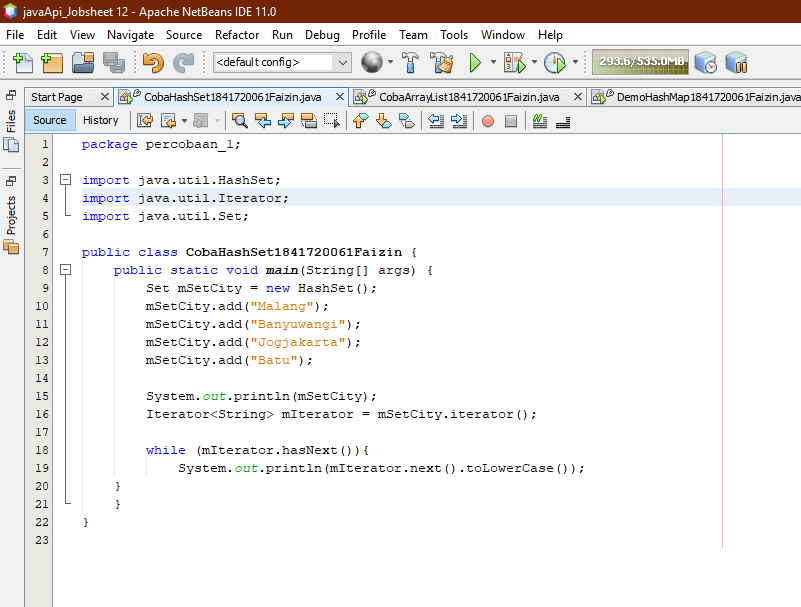

  [ini link ke kode program CobaHashSet1841720061Faizin](../../src/12_Java_API/percobaan_1/CobaHashSet1841720061Faizin.java)


# **B. Pertanyaan** 

1. Apakah fungsi import **java.util.*;** pada program diatas! 

....................................................................................................................................................... ....................................................................................................................................................... ................................................................................................................................................. 

2. Pada baris program keberapakah yang berfungsi untuk menciptakan object HashSet? 

....................................................................................................................................................... ....................................................................................................................................................... ................................................................................................................................................. 

3. Apakah fungsi potongan program dibawah ini pada percobaan 1! 

```java
mSetCity.add("Malang");
        mSetCity.add("Banyuwangi");
        mSetCity.add("Jogjakarta");
        mSetCity.add("Batu");
```

....................................................................................................................................................... ....................................................................................................................................................... ................................................................................................................................................. 

4. Tambahkan **set.add(“Malang”);** kemudian jalankan program! Amati hasilnya dan jelaskan mengapa terjadi error! 

....................................................................................................................................................... ....................................................................................................................................................... ................................................................................................................................................. 

5. Jelaskan fungsi potongan program dibawah ini pada percobaan 1! 

```java
Iterator<String> mIterator = mSetCity.iterator();
        
        while (mIterator.hasNext()){
            System.out.println(mIterator.next().toLowerCase());
        }
```

....................................................................................................................................................... ....................................................................................................................................................... ................................................................................................................................................. 

# **Hasil Pertanyaan Percobaan 1**

1. Suatu Perintah Untuk Memasukan suatu Method atau perintah dalam Bahasa Pemrograman Java sehingga perintah tersebut dapat Aktif dan digunakan atau berfungsi.

2. baris 17 samapi 25.

3. Memasukkan Suatu nilai bisa berupa String atau integer.

4. 
```java
    /*
 * To change this license header, choose License Headers in Project Properties.
 * To change this template file, choose Tools | Templates
 * and open the template in the editor.
 */
package Faizin.percobaan1.api;

/**
 *
 * @author ROG SERIES
 */
import java.util.HashSet;
import java.util.Iterator;
import java.util.Set;
public class CobaHashSet1841720061Faizin {
    public static void main(String[] args){
        Set mSetCity = new HashSet();
        mSetCity.add("Malang");
        mSetCity.add("Banyuwangi");
        mSetCity.add("Jogjakarta");
        mSetCity.add("Batu");
        mSetCity.add("Malang");
        
        
        System.out.println(mSetCity);
        Iterator<String> mIterator = mSetCity.iterator();
        
        while (mIterator.hasNext()){
            System.out.println(mIterator.next().toLowerCase());
        }
        
    }  
}

  ```

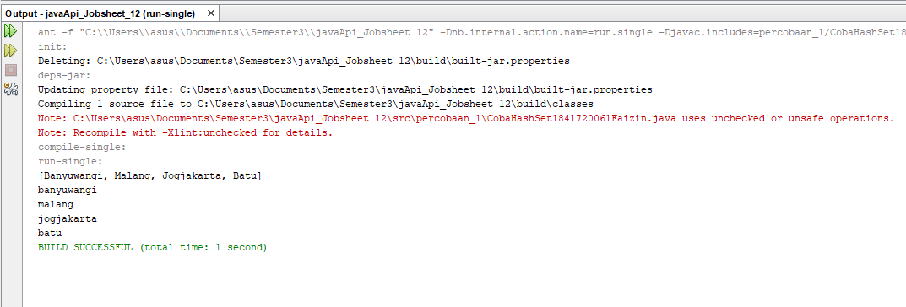

5. Kegunaan dari Interior adalah Menampilkan nilai bisa berupa String atau Integer beserta tambahan method


# **4. Percobaan 2 (List)** 

A. Langkah Percobaan (ArrayList) 

1. Buatlah package dengan nama identifier.percobaan2  pada project yang sudah anda buat sebelumnya, misalnya : arie.percobaan2.

2. Tambahkan source code berikut pada class yang sudah anda buat! 

```java
/*
 * To change this license header, choose License Headers in Project Properties.
 * To change this template file, choose Tools | Templates
 * and open the template in the editor.
 */
package Faizin.percobaan2.api;

/**
 *
 * @author ROG SERIES
 */
import java.util.ArrayList;
import java.util.List;
import java.util.Iterator;
public class CobaArrayList1841720061Faizin {
    public static void main(String[] args){
        List mListCountry = new ArrayList();
        mListCountry.add("Indonesia");
        mListCountry.add("Malaysia");
        mListCountry.add("German");
        System.out.println(mListCountry);
        System.out.format("List index 0 = %s\n",mListCountry.get(0));
        System.out.format("List index 2 = %s\n",mListCountry.get(2));
       
        //System.out.println("Country List");
        //Iterator mIterator = mListCountry.iterator();
        //while(mIterator.hasNext()){
           // Object element = mIterator.next();
           // System.out.format("%s ", element);
        
        
    }
    
}
```

3. Jalankan program diatas! 

**Hasil Percobaan 2**

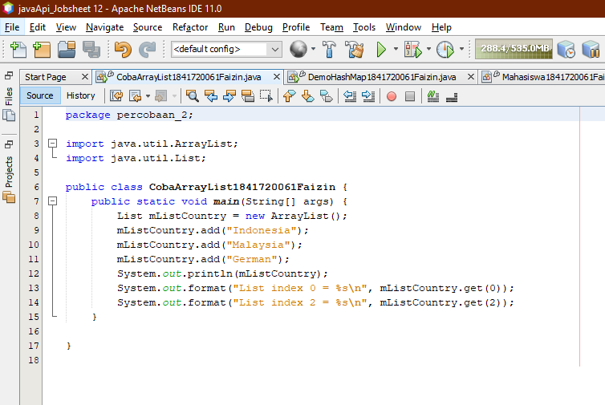

  [ini link ke kode program CobaArrayList1841720061Faizin](../../src/12_Java_API/percobaan_2/CobaArrayList1841720061Faizin.java)


# **B. Pertanyaan** 

1. Apakah fungsi potongan program dibawah ini! 

```java
System.out.println(mListCountry);
        System.out.format("List index 0 = %s\n",mListCountry.get(0));
        System.out.format("List index 2 = %s\n",mListCountry.get(2));
```

....................................................................................................................................................... ....................................................................................................................................................... ................................................................................................................................................. 

2. Ganti potongan program pada soal no 1 menjadi sebagai berikut 
 
```java
/*
 * To change this license header, choose License Headers in Project Properties.
 * To change this template file, choose Tools | Templates
 * and open the template in the editor.
 */
package Faizin.percobaan2.api;

/**
 *
 * @author ROG SERIES
 */
import java.util.ArrayList;
import java.util.List;
import java.util.Iterator;
public class CobaArrayList1841720061Faizin {
    public static void main(String[] args){
        List mListCountry = new ArrayList();
        mListCountry.add("Indonesia");
        mListCountry.add("Malaysia");
        mListCountry.add("German");
       // System.out.println(mListCountry);
       // System.out.format("List index 0 = %s\n",mListCountry.get(0));
       // System.out.format("List index 2 = %s\n",mListCountry.get(2));
       
        System.out.println("Country List");
        Iterator mIterator = mListCountry.iterator();
        while(mIterator.hasNext()){
            Object element = mIterator.next();
            System.out.format("%s ", element);
        
        
    }
    
}
```

Kemudian jalankan program tersebut! 

....................................................................................................................................................... ....................................................................................................................................................... ................................................................................................................................................. 

3. Jelaskan perbedaan menampilkan data pada ArrayList menggunakan potongan program pada soal no 1 dan no 2! 

....................................................................................................................................................... ....................................................................................................................................................... .................................................................................................................................................

# **Hasil Pertanyaan Percobaan 2**

1. Yang ditampilkan Hanya Index 0 = Indonesia dan Index 2 = German.

2. 


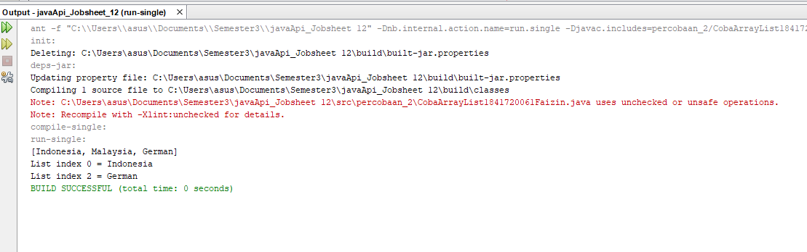

```java
/*
 * To change this license header, choose License Headers in Project Properties.
 * To change this template file, choose Tools | Templates
 * and open the template in the editor.
 */
package Faizin.percobaan2.api;

/**
 *
 * @author ROG SERIES
 */
import java.util.ArrayList;
import java.util.List;
import java.util.Iterator;
public class CobaArrayList1841720061Faizin {
    public static void main(String[] args){
        List mListCountry = new ArrayList();
        mListCountry.add("Indonesia");
        mListCountry.add("Malaysia");
        mListCountry.add("German");
        System.out.println(mListCountry);
        System.out.format("List index 0 = %s\n",mListCountry.get(0));
        System.out.format("List index 2 = %s\n",mListCountry.get(2));
       
        //System.out.println("Country List");
        //Iterator mIterator = mListCountry.iterator();
        //while(mIterator.hasNext()){
         //   Object element = mIterator.next();
         //   System.out.format("%s ", element);
        
        
    }
    
}
```

3. nomor 1 hanya memilih index beberapa sedangkan nomor 2 seluruhnya.


# **5. Percobaan 3 (Map)** 


**A. Langkah Percobaan** 

1. Buatlah package dengan nama identifier.percobaan3  pada project yang sudah anda buat sebelumnya, misalnya : arie.percobaan3. 

2. Buatlah class baru dengan nama DemoHashMap. Tambahkan source code dibawah ini kedalam class! 
 
```java
/*
 * To change this license header, choose License Headers in Project Properties.
 * To change this template file, choose Tools | Templates
 * and open the template in the editor.
 */
package Faizin.percobaan3.api;

/**
 *
 * @author ROG SERIES
 */
import java.util.Collection;
import java.util.HashMap;
import java.util.Iterator;
public class DemoHashMap1841720061Faizin {
    public static void main(String[] args){
        HashMap hMapItem = new HashMap();
        hMapItem.put("1", "Biskuit");;
        hMapItem.put("2", "Shampoo");
        hMapItem.put("3", "Soap");
        System.out.println(hMapItem);
        
       // Collection mCollection = hMapItem.values();
        //Iterator mIterator = mCollection.iterator();
       // while(mIterator.hasNext()){
        //    System.out.println(mIterator.next());
        }
              
        System.out.format("HashMap Item total : %d\n\n",hMapItem.size());
        
        Object mObject = hMapItem.remove("1");
        System.out.format("%s remove from HashMap\n",mObject);
        System.out.format("HashMap Item Total : %d\n",hMapItem.size());
        System.out.println(hMapItem);
        
        hMapItem.clear();
        System.out.format("HashMap Item Total : %d\n",hMapItem.size());
    }
    
}
```

3. Jalankan program diatas, maka outputnya adalah sebagai berikut: 

**Hasil Percobaan 3**

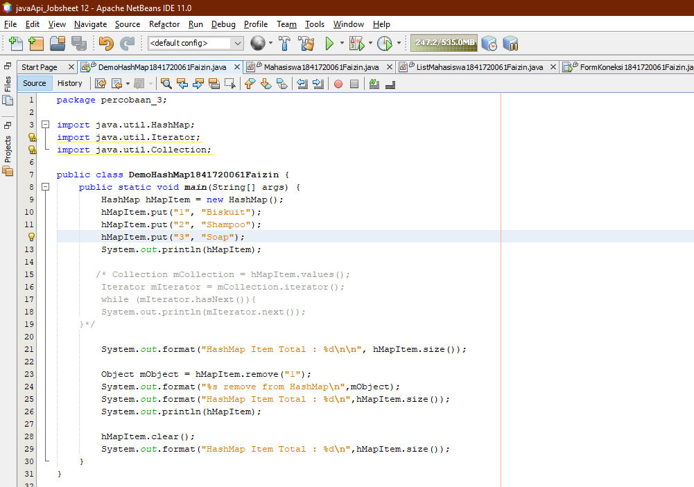

  [ini link ke kode program DemoHashMap1841720061Faizin](../../src/12_Java_API/percobaan_3/DemoHashMap1841720061Faizin.java)


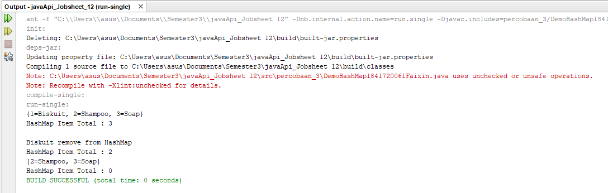

# **B. Pertanyaan** 

1. Jelaskan fungsi **hMapItem.put("1","Biskuit")** pada program! 

....................................................................................................................................................... ....................................................................................................................................................... ................................................................................................................................................. 

2. Jelaskan fungsi **hMapItem.size()** pada program! 

....................................................................................................................................................... ....................................................................................................................................................... ................................................................................................................................................. 

3. Jelaskan fungsi **hMapItem.remove("1")** pada program! 

....................................................................................................................................................... ....................................................................................................................................................... ................................................................................................................................................. 

4. Jelaskan fungsi **hMapItem.clear()** pada program! 

....................................................................................................................................................... ....................................................................................................................................................... ................................................................................................................................................. 

5. Tambahkan kode program yang di blok pada program yang sudah anda buat! 
 
```java
/*
 * To change this license header, choose License Headers in Project Properties.
 * To change this template file, choose Tools | Templates
 * and open the template in the editor.
 */
package Faizin.percobaan3.api;

/**
 *
 * @author ROG SERIES
 */
import java.util.Collection;
import java.util.HashMap;
import java.util.Iterator;
public class DemoHashMap1841720061Faizin {
    public static void main(String[] args){
        HashMap hMapItem = new HashMap();
        hMapItem.put("1", "Biskuit");;
        hMapItem.put("2", "Shampoo");
        hMapItem.put("3", "Soap");
        System.out.println(hMapItem);
        
        Collection mCollection = hMapItem.values();
        Iterator mIterator = mCollection.iterator();
        while(mIterator.hasNext()){
            System.out.println(mIterator.next());
        }
              
        System.out.format("HashMap Item total : %d\n\n",hMapItem.size());
        
        Object mObject = hMapItem.remove("1");
        System.out.format("%s remove from HashMap\n",mObject);
        System.out.format("HashMap Item Total : %d\n",hMapItem.size());
        System.out.println(hMapItem);
        
        hMapItem.clear();
        System.out.format("HashMap Item Total : %d\n",hMapItem.size());
    }
    
}

```

6. Jalankan program dan amati apa yang terjadi! 


7. Apakah perbedaan program sebelumnya dan setelah ditambahkan kode program pada soal no 5 diatas? Jelaskan! 

....................................................................................................................................................... ....................................................................................................................................................... .................................................................................................................................................


# **Hasil Pertanyaan Percobaan 3**

1. input nilai 1.Biskuit.

2. Memunculkan Hasil Eksekusi atau total Barang.

3. Menghilangkan Nilai 1.Biskuit dan Akhirnya di **hMapItem.size()** hanya muncul 2.Shampoo 3.Soap.

4. **hMapItem.clear()** tujuannya Menghapus Seluruh inputan data jadi output saat **hMapItem.size()** hanya 0.

5. 

7. Sama saja Hanya bentuk urutan huruf.

 
# **6 Percobaan 4 (Implementasi ArrayList dalam GUI)** 

1. Buatlah package dengan nama identifier.percobaan4  pada project yang sudah anda buat sebelumnya, misalnya : arie.percobaan4. 

2. Buatlah class baru dengan nama Mahasiswa 

3. Deklarasikan atribut Nim,Nama, Alamat dengan acces modifier private dan bertipe data String pada class Mahasiswa yang sudah dibuat

```java
private String Nim;
private String Nama;
private String Alamat;
```

4. Buatlah kontruktor pada class Mahasiswa sebagai berikut: 

```java
public Mahasiswa1841720061Faizin(String Nim, String Nama, String Alamat) {
        this.Nim = Nim;
        this.Nama = Nama;
        this.Alamat = Alamat;
    }
```

5. Buatlah method getNim(),getNama(), dan getAlamat() 

```java
public String getNimBagus() {
        return Nim;
    }

    public String getNamaBagus() {
        return Nama;
    }

    public String getAlamatBagus() {
        return Alamat;
    }
    
    
}
```

6. Buatlah class baru dengan nama InputData 

7. Lakukan import ArrayList dengan menambahkan import  java.util.ArrayList; 

8. Buatlah ArrayList dengan nama ListMahasiswa dari class Mahasiswa 

```java
ArrayList<Mahasiswa1841720061Faizin> ListMahasiswa;
```

9. Buatlah kontruktor dari class InputData kemudian isi kontruktor tersebut dengan inisialisasi dari ArrayList ListMahasiswa yang sudah anda deklarasikan sebelumnya 

```java
public InputData1841720061Faizin() {
        ListMahasiswa = new ArrayList();
    }
```

10. Buatlah method isi data sebagai berikut: 

```java
 public void isiDataBagus(String Nim, String Nama,String Alamat){
        Mahasiswa1841720061Faizin mhs = new Mahasiswa1841720061Faizin(Nim, Nama, Alamat);
        ListMahasiswa.add(mhs);
    }
```

11. Buatlah method getData() untuk mengambil seleuruh data yan ada pada ListMahasiswa 

```java
 public ArrayList<Mahasiswa1841720061Faizin> getData(){
        return ListMahasiswa;
    }
```

12. Buatlah class Jframe baru dengan nama TampilGui kemudian buat desain sebagai berikut: 


Ketentuan: 


13. Tambahkan  

```java
import javax.swing.table.DefaultTableModel;
```

14. Deklarasikan DeafultTableModel sebagai TabBuku

```java
DefaultTableModel TabMahasiswa;
```

15. Kemudian buatlah objek dari class InputData 

```java
InputData1841720061Faizin DataMahasiswa;
```

16. Inisialisasi objek DataMahasiswa dari class Input Data didalam kontruktor TampilGui()  
 
 ```java
DataMahasiswa = new InputData1841720061Faizin();
 ```

17. Buatlah method LihatDataMahasiswa() 

```java
public final void LihatDataMahasiswaBagus(){
        String[] NamaKolom = {"NIM", "Nama Mahasiswa", "Alamat"};
        Object[][] objekMahasiswa = new Object [DataMahasiswa.getData().size()][3];
        int i =0;
        for (Mahasiswa1841720061Faizin mhs: DataMahasiswa.getData()){
            String arrayMahasiswa[] = {mhs.getNimBagus(), mhs.getNamaBagus(), mhs.getAlamatBagus()};
            objekMahasiswa[i]=arrayMahasiswa;
            i++;
        }
        TabMahasiswa = new DefaultTableModel(objekMahasiswa, NamaKolom);
        jTableMhs.setModel(TabMahasiswa);
    }
```

18. Panggil method LihatDataMahasiswa() yang sudah dibuat didalam kontruktor TampilGui() 

```java
LihatDataMahasiswaBagus();
```

19. Double klik pada Button Simpan kemudian tambahkan kode berikut: 

```java
private void jButton1ActionPerformed(java.awt.event.ActionEvent evt) {                                         
        // TODO add your handling code here:
        DataMahasiswa.isiDataBagus(jTextFieldNim.getText(), jTextFieldNama.getText(), jTextAlamat.getText());
        LihatDataMahasiswaBagus();
    }        
```

20. Jalankan program 


21. Tambahkan data berikut kemudian klik simpan 


22. Maka data akan tersimpan pada Jtable 

**Hasil Percobaan 4**

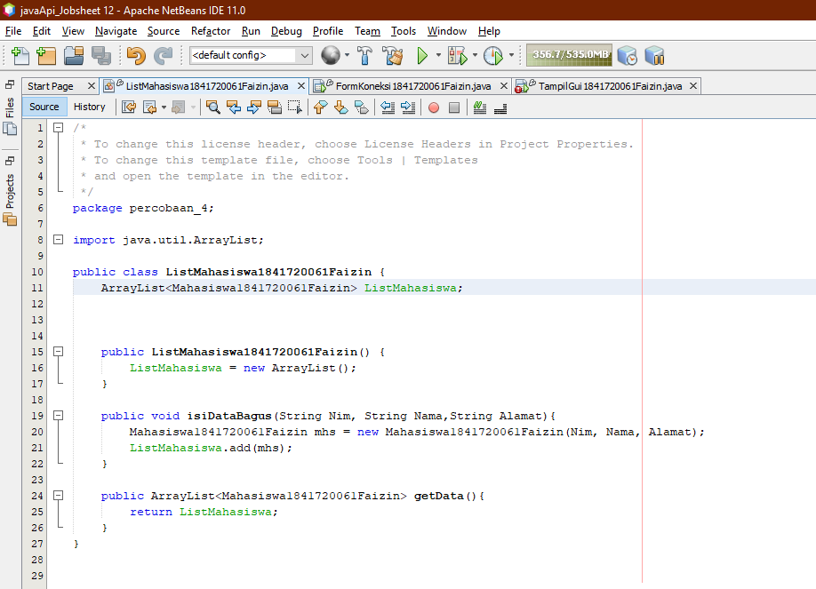

  [ini link ke kode program InputData1841720061Faizin](../../src/12_Java_API/percobaan_4/ListMahasiswa1841720061Faizin.java)

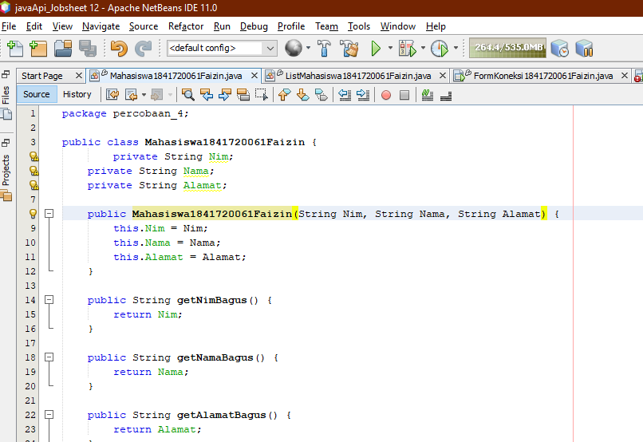

  [ini link ke kode program Mahasiswa1841720061Faizin](../../src/12_Java_API/percobaan_4/Mahasiswa1841720061Faizin.java)

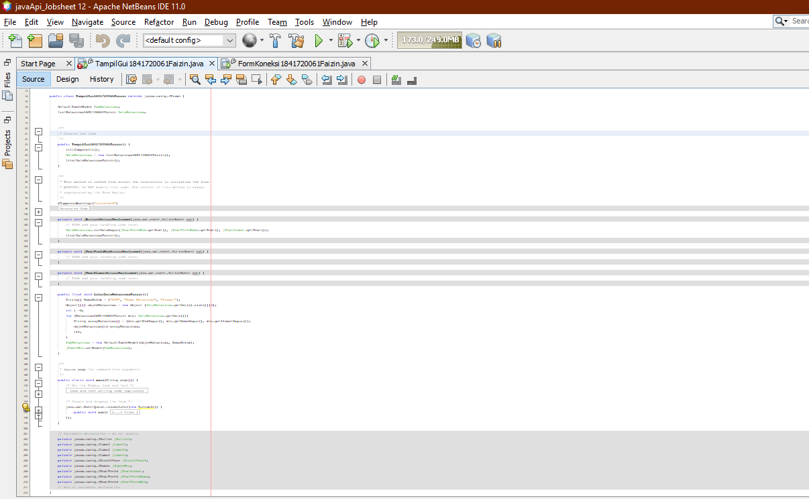

  [ini link ke kode program TampilGui1841720061Faizin](../../src/12_Java_API/percobaan_4/TampilGui1841720061Faizin.java)


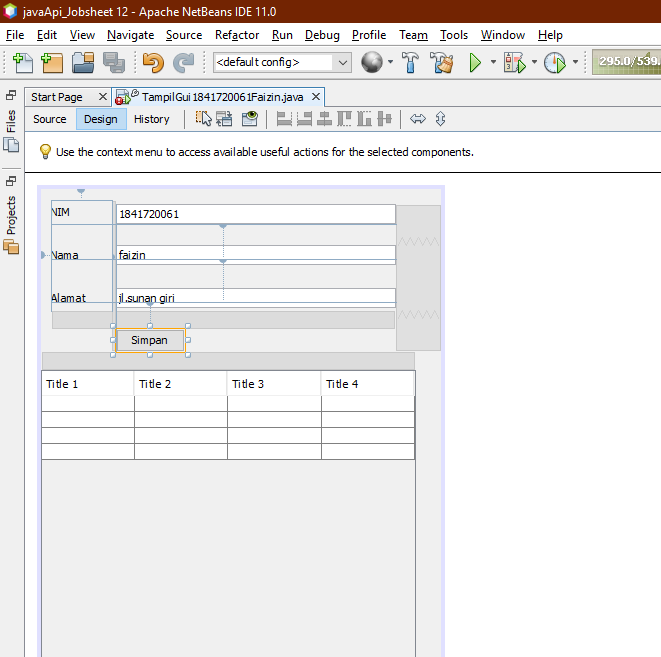


 
# **7 Percobaan 5 (Aplikasi Biodata)** 

1. Buatlah database dengan MySQL dengan desain tabel sebagai berikut: 


1. Buatlah Package baru dengan nama Biodata atau membuat project baru dengan cara 

a. File **->** New Project 

b. Pilih categories **->** Java dengan Projects **->**  Java Application **->** klik next 

c. Isi nama Project dengan Biodata dan atur letak project akan disimpan 

d. Kemudian tambahkan Jframe Form dengan nama FormKoneksi.  

e. Desain FormKoneksi seperti berikut 


2. Langkah selanjutnya tambahkan libraries, dengan cara klik kanan pada Libraries. Kemudian pilih add library dan pilih MySQL JDBC Driver. 


Tampilan Libraries setelah ditambah MySQL JDBC Driver. 


3. Pada tahap ini aplikasi sudah siap untuk bertransaksi dengan database yang sudah kita buat pada langkah 1. Selanjutnya kita buat method untuk melakukan koneksi dengan database, seperti berikut: 


Pada method buka_koneksi untuk variabel url terdapat angka 6606 adalah port mysql yang digunakan oleh penulis. Pada umumnya port mysql secara default adalah **3306**. Sedangkan untuk Biodata adalah nama database yang digunakan oleh penulis. 

4. Pada button add klik tambahkan code sebagai berikut:


5. Setelah menambah code pada action button klik, coba jalankan program dan tambahkan data. Apakah program berhasil menambahkan data? Jika tidak apakah penyebabnya.

................................................................. 

6. Jelaskan maksud source code untuk melakukan insert data diatas? 

................................................................. 
dd
7. Buat Table model yang digunakan untuk memanipulasi tampilan pada Jtable, seperti pada code dibawah ini: 


8. Selanjutnya buat method ambil_data_tabel seperti berikut 


Jalankan program maka data yang sudah kita add akan tampil seperti berikut: 


9. Jelaskan alur dari method ambil_data_tabel? 

........... 

10. Buat fungsi untuk merefresh sehingga data yang baru dapat ditampilkan pada tabel. 

**Hasil Percobaan 5**

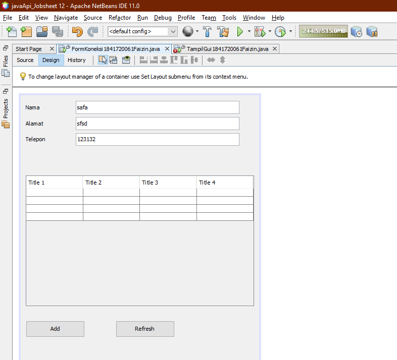

  [ini link ke kode program FormKoneksi](../../src/12_Java_API/percobaan_5/FormKoneksi1841720061Faizin.java)


5. Karena belum ada statement ambil data tabel hal tersebut di perlukan local host agar bisa terintegrasi dengan baik.

6. buka koneksi lalu insert nama, alamat, telepon berupa nilai String atau Integer.


10. 
```java
 private void jButtonRefreshActionPerformed(java.awt.event.ActionEvent evt) {                                               
        // TODO add your handling code here:
        ambil_data_tabelBagus();
          
    }                  
```

## Pernyataan Diri

Saya menyatakan isi tugas, kode program, dan laporan praktikum ini dibuat oleh saya sendiri. Saya tidak melakukan plagiasi, kecurangan, menyalin/menggandakan milik orang lain.

Jika saya melakukan plagiasi, kecurangan, atau melanggar hak kekayaan intelektual, saya siap untuk mendapat sanksi atau hukuman sesuai peraturan perundang-undangan yang berlaku.

Ttd,

***(Muhammad Nur Faizin)***


