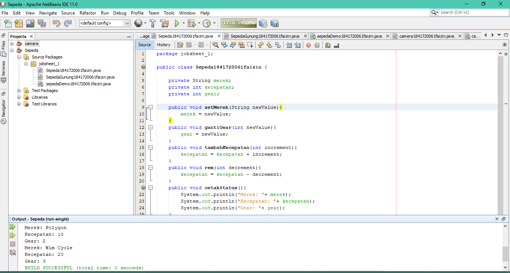
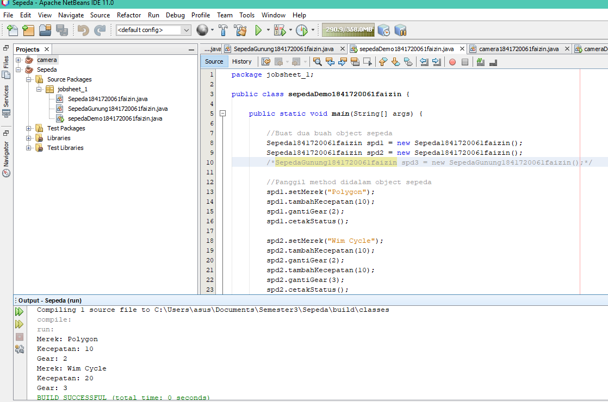
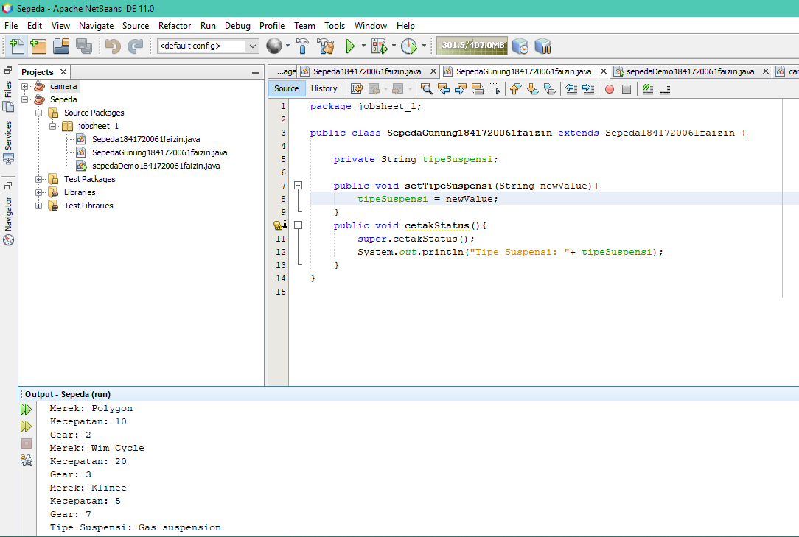
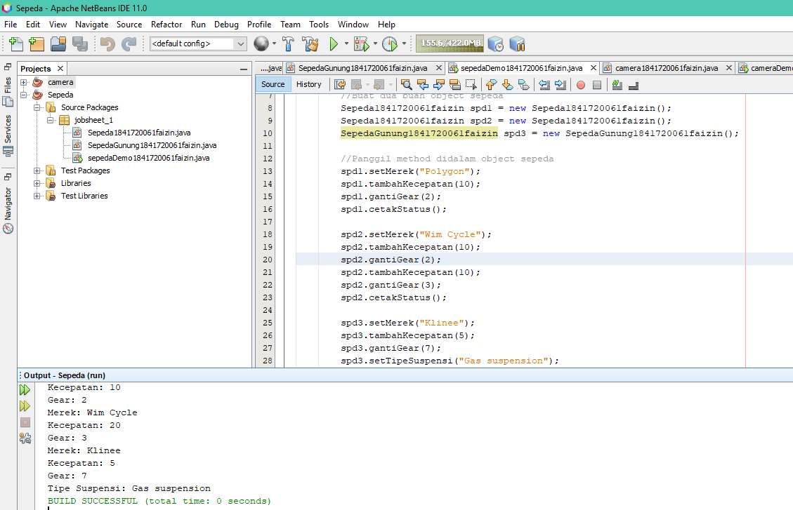
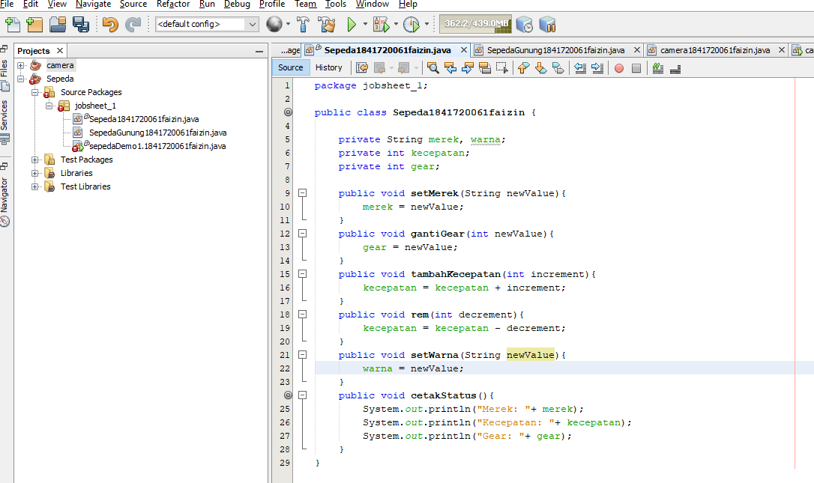
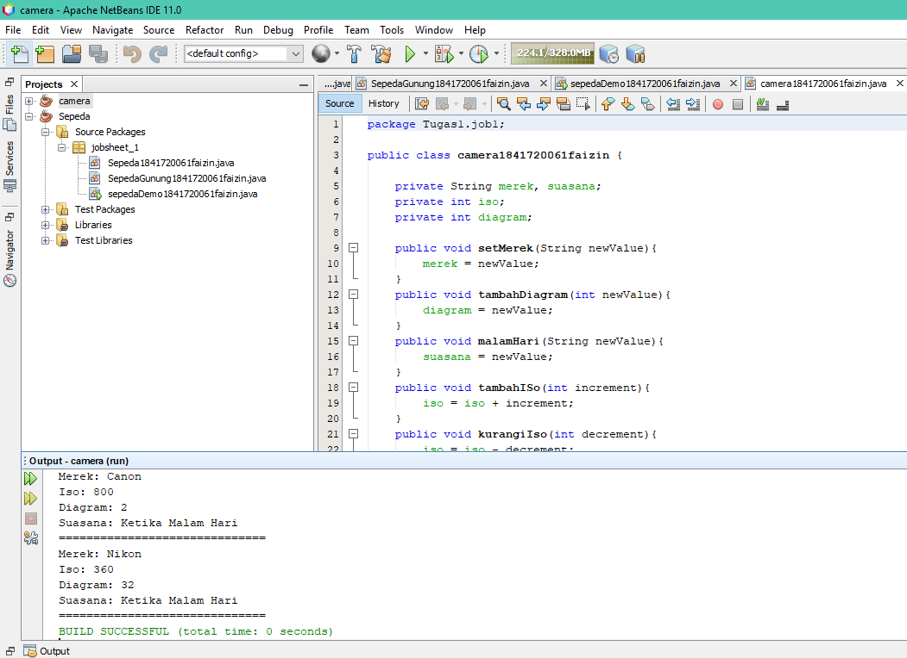
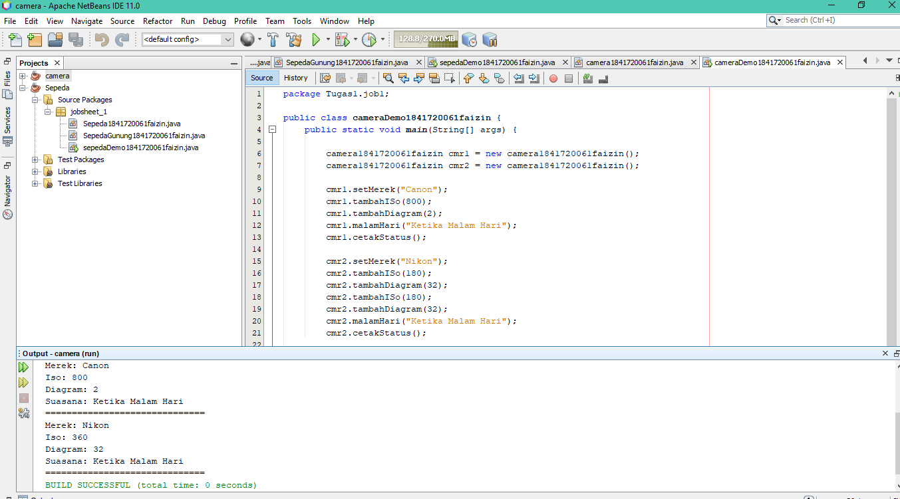

# Laporan Praktikum #1 - Pengantar Konsep PBO

## Kompetensi

(ketiklah kompetensi tiap praktikum di sini)

## Ringkasan Materi

(Alhamdulillah lancar.. Cuman masih belajar cara membuat laporan)

## Percobaan

### Percobaan 1

(berisi penjelasan percobaan 1. Jika ada rujukan ke file program, bisa dibuat linknya di sini.)

`contoh screenshot yang benar, menampilkan 3 komponen, yaitu struktur project, kode program, dan hasil kompilasi`

Contoh link kode program : [ini contoh link ke kode program](../../src/1_Pengantar_Konsep_PBO/Sepeda1841720061faizin.java)

Contoh link kode program : [ini contoh link ke kode program](../../src/1_Pengantar_Konsep_PBO/sepedaDemo1.1841720061faizin.java)

### Percobaan 2

(berisi penjelasan percobaan 2. Jika ada rujukan ke file program, bisa dibuat linknya di sini.)

`contoh screenshot yang benar, menampilkan 3 komponen, yaitu struktur project, kode program, dan hasil kompilasi`

Contoh link kode program : [ini contoh link ke kode program](../../src/1_Pengantar_Konsep_PBO/SepedaGunung1841720061faizin.java)

Contoh link kode program : [ini contoh link ke kode program](../../src/1_Pengantar_Konsep_PBO/sepedaDemo1841720061faizin.java)

## Pertanyaan

PERTANYAAN
1.	Sebutkan dan jelaskan aspek-aspek yang ada pada pemrograman     berorientasi objek!
2.	Apa yang dimaksud dengan object dan apa bedanya dengan class?
3.	Sebutkan salah satu kelebihan utama dari pemrograman             berorientasi objek dibandingkan dengan pemrograman struktural!
4.	Pada class Sepeda, terdapat state/atribut apa saja?
5.	Tambahkan atribut warna pada class Sepeda.
6.	Mengapa pada saat kita membuat class SepedaGunung, kita tidak perlu membuat class nya dari nol?

JAWAB
1. 
*Abstraction adalah deskripsi abstrak informasi dan tingkah laku dari sekumpulan data.
Kelas dapat diilustrasikan sebagai suatu cetak biru(blueprint) atau prototipe yang digunakan untuk menciptakan objek.
*Enkapsulasi (encapsulation)
Enkapulasi adalah kombinasi data dan fungsionalitas dalam sebuah unit tunggal sebagai bentuk untuk menyembunyikan detail informasi.
*Pewarisan (Inheritance)
suatu kelas baru dengan mewarisi sifat dari kelas lain yang sudah ada.
Penurunan sifat ini bisa dilakukan secara bertingkattingkat, sehingga semakin ke bawah kelas tersebut menjadi semakin spesifik.
*Polimorfisme (polymorphism)
Polimorfisme merupakan kemampuan objekobjek yang berbeda kelas namun terkait dalam pewarisan untuk merespon secara berbeda terhadap suatu pesan yang sama.
2. Class adalah deskripsi abstrak informasi dan tingkah laku dari sekumpulan data sedangkan object pemanfaatan dari class.

3. Kelebihan dari PBO adalah untuk meningkatkan produktivitas karena di dalam PBO yang telah dibuat untuk suatu problem masih bisa digunakan untuk problem yang lain

4. rem, merek, warna, kecepatan, gear, seMerek, gantiGear, tamhaKecepatan, cetakStatus

5. 

6. Dikarenakan class SepedaGunung merupakan penurunan dari class Sepeda.

## Tugas

(silakan kerjakan tugas di sini beserta `screenshot` hasil kompilasi program. Jika ada rujukan ke file program, bisa dibuat linknya di sini.)

`contoh screenshot yang benar, menampilkan 3 komponen, yaitu struktur project, kode program, dan hasil kompilasi`

Contoh link kode program : [ini contoh link ke kode program](../../src/1_Pengantar_Konsep_PBO/camera1841720061faizin.java)

Contoh link kode program : [ini contoh link ke kode program](../../src/1_Pengantar_Konsep_PBO/cameraDemo1841720061faizin.java)

## Kesimpulan

(Berisi simpulan yang telah diperoleh selama praktikum atau belajar pada pertemuan ini)

## Pernyataan Diri

Saya menyatakan isi tugas, kode program, dan laporan praktikum ini dibuat oleh saya sendiri. Saya tidak melakukan plagiasi, kecurangan, menyalin/menggandakan milik orang lain.

Jika saya melakukan plagiasi, kecurangan, atau melanggar hak kekayaan intelektual, saya siap untuk mendapat sanksi atau hukuman sesuai peraturan perundang-undangan yang berlaku.

Ttd,

***(silakan isi nama lengkap di sini)***
