# Laporan Praktikum #2 - Class dan Objek

## Kompetensi

( Mahasiswa dapat memahami deskripsi dari class dan object 
 Mahasiswa memahami implementasi dari class 
 Mahasiswa dapat memahami implementasi dari attribute 
 Mahasiswa dapat memahami implementasi dari method 
 Mahasiswa dapat memahami implementasi dari proses instansiasi 
 Mahasiswa dapat memahami implementasi dari try-catch 
 Mahasiswa dapat memahami proses pemodelan class diagram menggunakan UML ).
## Ringkasan Materi

(saya dapat menguasai class dan objek. Dan ada 4 pilar pemograman berbasis web yaitu : 1. abstraction 2.encapsulation 3.heritance 4.polymorpysm).lms

## Percobaan

### Percobaan 1

1. 
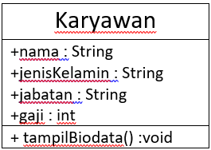

2.  class karyawan dan class karyawanMain

3.  integer : id, gaji 
    String : nama, jenis kelamin, jabatan

4. tampilBiodata() :void

### Percobaan 2

 1. 
 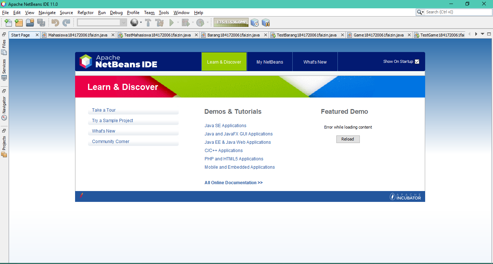  Bukalah text editor atau IDE, misalnya Notepad ++ / netbeans
 
 2.
 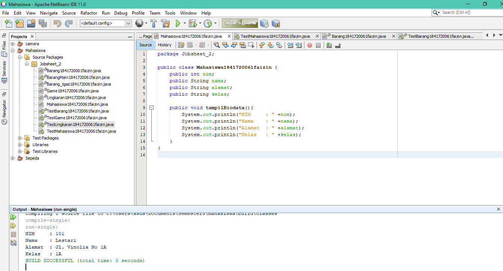

 [ini adalah link ke kode program](../../src/2_Class_dan_Object/Mahasiswa1841720061faizin.java)

3. Simpan dengan nama file Mahasiswa.java. 

4. Untuk dapat mengakses anggota-anggota dari suatu obyek, maka harus dibuat instance dari class tersebut terlebih dahulu. Berikut ini adalah cara pengaksesan anggota- anggota dari class Mahasiswa dengan membuka file baru kemudian ketikkan kode program berikut: 
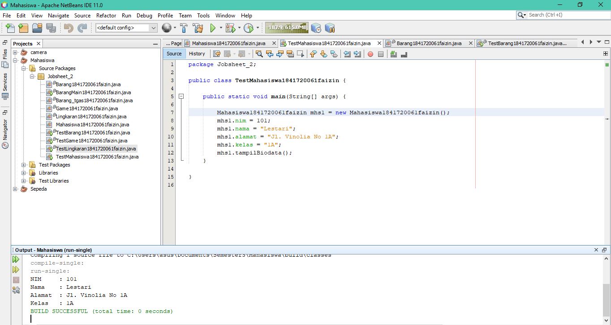

[ini adalah link ke kode program](../../src/2_Class_dan_Object/sepedaDemo1.1841720061faizin.java)

5.  Simpan file dengan TestMahasiswa.java 

6. class Test mahasiswa akan memanggil ke class mahasiswa yang akan diolah dan diaksesnya suatu program yaitu mahasiswa

7.  integer : nim;  
    String : nama, alamat, kelas;

8. pada methood tampilBiodata()

9.  objek yang di instansiasi pada program ada 1 yaitu mahasiswa mhs1= new mahasiswa()

10. dia akan memanggil pada kelas nim dan akan meng output nilai 101

11. memanggil methood biodata pada class mahasiswa dan meng akses di dalam methood tersebut

12. 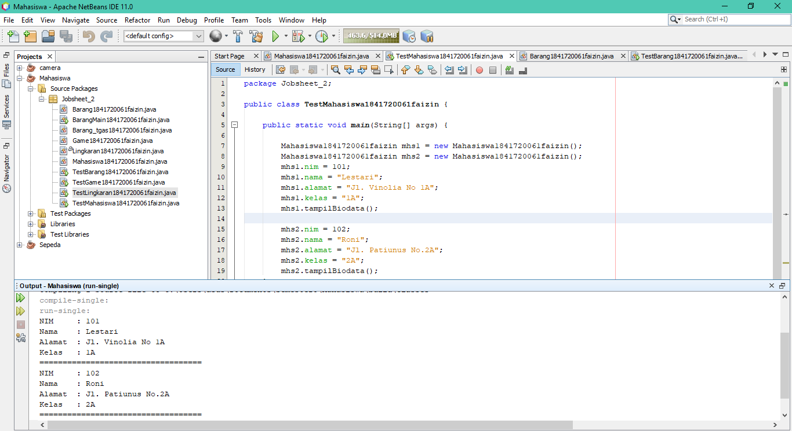

[ini adalah link ke kode program](../../src/2_Class_dan_Object/TestMahasiswa.1841720061faizin.java)

### Percobaan 3

1. 

 disini saya memakai neatbeans

2. 

[ini adalah link ke kode program](../../src/2_Class_dan_Object/Barang1841720061faizin.java)

3. Simpan dengan nama file Barang.java

4.  Untuk dapat mengakses anggota-anggota dari suatu obyek, maka harus dibuat instance dari class tersebut terlebih dahulu. Berikut ini adalah cara pengaksesan anggota- anggota dari class Barang dengan membuka file baru kemudian ketikkan kode program berikut: 
 
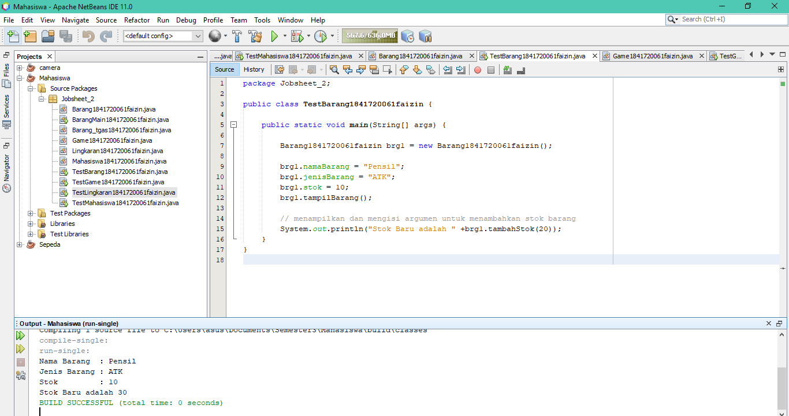

[ini adalah link ke kode program](../../src/2_Class_dan_Object/TestBarang1841720061faizin.java)

5. Simpan dengan nama file TestBarang.java 

6. 

7. fungsi argumen pada methood adalah mengakses nilai suatu data

8. return digunakan untuk mengembalikan nilai dan return di gunakan ketika methood yang mempunyai kalkulasi suatu input

## Tugas
1. 

 [ini adalah link ke kode program](../../src/2_Class_dan_Object/Game1841720061faizin.java)

2. 

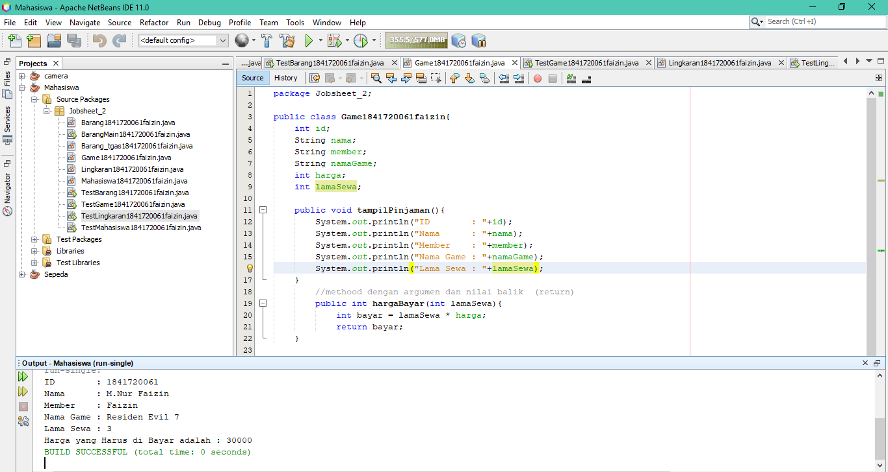

 [ini adalah link ke kode program](../../src/2_Class_dan_Object/Game1841720061faizin.java)

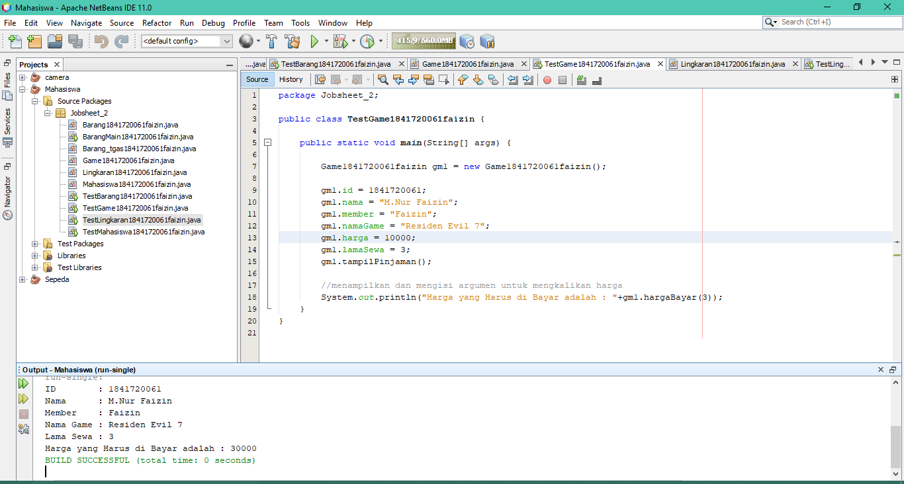

 [ini adalah link ke kode program](../../src/2_Class_dan_Object/TestGame1841720061faizin.java)

3. 
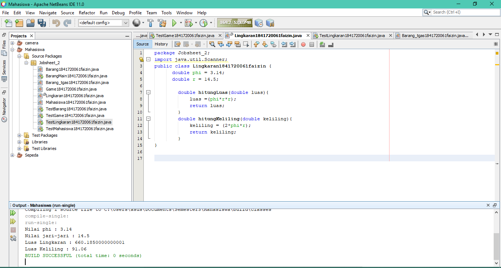

 [ini adalah link ke kode program](../../src/2_Class_dan_Object/Lingkaran1841720061faizin.java)

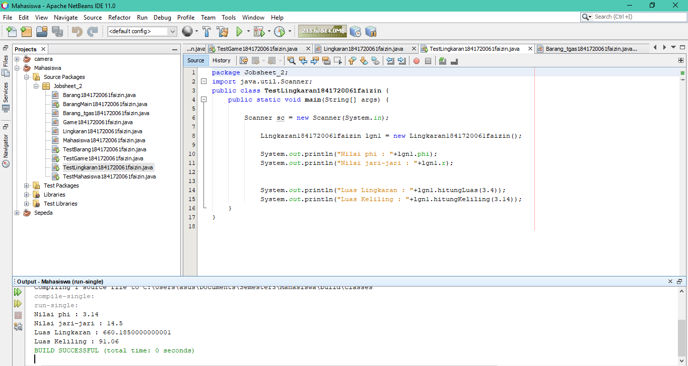

 [ini adalah link ke kode program](../../src/2_Class_dan_Object/TestLingkaran1841720061faizin.java)

4. 
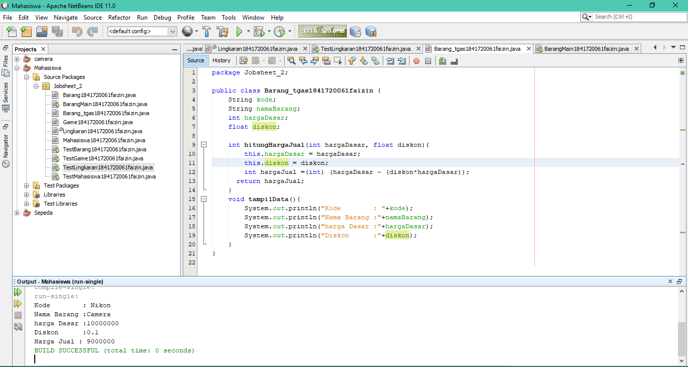

 [ini adalah link ke kode program](../../src/2_Class_dan_Object/Barang_tgas1841720061faizin.java)

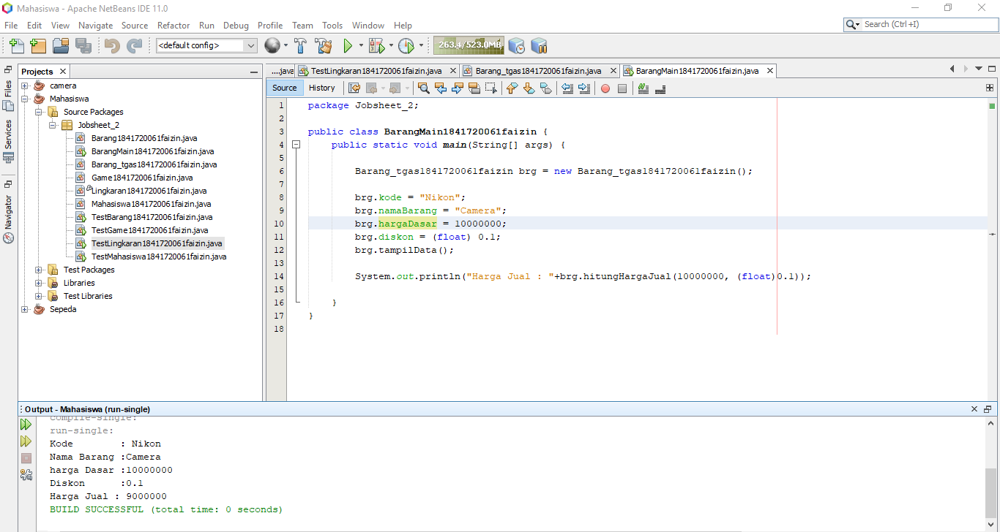

 [ini adalah link ke kode program](../../src/2_Class_dan_Object/BarangMain1841720061faizin.java)

## Kesimpulan

(
* Class dan Object adalah suatu yang dibuat untuk memogram
* Attribute: Untuk melakukan pendeklarasian attribute dapat dilakukan dengan sintaks 
* Method : suatu blok dari program yang berisi kode program nama dan properti yang dapat digunakan kembali
*  )

## Pernyataan Diri

Saya menyatakan isi tugas, kode program, dan laporan praktikum ini dibuat oleh saya sendiri. Saya tidak melakukan plagiasi, kecurangan, menyalin/menggandakan milik orang lain.

Jika saya melakukan plagiasi, kecurangan, atau melanggar hak kekayaan intelektual, saya siap untuk mendapat sanksi atau hukuman sesuai peraturan perundang-undangan yang berlaku.

Ttd,

***(MUHAMMAD NUR FAIZIN)***
