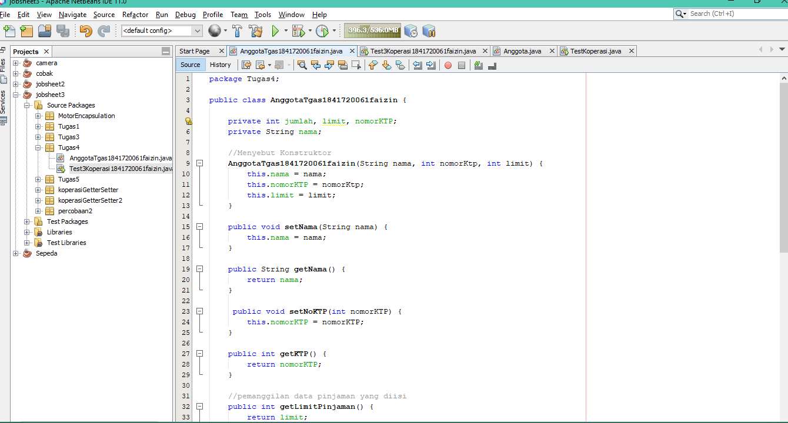

# Laporan Praktikum #3 - Enkapsulasi

## Kompetensi

Setelah melakukan percobaan pada modul ini, mahasiswa memahami konsep:

1. Konstruktor 
2. Akses Modifier 
3. Atribut/method pada class 
4. Intansiasi atribut/method  
5. Setter dan getter 
6. Memahami notasi pada UML Class Diagram 

## Ringkasan Materi
1. ENKAPSULASI 
    Enkapsukasi disebut juga dengan information-hiding. Dalam berinteraksi dengan objek, seringkali kita tidak perlu mengetahui kompleksitas yang ada didalamnya. 
2. KONSTRUKTOR 
    Konstruktor mirip dengan method cara deklarasinya akan tetapi tidak memiliki tipe return. Dan konstruktor dieksekusi ketika instan dari objek dibuat. 
3. AKSES MODIFER  
    Terdapat 2 tipe modifier di java yaitu : akses modifier dan non-access modifier. Dalam hal ini kita akan fokus pada akses modifier yang berguna untuk mengatur akses method, class, dan constructor. Terdapat 4 akses modifier yaitu: 
    1. private – hanya dapat diakses di dalam kelas yang sama 
    2. default –  hanya dapat diakses di dalam package yang sama 
    3. protected – dapat diakases di luar package menggunakan subclass  (membuat inheritance) 
    4. public – dapat diakases dari mana saja 

## <h2>Percobaan</h2>

### PERCOBAAN 1

1. 

ini adalah contoh untuk membuat class Motor 
[ini adalah link ke class motor](../../src/3_Enkapsulasi/Motor1841720061faizin.java)

ini adalah contoh untuk membuat class MotorDemo 
[ini adalah link ke class motor](../../src/3_Enkapsulasi/MotorDemo1841720061faizin.java)

### PERCOBAAN 2

 1. Berdasarkan UML class diagram tersebut maka class Motor terdapat      perubahan, yaitu:  
 
a. Ubah access modifier kecepatan dan kontakOn menjadi private

b. Tambahkan method nyalakanMesin, matikanMesin, tambahKecepatan, kurangiKecepatan. 
Implementasi class Motor adalah sebagai berikut: 
 
 
  ini adalah pada class Motor 
[ini adalah link ke class motor](../../src/3_Enkapsulasi/PMotor1841720061faizin.java)

 2. 
 
 ini adalah pada class motorDemo 

 [ini adalah link ke class motorDemo](../../src/3_Enkapsulasi/PMotorDemo1841720061faizin.java)

  ### Pertanyaan  
  1. Pada class TestMotor, saat kita menambah kecepatan untuk pertama kalinya, mengapa muncul peringatan “Kecepatan tidak bisa bertambah karena Mesin Off!”? 
  * karena kecepatan mulai dari 0, jika kecepatan nol dan dia berjalan maka itu seperti aneh maka dari itu jia kecepatan 0 maka dia pasti tidak berjalan dan mesin masih off 
  2. Mengapa atribut kecepatan dan kontakOn diset private? 
  * karena pada atribut kecepatan dan kontakOn akan diakses pada kelas yang sama 
  3. Ubah class Motor sehingga kecepatan maksimalnya adalah 100! 
*
    
    ini adalah pada class motor 
    [ini adalah link ke class motor](../../src/3_Enkapsulasi/PMotor1841720061faizin.java)
*
    
    ini adalah pada class motorDemo 

[ini adalah link ke class motorDemo](../../src/3_Enkapsulasi/PMotorDemo1841720061faizin.java)

### PERCOBAAN 3
* Sama dengan percobaan 1 untuk membuat project baru 
a. Buka Netbeans, buat project KoperasiGetterSetter. 
b. Buat class Anggota. Klik kanan pada package koperasigettersetter – New – Java Class. 
c. Ketikkan kode class Anggota dibawah ini.
1. 
    
     ini adalah pada class Anggota 
     [ini adalah link ke class Anggota](../../src/3_Enkapsulasi/Anggota1841720061faizin.java)
2. 
    
 ini adalah pada class KoperasiDemo 
     [ini adalah link ke class KoperasiDemo](../../src/3_Enkapsulasi/KoperasiDemo1841720061faizin.java)

### PERCOBAAN 4
1.  Langkah pertama percobaan 4 adalah ubah class KoperasiDemo seperti berikut 
    
     ini adalah pada class KoperasiDemo 
     [ini adalah link ke class KoperasiDemo](../../src/3_Enkapsulasi/PKoperasiDemo1841720061faizin.java)

2. Pada class Anggota dibuat kontruktor dengan access modifier default yang memiliki 2 parameter nama dan alamat. Dan didalam konstruktor tersebut dipastikan nilai simpanan untuk pertama kali adalah Rp. 0. 
*
 
     ini adalah pada class Anggota 
     [ini adalah link ke Anggota](../../src/3_Enkapsulasi/PAnggota1841720061faizin.java)
 
*
    
 ini adalah pada class KoperasiDemo 
 [ini adalah link ke KoperasiDemo](../../src/3_Enkapsulasi/PKoperasiDemo1841720061faizin.java)

  ### Pertanyaan – Percobaan 3 dan 4 
  1. Apa yang dimaksud getter dan setter?  
    Getter adalah public method dan memiliki tipe data return, yang berfungsi untuk mendapatkan nilai dari atribut private. Sedangkan  
    setter adalah public method yang tidak memliki tipe data return, yang berfungsi untuk memanipulasi nilai dari atribut private
     
  2. Apa kegunaan dari method getSimpanan()?  
    Kegunaan method simpanan adalah untuk memanggil atribut simpanan untuk diakses ke class lain

  3. Method apa yang digunakan untk menambah saldo?  
    public void setor(float uang){ 
        simpanan += uang;
    }

  4. Apa yand dimaksud konstruktor?  
    konstruktor adalah method khusus yang akan dijalankan secara otomatis pada saat sebuah objek dibuat (instansiasi), yakni ketika perintah “new” dijalankan.

  5. Sebutkan aturan dalam membuat konstruktor?  
    Nama konstruktor harus sama dengan nama class nya
    Tidak mempunyai tipe data

  6. Apakah boleh konstruktor bertipe private?  
    Tidak Bisa
  
  7. Kapan menggunakan parameter dengan passsing parameter?  
     Ketika ada konstruktor yang mempunyai parameter 

  8. Apa perbedaan atribut class dan instansiasi atribut? 
     Atribut class merupakan nilai data yang terdapat pada suatu object yang berasal dari class. (sedangkan) 
     instansiasi atribut adalah memanggil suatu atribut class pada class berbeda

  9. Apa perbedaan class method dan instansiasi method?   
    Clas Method adalah sesuatu yang mempunyai object dalam menginput kan suatu object (sedangkan) 
    instansiasi methood adalah suatu method yang udah ada pada class yang berbeda dan di panggil untuk mengakses object yang ada pada method class

### Kesimpulan 
Dari percobaan diatas, telah dipelajari kosep dari enkapsulasi, kontruktor, access modifier yang terdiri dari 4 jenis yaitu public, protected, default dan private. Konsep atribut atau method class yang ada di dalam blok code class dan konsep instansiasi atribut atau method. Cara penggunaan getter dan setter beserta fungsi dari getter dan setter. Dan juga telah dipelajari atau memahami notasi UML 

### Tugas 
1. Cobalah program dibawah ini dan tuliskan hasil outputnya 
*
 
     ini adalah pada class EnacapDemo 
     [ini adalah link ke EncapDemo](../../src/3_Enkapsulasi/EncapDemo1841720061faizin.java)
 
*
    
 ini adalah pada class KoperasiTest 
 [ini adalah link ke EncapTest](../../src/3_Enkapsulasi/EncapTest1841720061faizin.java)

2. Pada program diatas, pada class EncapTest kita mengeset age dengan nilai 35, namun pada saat ditampilkan ke layar nilainya 30, jelaskan mengapa.  
jawab : Karena pada method set age mempunyai parameter yang bernama newAge yang mana pada newage memuat parameter age menjadi 30 jika inputan ntuk nilai new age lebih dari 30

3. Ubah program diatas agar atribut age dapat diberi nilai maksimal 30    dan minimal 18.
*

     ini adalah pada class EnacapDemo 
     [ini adalah link ke EncapDemo](../../src/3_Enkapsulasi/Encap2Demo1841720061faizin.java)
 
*
    
 ini adalah pada class EncapTest 
 [ini adalah link ke EncapTest](../../src/3_Enkapsulasi/EncapTest1841720061faizin.java)

 4. Pada sebuah sistem informasi koperasi simpan pinjam, terdapat class Anggota yang memiliki atribut antara lain nomor KTP, nama, limit peminjaman, dan jumlah pinjaman. Anggota dapat meminjam uang dengan batas limit peminjaman yang ditentukan. Anggota juga dapat mengangsur pinjaman. Ketika Anggota tersebut mengangsur pinjaman, maka jumlah pinjaman akan berkurang sesuai dengan nominal yang diangsur. Buatlah class Anggota tersebut, berikan atribut, method dan konstruktor sesuai dengan kebutuhan. Uji dengan TestKoperasi berikut ini untuk memeriksa apakah class Anggota yang anda buat telah sesuai dengan yang diharapkan. 
 
 
 
     ini adalah pada class Anggota 
     [ini adalah link ke Anggota](../../src/3_Enkapsulasi/AnggotaTgas1841720061faizin.java)
*
    
 ini adalah pada class koperasiTest 
 [ini adalah link ke KoperasiTest](../../src/3_Enkapsulasi/Test3Koperasi1841720061faizin.java)

 
 ini adalah outputan dari class Anggota

5. Modifikasi soal no. 4 agar nominal yang dapat diangsur minimal adalah 10% dari jumlah pinjaman saat ini. Jika mengangsur kurang dari itu, maka muncul peringatan “Maaf, angsuran harus 10% dari jumlah pinjaman”. 

 
     ini adalah pada class Anggota 
     [ini adalah link ke Anggota](../../src/3_Enkapsulasi/Anggota.java)
*
    
 ini adalah pada class koperasiTest 
 [ini adalah link ke KoperasiTest](../../src/3_Enkapsulasi/TestKoperasi.java)

 
 ini adalah outputan dari class Anggota

 
 6. Modifikasi class TestKoperasi, agar jumlah pinjaman dan angsuran dapat menerima input dari console. 

 
     ini adalah pada class Anggota 
     [ini adalah link ke Anggota](../../src/3_Enkapsulasi/Anggota.java)
*
    
 ini adalah pada class koperasiTest 
 [ini adalah link ke KoperasiTest](../../src/3_Enkapsulasi/TestKoperasi.java)

 
 ini adalah outputan dari class Anggota

## Kesimpulan

(
* Class dan Object adalah suatu yang dibuat untuk memogram
* Attribute: Untuk melakukan pendeklarasian attribute dapat dilakukan dengan sintaks 
* Method : suatu blok dari program yang berisi kode program nama dan properti yang dapat digunakan kembali
*  )

## Pernyataan Diri

Saya menyatakan isi tugas, kode program, dan laporan praktikum ini dibuat oleh saya sendiri. Saya tidak melakukan plagiasi, kecurangan, menyalin/menggandakan milik orang lain.

Jika saya melakukan plagiasi, kecurangan, atau melanggar hak kekayaan intelektual, saya siap untuk mendapat sanksi atau hukuman sesuai peraturan perundang-undangan yang berlaku.

Ttd,

***(MUHAMMAD NUR FAIZIN)***
