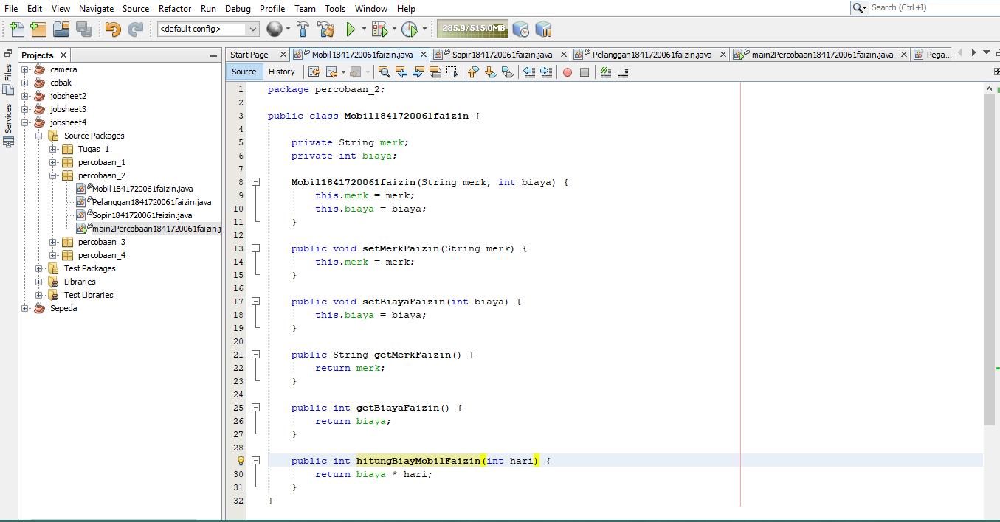
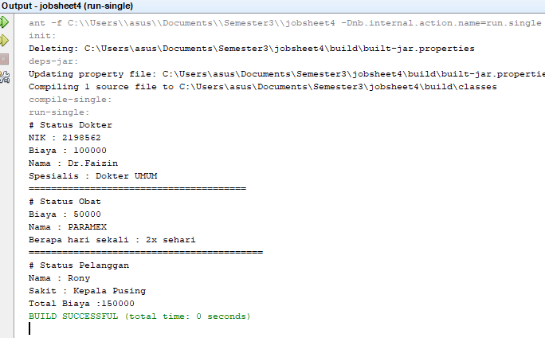

# Laporan Praktikum #3 - Relasi Kelas

## Kompetensi

Setelah melakukan percobaan pada modul ini, mahasiswa memahami konsep:

1. Memahami konsep relasi kelas
2. Mengimplementasikan relasi has-a dalam program

## Ringkasan Materi
Misalnya terdapat class Laptop yang memiliki atribut berupa merk dan prosesor. Jika diperhatikan lebih rinci, maka atribut prosesor sendiri didalamnya memiliki data berupa merk, nilai cache memori, dan nilai clock‑nya. Artinya, ada class lain yang namanya Processor yang memiliki atribut merk, cache dan clock, dan atribut prosesor yang ada di dalam class Laptop itu merupakan objek dari class Proceessor tersebut. Sehingga terlihat antara class Laptop dan class Processor memiliki relasi (has‑a). 
 
 
 
Jenis relasi has‑a ini yang akan dicontohkan pada percobaan di jobsheet ini. Apabila dilihat lebih rinci lagi, relasi tersebut disebut juga dengan agregasi (has-a). Relasi antar kelas yang lain adalah dependensi (uses-a) dan inheritance (is-a). 

## <h2>Percobaan</h2>

### PERCOBAAN 1

1. 

ini adalah contoh untuk membuat class laptop 
[ini adalah link ke laptop](../../src/4_Relasi_Class/Laptop1841720061faizin.java)

ini adalah contoh untuk membuat class Processor 
[ini adalah link ke processor](../../src/4_Relasi_Class/Processor1841720061faizin.java)

ini adalah contoh untuk membuat class MotorDemo 
[ini adalah link ke main](../../src/4_Relasi_Class/mainPercobaan1841720061faizin.java)

### Pertanyaan 
Berdasarkan percobaan 1, jawablah pertanyaan‑pertanyaan yang terkait: 
1. Di dalam class Processor dan class Laptop , terdapat method setter dan getter untuk masing‑masing atributnya. Apakah gunanya method setter dan getter tersebut ?  
JAWAB : getter berfungsi untuk mendapatkan nilai dari atribut private. Sedangkan  
    setter berfungsi untuk memanipulasi nilai dari atribut private

2. Di dalam class Processor dan class Laptop, masing‑masing terdapat konstruktor default dan konstruktor berparameter. Bagaimanakah beda penggunaan dari kedua jenis konstruktor tersebut ?
JAWAB :  Perbedaan dari kedua konstruktur tersebut adalah salah satu nya memiliki parameter dan mengeset nilai atribut pada saat instansiasi, sedangkan yg satunya merupakan konstruktor default 

3. Perhatikan class Laptop, di antara 2 atribut yang dimiliki (merk dan proc), atribut manakah yang bertipe object ? 
JAWAB : Atribur proc

4. Perhatikan class Laptop, pada baris manakah yang menunjukan bahwa class Laptop memiliki relasi dengan class Processor ? 
JAWAB :private Processor1841720061faizin proc; 

5. Perhatikan pada class Laptop , Apakah guna dari sintaks proc.info() ?  
JAWAB:  Untuk memanggil method infoFaizin() yang ada pada atribut proc

6. Pada class MainPercobaan1, terdapat baris kode: 
Laptop l = new Laptop("Thinkpad", p);. 
Apakah p tersebut ? Dan apakah yang terjadi jika baris kode tersebut diubah menjadi: 
Laptop l = new Laptop("Thinkpad", new Processor("Intel i5", 3)); Bagaimanakah hasil program saat dijalankan, apakah ada perubahan ?  
JAWAB: p adalah objek dari processor, sama saja tidak ada perubahan 

### PERCOBAAN 2

 Perhatikan diagram class berikut yang menggambarkan sistem rental mobil. Pelanggan bisa menyewa mobil sekaligus sopir. Biaya sopir dan biaya sewa mobil dihitung per hari. 

 
  ini adalah pada class Mobil 
[ini adalah link ke Mobil](../../src/4_Relasi_Class/Mobil1841720061faizin.java)

 
 
 
 ini adalah pada class pelanggan 
 [ini adalah link ke class pelanggan](../../src/4_Relasi_Class/Pelanggan1841720061faizin.java)

 ini adalah pada class sopir 
 [ini adalah link ke class sopir](../../src/4_Relasi_Class/Sopir1841720061faizin.java)

 
 ini adalah pada class main 
 [ini adalah link ke class main](../../src/4_Relasi_Class/main2Percobaan1841720061faizin.java)

 ini adalah pada outputnya 

  ### Pertanyaan  
  Pertanyaan 
 
1. Perhatikan class Pelanggan. Pada baris program manakah yang menunjukan bahwa class Pelanggan memiliki relasi dengan class Mobil dan class Sopir ?  JAWAB : private Mobil1841720061Faizin mobil;          private Sopir1841720061Faizin sopir;

2. Perhatikan method hitungBiayaSopir pada class Sopir, serta method hitungBiayaMobil pada class Mobil. Mengapa menurut Anda method tersebut harus memiliki argument hari ?  
JAWAB:  Karena pada method hitungBayarSopirZaafril diperlukan sejumlah hari untuk menghitung hasil biaya. Sedangkan argumen hari merupakan nilai yang       ditentukan oleh user, bukan oleh objek itu 

3. Perhatikan kode dari class Pelanggan. Untuk apakah perintah mobil.hitungBiayaMobil(hari) dan sopir.hitungBiayaSopir(hari) ?  
JAWAB: Untuk mendapatkan masing-masing biaya sewa mobil dan biaya sewa sopir

4. Perhatikan class MainPercobaan2. Untuk apakah sintaks p.setMobil(m) dan p.setSopir(s) ?  
JAWAB: Untuk mengeset atribut mobil dan sopir pada objek p(penumpang)

5. Perhatikan class MainPercobaan2. Untuk apakah proses p.hitungBiayaTotal() tersebut ?  
JAWAB: Untuk menghitung biaya total yang didapatkan dari penjumlahan biaya sewa mobil dan biaya sewa sopir

6. Perhatikan class MainPercobaan2, coba tambahkan pada baris terakhir dari method main dan amati perubahan saat di‑run! 
  System.out.println(p.getMobil().getMerk());  
Jadi untuk apakah sintaks p.getMobil().getMerk() yang ada di dalam method main tersebut?  
JAWAB: Untuk mendapatkan nama merk dari mobil yang menjadi atribut dari objek p(penumpang)

### PERCOBAAN 3
Menulis method yang memiliki argument/parameter dan memiliki return
 

ini adalah pada class keretaApi 
[ini adalah link ke class keretaApi](../../src/4_Relasi_Class/keretaApi1841720061faizin.java)

 ini adalah pada class pegawai 
 [ini adalah link ke class pegawai](../../src/4_Relasi_Class/Pegawai1841720061faizin.java)

 ini adalah pada class main 
 [ini adalah link ke main](../../src/4_Relasi_Class/Main3Percobaan1841720061faizin.java)

### Pertanyaan
1. Di dalam method info() pada class KeretaApi, baris this.masinis.info() dan this.asisten.info() digunakan untuk apa ? 
JAWAB: Untuk memanggil method infoFaizin() yang berada di dalam objek masinis dan asisten untuk menampilkan info dari onjek tersebut

2. Buatlah main program baru dengan nama class MainPertanyaan pada package yang sama. Tambahkan kode berikut pada method main() ! 
Pegawai masinis = new Pegawai("1234", "Spongebob Squarepants"); KeretaApi keretaApi = new KeretaApi("Gaya Baru", "Bisnis", masinis); 
 
System.out.println(keretaApi.info()); 
 
JAWAB :  

   Link kode program : [MainPertanyaan](../../src/4_Relasi_Class/MainPertanyaanPer3.java)

3. Apa hasil output dari main program tersebut ? Mengapa hal tersebut dapat terjadi ? 
JAWAB: Karena pada pemanggilan method infoFaizin(), methodnya membutuhkan objek masinis

4. Perbaiki class KeretaApi sehingga program dapat berjalan ! 
JAWAB:  Class MainPertanyaan.java

[ini adalah link ke main](../../src/4_Relasi_Class/Main3Percobaan1841720061faizin.java)

### PERCOBAAN 4
1.  Menulis method yang memiliki argument/parameter dan memiliki return

ini adalah pada class penumpang 
[ini adalah link ke class penumpang](../../src/4_Relasi_Class/Penumpang1841720061faizin.java)

ini adalah pada class kursi 
[ini adalah link ke kursi](../../src/4_Relasi_Class/Kursi1841720061faizin.java)
 

ini adalah pada class gerbong 
[ini adalah link ke gerbog](../../src/4_Relasi_Class/Gerbong1841720061faizin.java)

ini adalah pada class main 
[ini adalah link ke main](../../src/4_Relasi_Class/main4Percobaan1841720061faizin.java)

 ### Pertanyaan 
 
1. Pada main program dalam class MainPercobaan4, berapakah jumlah kursi dalam Gerbong A ?  
JAWAB: jumlah kursi dalam Gerbong A ada 10 kursi

2. Perhatikan potongan kode pada method info() dalam class Kursi. Apa maksud kode tersebut ? 
... 
if (this.penumpang != null) {
     info += "Penumpang: " + penumpang.info() + "\n"; } 
     ...  
JAWAB:  Maksud dari kode tersebut adalah, jika penumpang tidak kosong maka akan dikeluarkan data pada class Penumpang di method infoFaizin() 

3. Mengapa pada method setPenumpang() dalam class Gerbong, nilai nomor dikurangi dengan angka 1 ?  
JAWAB:  Nilai nomor dikurangi dengan angka 1 pada method setPenumpangFaizin() dikarenakan index array dimulai dari angka 0 

4. Instansiasi objek baru budi dengan tipe Penumpang, kemudian masukkan objek baru tersebut pada gerbong dengan gerbong.setPenumpang(budi, 1). Apakah yang terjadi ?  
JAWAB:  Yang terjadi adalah, data budi tetap keluar akan tetapi menggunakan kursi yang telah digunakan oleh orang lain 

5. Modifikasi program sehingga tidak diperkenankan untuk menduduki kursi yang sudah ada penumpang lain ! 
 
   Link kode program : [MainPercobaan4faizin.java](../../src/4_Relasi_Class/MainPercobaan4faizin.java)

### Kesimpulan 
Pada kasus yang lebih kompleks, dalam suatu sistem akan ditemukan lebih dari satu class yang saling memiliki keterkaitan antara class satu dengan yang lain. Pada percobaan‑percobaan sebelumnya, mayoritas kasus yang sudah dikerjakan hanya fokus pada satu class saja. Pada jobsheet ini akan dilakukan percobaan yang melibatkan beberapa class yang saling berelasi. Misalnya terdapat class Laptop yang memiliki atribut berupa merk dan prosesor. Jika diperhatikan lebih rinci, maka atribut prosesor sendiri didalamnya memiliki data berupa merk, nilai cache memori, dan nilai clock‑nya. Artinya, ada class lain yang namanya Processor yang memiliki atribut merk, cache dan clock, dan atribut prosesor yang ada di dalam class Laptop itu merupakan objek dari class Proceessor tersebut. Sehingga terlihat antara class Laptop dan class Processor memiliki relasi (has‑a). 
 
 

### Tugas 
1. Buatlah sebuah studi kasus, rancang dengan class diagram, kemudian implementasikan ke dalam 
  program! Studi kasus harus mewakili relasi class dari percobaan‑percobaan yang telah dilakukan 
  pada materi ini, setidaknya melibatkan minimal 4 class (class yang berisi main tidak dihitung).
*
 
 
ini adalah pada class dokter 
[ini adalah link ke dokter](../../src/4_Relasi_Class/Dokter1841720061faizin.java)
 

ini adalah pada class pasien 
[ini adalah link ke pasien](../../src/4_Relasi_Class/Pasien1841720061faizin.java)

ini adalah pada class obat 
[ini adalah link ke obat](../../src/4_Relasi_Class/Obat1841720061faizin.java)

ini adalah pada class main 
[ini adalah link ke main](../../src/4_Relasi_Class/mainTugas1841720061faizin.java)

ini adalah hasil pada class tugas

## Kesimpulan

Objek-objek ada secara independen, mempunyai aturan-aturan berkomunikasi dengan objek lain dan untuk memerintahkan objek lain guna meminta informasi tertentu atau meminta objek lain mengerjakan sesuatu. 
Kelas bertindak sebagai modul sekaligus tipe. Cara mengetahui apa yang dideklasikasin, biasanya ditandai dengan sintak tertentu.
Contohnya : class untuk Kelas, tipe data untuk atribut, void untuk metode, dan new untuk object

## Pernyataan Diri

Saya menyatakan isi tugas, kode program, dan laporan praktikum ini dibuat oleh saya sendiri. Saya tidak melakukan plagiasi, kecurangan, menyalin/menggandakan milik orang lain.

Jika saya melakukan plagiasi, kecurangan, atau melanggar hak kekayaan intelektual, saya siap untuk mendapat sanksi atau hukuman sesuai peraturan perundang-undangan yang berlaku.

Ttd,

***(MUHAMMAD NUR FAIZIN)***
