# Laporan Praktikum #6 - INHERITANCE(PEWARISAN)

## Kompetensi

Setelah melakukan percobaan pada modul ini, mahasiswa memahami konsep:
1.	Memahami konsep dasar	inheritance	atau pewarisan.	   
2.	Mampu membuat suatu subclass dari suatu superclass tertentu.
3.	Mampu mengimplementasikan konsep single dan multilevel inheritance.	   
4.	Mampu membuat objek dari suatu subclass dan melakukan pengaksesan terhadap atribut dan method baik yang dimiliki sendiri atau turunan dari superclass nya.

## Ringkasan Materi
Inheritance	 atau	 pewarisan	 sifat	 merupakan	 suatu	 cara	 untuk	 menurunkan	 suatu	 class	 yang	 
lebih	 umum	 menjadi	 suatu	 class	 yang	 lebih	 spesifik.	 Inheritance	 adalah	 salah	 satu	 ciri	 utama	 suatu	 bahasa	 program	 yang	 berorientasi	 pada	 objek.	 Inti	 dari	 pewarisan	 adalah	 sifat	 reusable	 dari	 konsep	 object	 oriented.	 Setiap	 subclass	 akan	 “mewarisi”	 sifat	 dari	 superclass	 selama	 bersifat	 protected	 ataupun	 public.	 

Ada 3 jenis inheritance yaitu:
Single Inheritance: Suatu class yang hanya mempunyai satu parent class.
Multiple Inheritance: Suatu class yang mempunyai lebih dari satu parent class.
Multilevel Inheritance: Suatu sub class yang menjadi parent class untuk class lainnya.
 

## <h2>Percobaan</h2>

### PERCOBAAN 1 (extends)

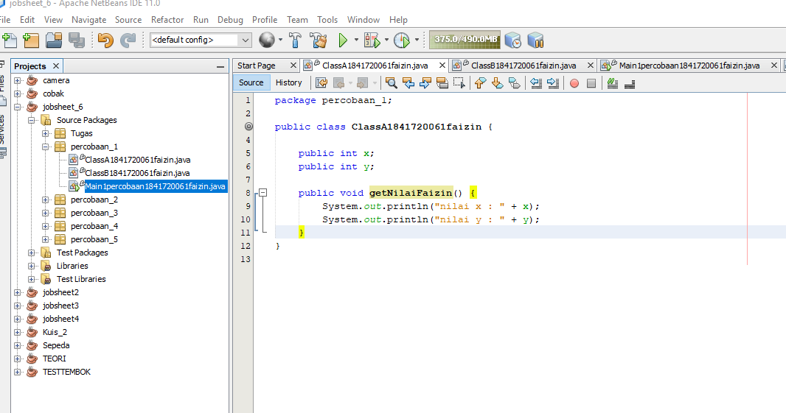
ini adalah contoh untuk membuat class ClassA 
[ini adalah link ke ClassA](../../src/6_Inheritance/ClassA1841720061faizin.java)

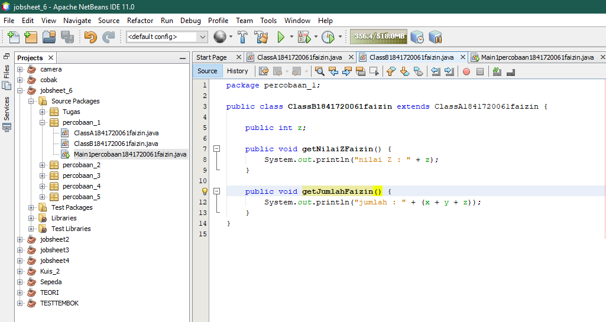
ini adalah contoh untuk membuat class classB 
[ini adalah link ke ClassB](../../src/6_Inheritance/ClassB1841720061faizin.java)

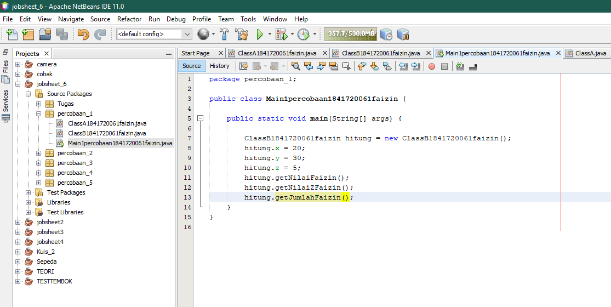
ini adalah contoh untuk membuat class Main Percobaan 1 
[ini adalah link ke main](../../src/6_Inheritance/main1Percobaan1841720061faizin.java)

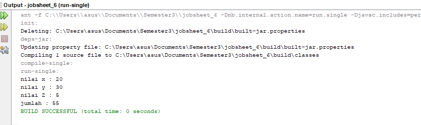
ini adalah contoh untuk hasil dari percobaan 1 

### Pertanyaan 
Berdasarkan percobaan 1, jawablah pertanyaan‑pertanyaan yang terkait: 

1. Pada percobaan 1 diatas program yang dijalankan terjadi eror, kemudian perbaiki sehingga program tersebut bisa dijalankan dan tidak eror!
JAWAB:

ini adalah contoh untuk membuat class classB 
[ini adalah link ke ClassB](../../src/6_Inheritance/ClassB1841720061faizin.java)

2. Jelaskan apa penyebab program pada percobaan 1 ketika dijalankan terdapat eror!
JAWAB :  karena tidak ada kode extends yang mana classB akan merujuk pada class induknya yaitu classA 

### PERCOBAAN 2 (Hak Akses)

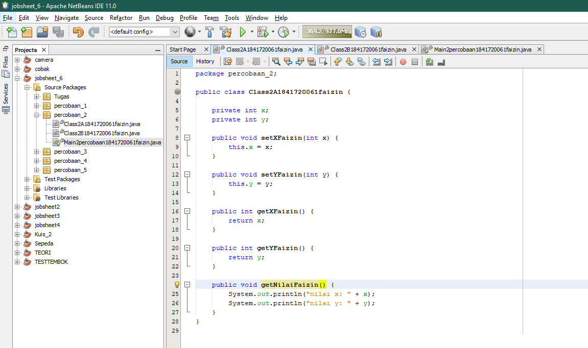
ini adalah pada class classA 
[ini adalah link ke ClassA](../../src/6_Inheritance/Class2A1841720061faizin.java)

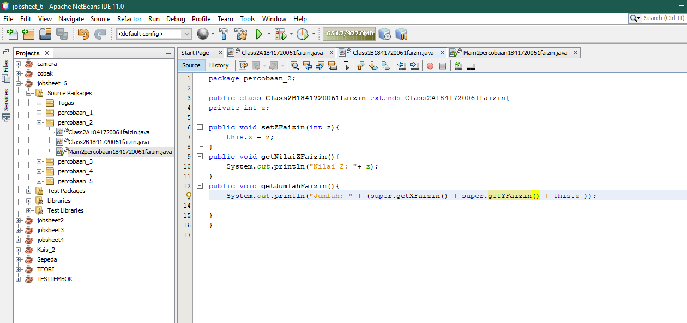
ini adalah pada class classB 
[ini adalah link ke class classB](../../src/6_Inheritance/Class2B1841720061faizin.java)

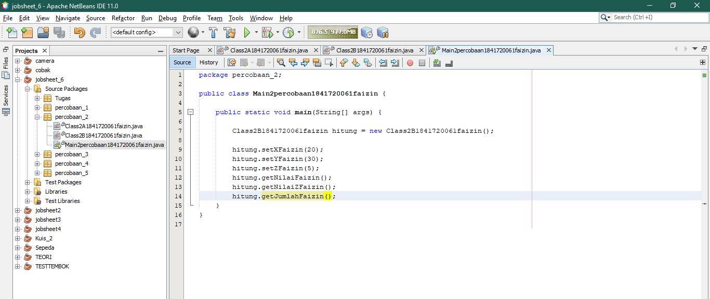
ini adalah pada class Main pada percobaan 2 
[ini adalah link ke class Main](../../src/6_Inheritance/Main2percobaan1841720061faizin.java)

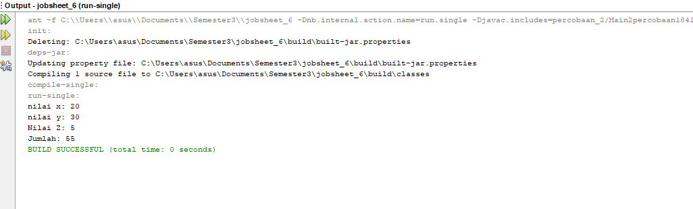
 ini adalah untuk hasil pada percobaan 2 

  ### Pertanyaan  

1. Pada percobaan 2 diatas program yang dijalankan terjadi eror, kemudian perbaiki sehingga program tersebut bisa dijalankan dan tidak eror!
JAWAB:

ini adalah pada class classA 
[ini adalah link ke ClassA](../../src/6_Inheritance/Class2A1841720061faizin.java)

ini adalah pada class classB 
[ini adalah link ke class classB](../../src/6_Inheritance/Class2B1841720061faizin.java)

2. Jelaskan apa penyebab program pada percobaan 1 ketika dijalankan terdapat eror!
JAWAB :  karena pada classB tidak mempunyai super yang mana super ini akan memanggil method yang ada pada classA, dan disitu masih eror kenapa? Karena pada classA tidak terdapat getter yang mempunyai nilai kembali/return dan terdapat tipe data private dan disitu ada setter saja dan setter tidak bisa dipanggil di class lain karena tidak mempunyai nilai kembali/return  

### PERCOBAAN 3
Menulis method yang memiliki argument/parameter dan memiliki return
 
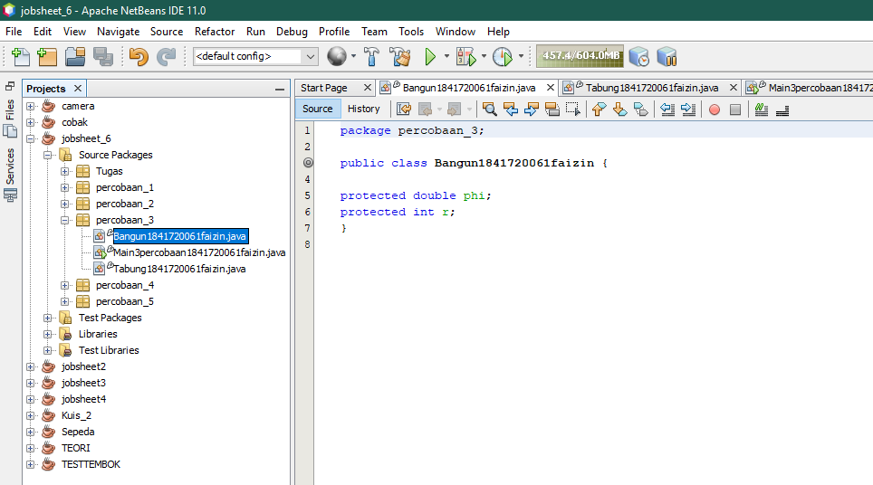
ini adalah pada class Bangun 
[ini adalah link ke class Bangun](../../src/6_Inheritance/Bangun1841720061faizin.java)

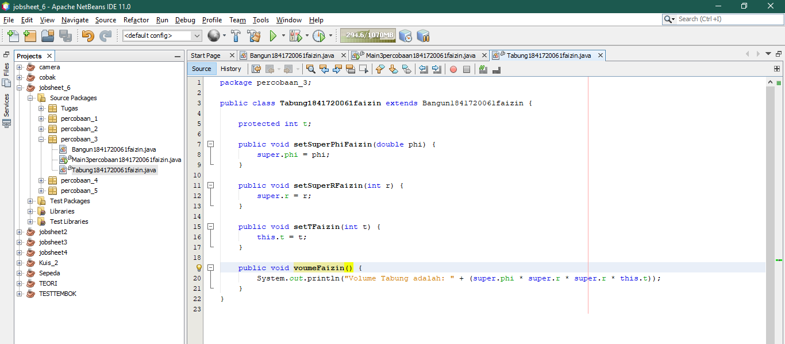
ini adalah pada class Tabung 
[ini adalah link ke class Tabung](../../src/6_Inheritance/Tabung1841720061faizin.java)

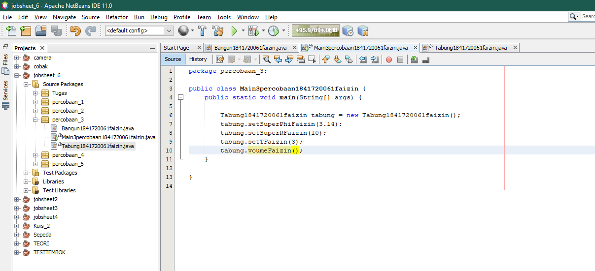
ini adalah pada class main 
[ini adalah link ke main](../../src/6_Inheritance/Main3Percobaan1841720061faizin.java)

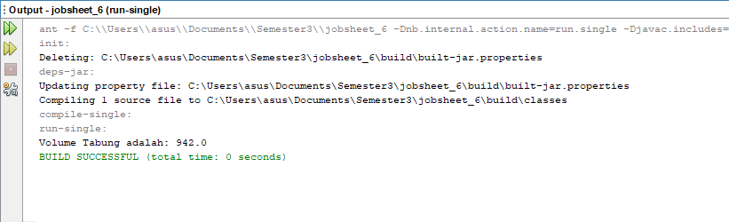
 ini adalah untuk hasil pada percobaan 3 

### Pertanyaan
1. Jelaskan fungsi "Super" pada potongan program berikut di class tabung!
`'
super.phi = phi;
}
public void setSuperR(int r){
  super.r;
}
`.
JAWAB: Untuk  memanggil method setSuperPhi yang mana method tsb memanggil atribut phi dari class induk (Bangun).

2. Jelaskan fungsi "super" dan "this" pada potongan program berikut di class Tabung! 
`
public void volume(){
  System.out.println("Volume Tabung adalah: "+(super.phi*super.r*super.r*this.t));
} 
 `
 
JAWAB : this: objek yang mewakili class itu sendiri; 
        super: objek yang mewakili class induk (Bangun).

3. Jelaskan mengapa pada class Tabung tidak dideklarasikan atribut "phi" dan "r" tetapi class tsb dapat mengakses atribut tsb!
JAWAB: Karena menggunakan tipe data protected

### PERCOBAAN 4
1.  Buatlah tiga file dengan nama ClassA.java,ClassB.java,dan ClassC.java,seperti pada kode program dibawah	ini!

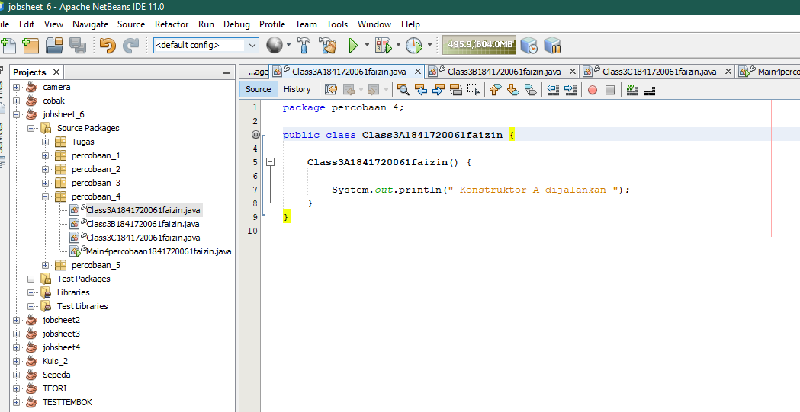
ini adalah pada class classA 
[ini adalah link ke class ClassA](../../src/6_Inheritance/Class3A1841720061faizin.java)

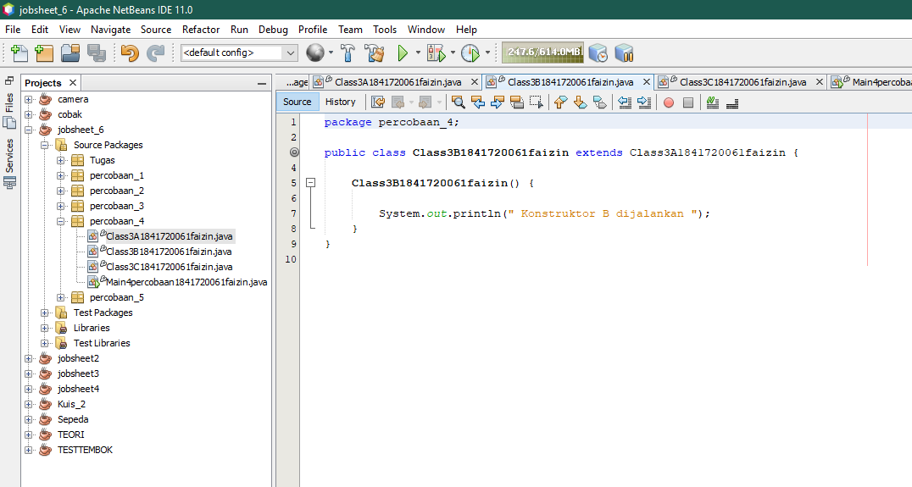
ini adalah pada class classB 
[ini adalah link ke ClassB](../../src/6_Inheritance/Class3B1841720061faizin.java)
 
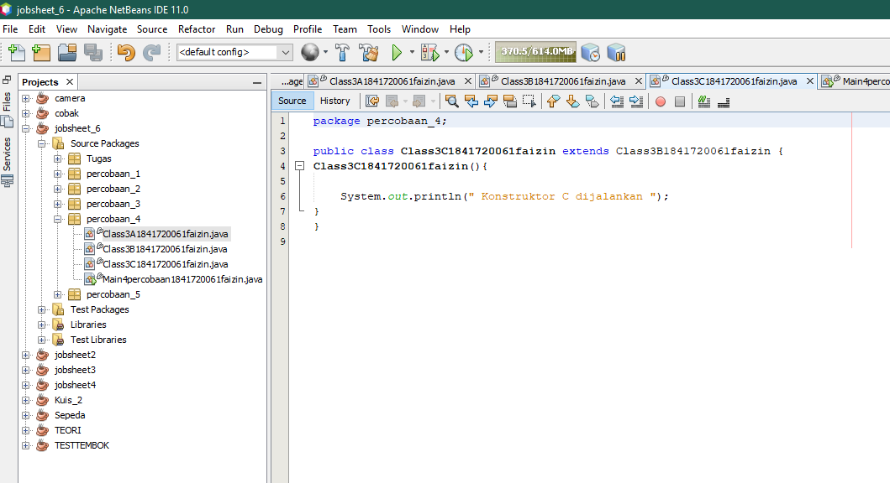
ini adalah pada class classC 
[ini adalah link ke classC](../../src/6_Inheritance/Class3C1841720061faizin.java)

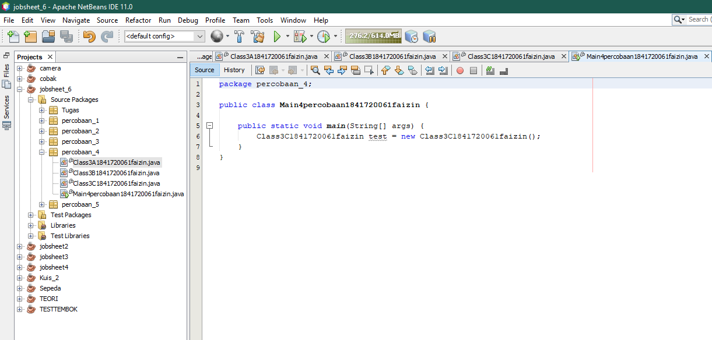
ini adalah pada class main 
[ini adalah link ke main](../../src/6_Inheritance/main4Percobaan1841720061faizin.java)

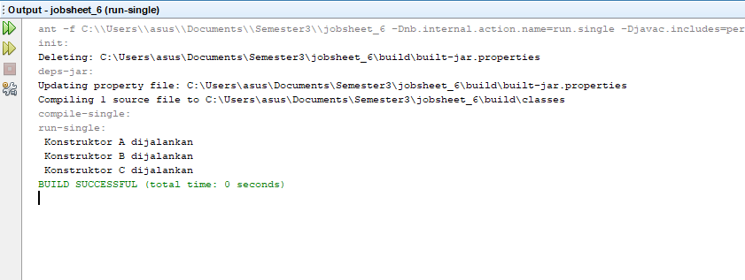
ini adalah untuk hasil pada percobaan 4 

 ### Pertanyaan 
 
1. pada percobaan 4 sebutkan mana class yang termasuk superclass dan subclass, kemudian jelaskan alasanya!  
JAWAB: Pada percobaan 4 terdapat superclass yaitu pada ClassA
Karena pada ClassA yang dijadikan acuan pewarisan/penurunan pada class lain.

Dan ada juga terdapat subclass yaitu pada ClassB dan ClassC
Karena pada ClassB dan ClassC yang merujuk pada class yang diturunkan atau diwariskan dari 

2. Ubahlah isi konstruktor default ClassC seperti berikut:
`
public class ClassC extends ClassB{
  ClassC(){
    super();
    System.out.println("Konstruktor C dijalankan");
  }
}
`  
JAWAB:  

ini adalah pada class classC 
[ini adalah link ke classC](../../src/6_Inheritance/Class3C1841720061faizin.java)

3. Ketika mengubah posisi super() di baris kedua dalam konstruktor defaultnya dan terlihat ada eror.kemudian kembalikan super()ke baris pertama seperti sebelumnya, maka erornya akan hilang.
Jelaskan bagaimana urutan proses jalanya konstruktor saat objeck test dibuat!  
JAWAB: Pada konstruktor memanggil classnya dan classnya meng entends ke class perent.

4. apakah fungsi super() pada potongan program dibawah ini di classC?
 `'
public class ClassC extends ClassB{
  ClassC(){
    super();
    System.out.println("Konstruktor C dijalankan");
  }
}
`.`  
JAWAB:  Untuk memenggil objek yang mewakili class induk

### Percobaan 5

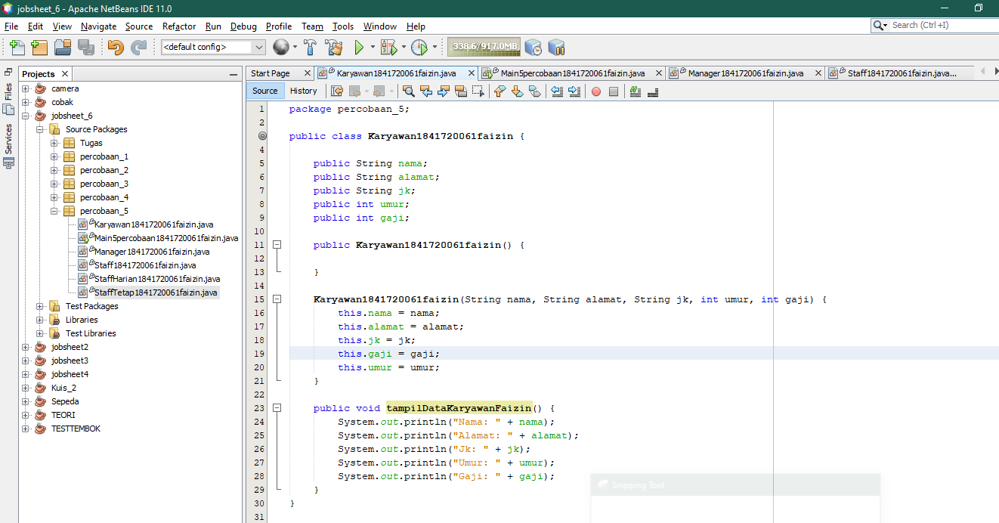
ini adalah pada class karyawan 
[ini adalah link ke class karyawan](../../src/6_Inheritance/Karyawan1841720061faizin.java)

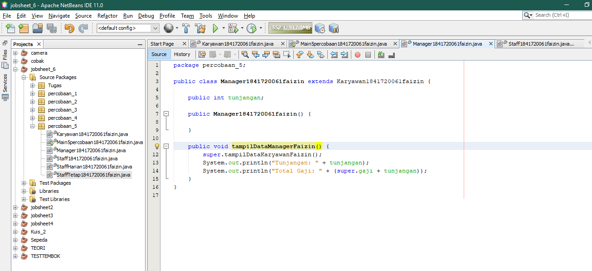
ini adalah pada class Manager 
[ini adalah link ke Manager](../../src/6_Inheritance/Manager1841720061faizin.java)
 
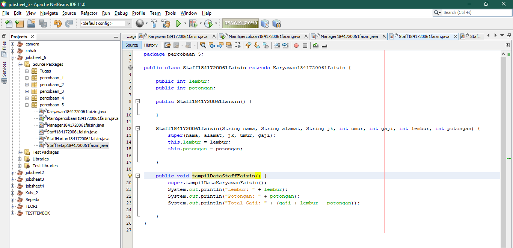
ini adalah pada class Staff 
[ini adalah link ke Staff](../../src/6_Inheritance/Staff1841720061faizin.java)

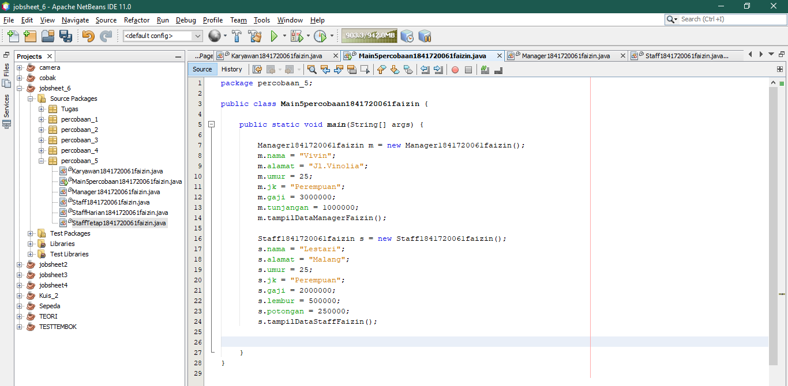
ini adalah pada class main 
[ini adalah link ke main](../../src/6_Inheritance/main5Percobaan1841720061faizin.java)

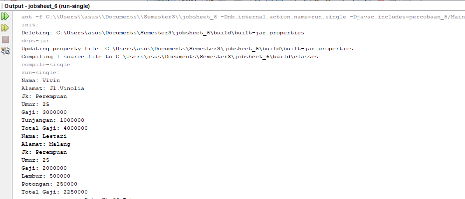
ini adalah untuk hasil pada percobaan 5 

### pertanyaan
1. Sebutkan class mana yang termasuk super class dan subclass dari percobaan diatas!
JAWAB: Yang termasuk superclass yaitu class Karyawan 
       Yang termasuk subclass yaitu pada class Manager dan class Staff

2. Kata kuci apakah yang digunakan untuk menurunkan suatu class ke class yang lain?
JAWAB: Kata kunci yang menurunkan suatu class ke class lain adalah extends

3. perhatikan kode program pada class Manager, atribut apa saja yang dimiliki oleh class tsb? Sebutkan atribut mana saja yang diwarisi dari class Karyawan!
JAWAB: Atribut pada class Manager yaitu tunjangan
Dan atribut yang diwarisi dari class Karyawan adalah gaji

4. Jelaskan kata kunci super pada potongan program dibawah ini yang terdapat pada class Manager!
` Sytem.out.println("Total Gaji: "(+super.gaji+tunjangan));`
JAWAB: 4.	Untuk memanggil atribut gaji pada class induk (Karyawan).

5. Program pada percobaan diatas termasuk dalam jenis inheritance apa? Jelaskan alasanya!
JAWAB: progam diatas adalah termasuk jenis inheritance Single inheritance karena dia mempunyai satu parent class.

### percobaan 6

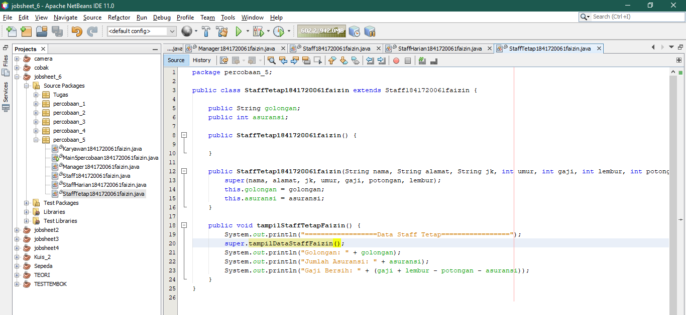
ini adalah pada class staff Tetap 
[ini adalah link ke staff tetap](../../src/6_Inheritance/StaffTetap1841720061faizin.java)
 
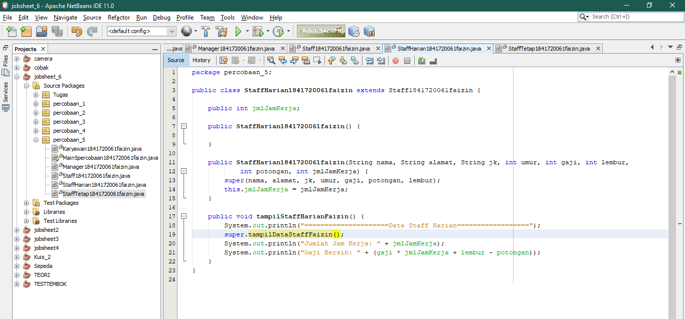
ini adalah pada class Staff harian 
[ini adalah link ke Staff harian](../../src/6_Inheritance/StaffHarian1841720061faizin.java)

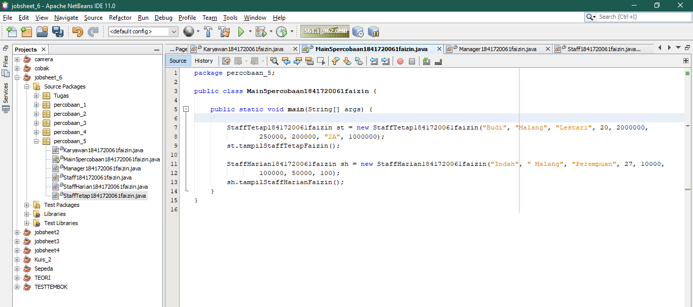
ini adalah pada class main 
[ini adalah link ke main](../../src/6_Inheritance/main5Percobaan1841720061faizin.java)

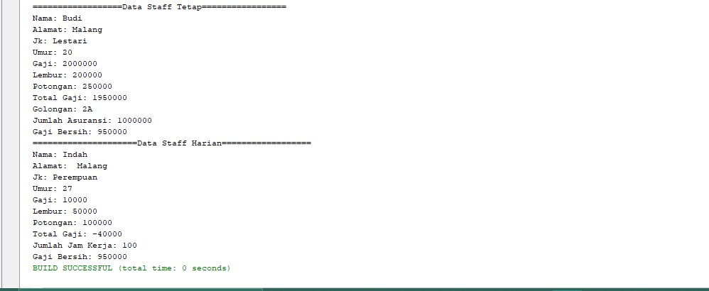
ini adalah untuk hasil pada percobaan 5 

### pertanyaan 
1. Berdasarkan class diatas manakah yang termasuk single inheritance dan mana yang termasuk multilevel inheritance?
JAWAB: Yang termasuk single inheritance Class yaitu Karyawan 
       Yang termasuk multilevel inheritance yaitu Class Staff

2. Perhatikan kode program class StaffTetap dan StaffHarian, atribut apa saja yang dimiliki oleh class tsb? Sebutkan atribut mana saja yang diwarisi dari class Staff!
JAWAB: Atribut pada class StaffTetap yaitu golongan dan asuransi 
       Atribut pada class StaffHarian yaitu jmlJamKerja

Atribut yang diwarisi dari class Staff adalah nama, alamat, jk, umur, gaji, lembur, potongan.

3. Apakah fungsi potogan program berikut pada class StaffHarian
` super(nama,alamat,jk,umur,gaji,lembur,potongan) `
JAWAB: Fungsi dari super(nama, alamat, jk, umur, gaji, potongan, lembur); adalah memanggil suatu atribut yang ada pada induk(Staff).

4. Apakah fungsi potongan program berikut pada class StaffHarian
` super.tampilDataStaff(); `
JAWAB: Fungsi dari super.tampilDataStaff(); adalah memanggil method yang ada pada class induk(Staff).

5. perhatikan kode program dibawah ini yang terdapat pada class StaffTetap ` System.out.println("Gaji Bersih: "+(gaji+lembur-potongan-asuransi)); `
Terlihat di potongan program diatas atribut gaji, lembur, dan potongan dapat diakses langsung. Kenapa hal ini bis terjadi dan bagaimana class StaffTetap memiliki atribut gaji, lembur, dan potongan padahal dalam class tsb tidak dideklarasikan atribut gaji, lembur, dan potongan?
JAWAB: Karena terdapat konstruktor yang mana konstruktor memanggil atribut pada class induk(Staff).

### Kesimpulan 
Pada kasus yang lebih kompleks, dalam suatu sistem akan ditemukan lebih dari satu class yang saling memiliki keterkaitan antara class satu dengan yang lain. Pada percobaan‑percobaan sebelumnya, mayoritas kasus yang sudah dikerjakan hanya fokus pada satu class saja. Pada jobsheet ini akan dilakukan percobaan yang melibatkan beberapa class yang saling berelasi. Misalnya terdapat class Laptop yang memiliki atribut berupa merk dan prosesor. Jika diperhatikan lebih rinci, maka atribut prosesor sendiri didalamnya memiliki data berupa merk, nilai cache memori, dan nilai clock‑nya. Artinya, ada class lain yang namanya Processor yang memiliki atribut merk, cache dan clock, dan atribut prosesor yang ada di dalam class Laptop itu merupakan objek dari class Proceessor tersebut. Sehingga terlihat antara class Laptop dan class Processor memiliki extends/turunan. 
 
 

### Tugas 
1. Buatlah sebuah program dengan konsep pewarisan seperti seperti pada class diagram berikut ini.
kemudian buatlah instansiasi objek untuk menampilkan data pada class Mac, Windows dan Pc!

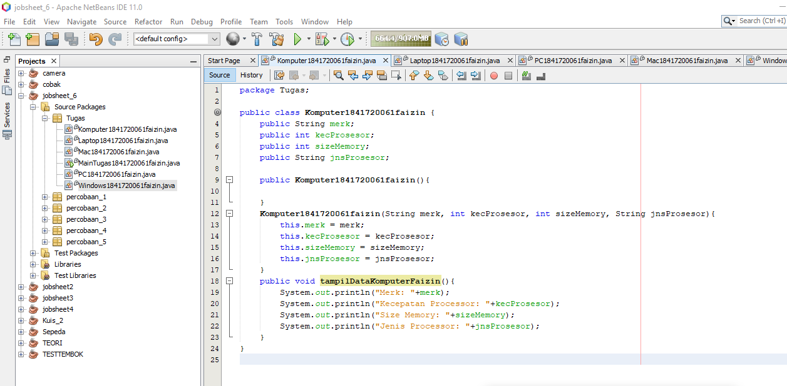
ini adalah pada class Komputer 
[ini adalah link ke Komputer](../../src/6_Inheritance/Komputer1841720061faizin.java)
 
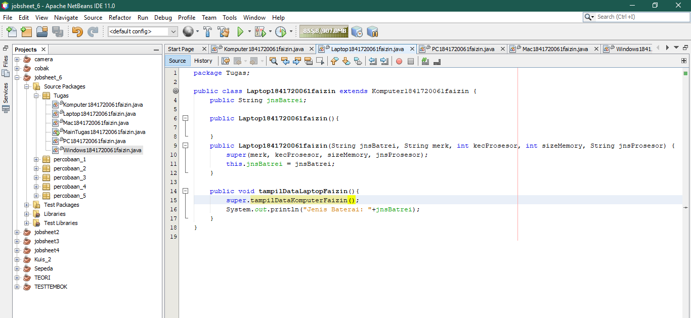
ini adalah pada class Laptop 
[ini adalah link ke Laptop](../../src/6_Inheritance/Laptop1841720061faizin.java)

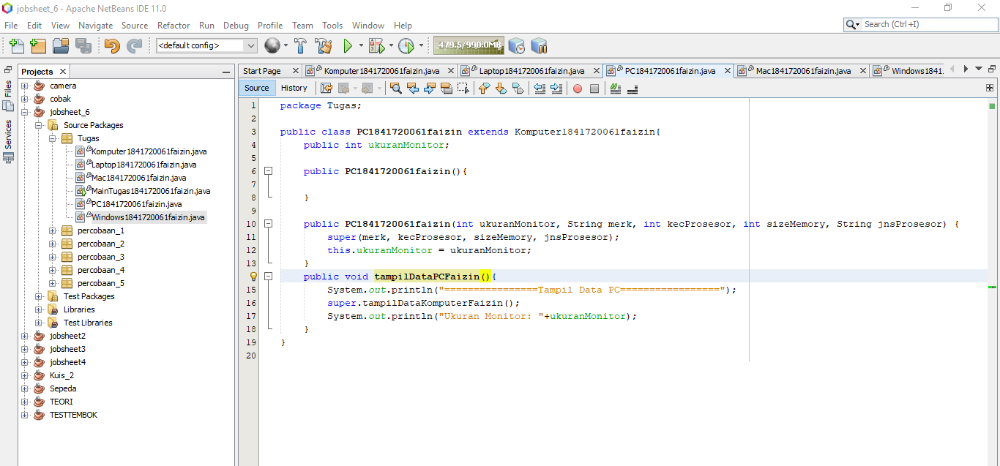
ini adalah pada class PC 
[ini adalah link ke PC](../../src/6_Inheritance/PC1841720061faizin.java)

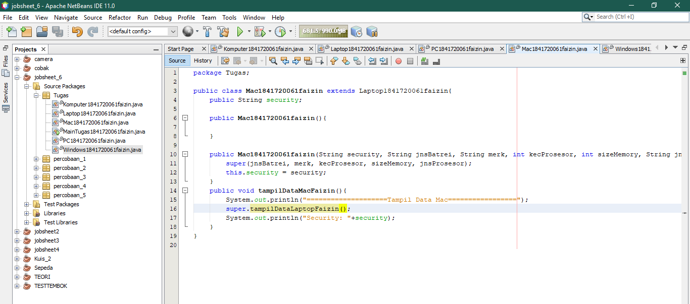
ini adalah pada class MAC 
[ini adalah link ke MAC](../../src/6_Inheritance/MAC1841720061faizin.java)

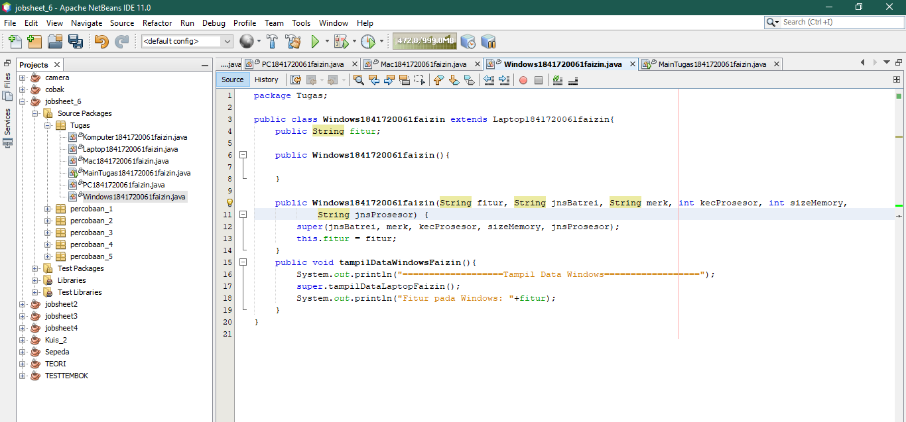
ini adalah pada class Windows 
[ini adalah link ke Windows](../../src/6_Inheritance/Windows1841720061faizin.java)

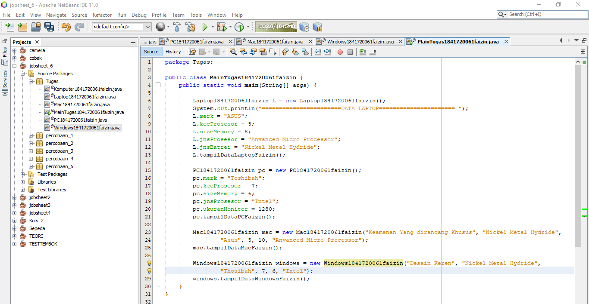
ini adalah pada class Windows 
[ini adalah link ke Windows](../../src/6_Inheritance/MainTugas1841720061faizin.java)

ini adalah hasil pada class tugas

## Kesimpulan

Inheritance atau Pewarisan/Penurunan adalah konsep pemrograman dimana sebuah class dapat ‘menurunkan’ property dan method yang dimilikinya kepada class lain. Konsep inheritance digunakan untuk memanfaatkan fitur ‘code reuse’ untuk menghindari duplikasi kode program.

Konsep inheritance membuat sebuah struktur atau ‘hierarchy’ class dalam kode program. Class yang akan ‘diturunkan’ bisa disebut sebagai class induk (parent class), super class, atau base class. Sedangkan class yang ‘menerima penurunan’ bisa disebut sebagai class anak (child class), sub class, derived class atauheir class.

Tidak semua property dan method dari class induk akan diturunkan. Property dan method dengan hak akses private, tidak akan diturunkan kepada class anak. Hanya property dan method dengan hak akses protected dan public saja yang bisa diakses dari class anak

## Pernyataan Diri

Saya menyatakan isi tugas, kode program, dan laporan praktikum ini dibuat oleh saya sendiri. Saya tidak melakukan plagiasi, kecurangan, menyalin/menggandakan milik orang lain.

Jika saya melakukan plagiasi, kecurangan, atau melanggar hak kekayaan intelektual, saya siap untuk mendapat sanksi atau hukuman sesuai peraturan perundang-undangan yang berlaku.

Ttd,

***(MUHAMMAD NUR FAIZIN)***
