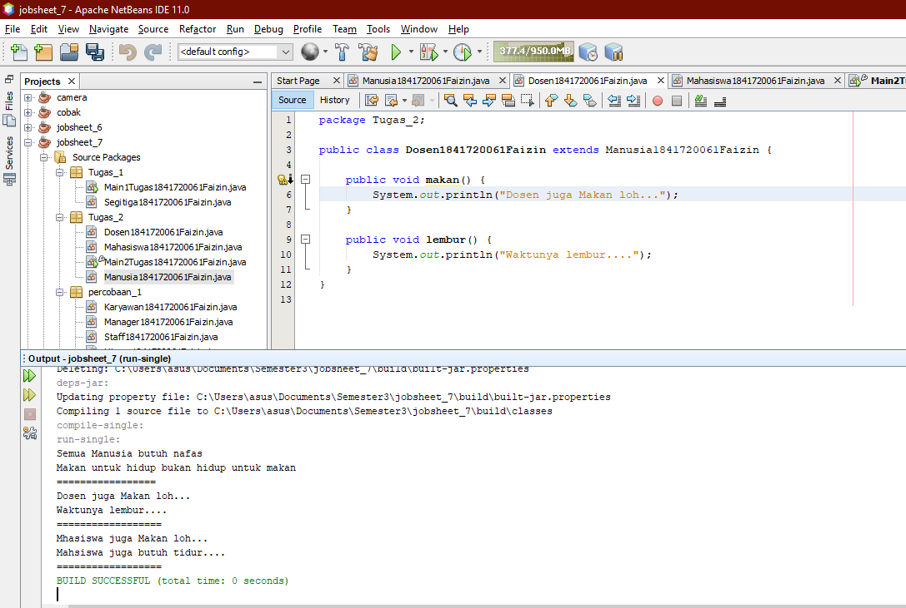

# Laporan Praktikum #7 - Overriding_dan_Overloading

## Kompetensi

Setelah menempuh pokok bahasan ini, mahasiswa mampu : 
a. Memahami konsep overloading dan overriding, 
b. Memahami perbedaan overloading dan overriding, 
c. Ketepatan dalam mengidentifikasi method overriding dan overloading 
d. Ketepatan dalam mempraktekkan instruksi pada jobsheet 
e. Mengimplementasikan method overloading dan overriding. 


## Ringkasan Materi
 Overloading  adalah menuliskan kembali method dengan nama yang sama pada suatu class. Tujuannya dapat memudahkan penggunaan/pemanggilan method dengan fungsionalitas yang mirip. Untuk aturan pendeklarasian method Overloading sebagai berikut: 
  Nama method harus sama. 
  Daftar parameter harus berbeda. 
  Return type boleh sama, juga boleh berbeda.

 Overriding  adalah Sublass yang berusaha memodifkasi tingkah laku yang diwarisi dari superclass. Tujuannya subclass dapat memiliki tingkah laku yang lebih spesifik sehingga dapat dilakukan dengan cara mendeklarasikan kembali method milik parent class di subclass. Deklarasi method pada subclass harus sama dengan yang terdapat di super class. Kesamaan pada: 
  Nama 
  Return type (untuk return type : class A atau merupakan subclass dari class A) 
  Daftar parameter (jumlah, tipe dan urutan)   

## <h2>Percobaan</h2>

### PERCOBAAN 1 (extends)
Untuk kasus contoh berikut ini, terdapat tiga kelas, yaitu Karyawan,Manager, dan Staff. Class Karyawan merupakan superclass dari Manager dan Staff dimana subclass Manager dan Staff memiliki method untuk menghitung gaji yang berbeda.


ini adalah contoh untuk membuat class karyawan<br>
[ini adalah link ke ClassA](../../src/7_Overriding_dan_Overloading/Karyawan1841720061faizin.java)


ini adalah contoh untuk membuat class manager<br>
[ini adalah link ke ClassB](../../src/7_Overriding_dan_Overloading/Manager1841720061faizin.java)


ini adalah contoh untuk membuat class staff<br>
[ini adalah link ke main](../../src/7_Overriding_dan_Overloading/Staff1841720061faizin.java)


ini adalah contoh untuk membuat class Main Percobaan 1<br>
[ini adalah link ke main](../../src/7_Overriding_dan_Overloading/Staff1841720061faizin.java)


ini adalah contoh untuk hasil dari percobaan 1<br>


### PERCOBAAN 2 (Latihan)


ini adalah pada class perkalian1ku<br>
[ini adalah link ke perkalian1ku](../../src/7_Overriding_dan_Overloading/Perkalian1Ku1841720061faizin.java)

## Pertanyaan 
1. Dari source coding diatas terletak dimanakah overloading

Jawab: 
```
void perkalian (int a, int b, int c){
  System.out.print(a * b * c);
}

```

2. Jika terdapat overloading berapa jumlah parameter yang berbeda?

Jawab:

jumlah parameter yang berbeda ada satu yaitu pada int c 


ini adalah pada class Perkalian2ku<br>
[ini adalah link ke class Perkalian2ku](../../src/7_Overriding_dan_Overloading/Perkalian2Ku1841720061faizin.java)

## Pertanyaan 
1. Dari source coding diatas terletak dimanakah overloading

Jawab: 
```
void perkalian (double a, double b){
  System.out.print(a * b);
}

```

2. Jika terdapat overloading ada berapa tipe parameter yang berbeda?

Jawab:

tipe parameter yang berbeda ada satu yaitu double 


ini adalah pada class Ikan<br>
[ini adalah link ke class Ikan](../../src/7_Overriding_dan_Overloading/Fish1841720061faizin.java)

## Pertanyaan
1. Dari source coding diatas terletak dimanakah overriding?

Jawab:

```
class Piranha extends Ikan{
  public void swim(){
    System.out.println("Piranha bisa makan daging");
  }
}
```
2. Jabarkanlah apabila sourcoding diatas jika terdapat overriding?
  

ini adalah pada class jabarIkan<br>
[ini adalah link ke class JabarIkan](../../src/7_Overriding_dan_Overloading/JabarIkan1841720061faizin.java)


### Kesimpulan 
pada intinya overloading dan overriding itu termasuk polymorphism
 Aturan dari method overriding pada Java :

1. Parameter yang terdapat pada method overriding di subclass harus sama dengan parameter yang terdapat pada parent class.
2. Aturan hak akses, hak akses method overriding di subclass tidak boleh lebih ketat di bandingkan dengan hak akses method pada parent class.

Pada method overloading perbedaan parameter mencakup :

1. Jumlah parameter
2. Tipe data dari parameter
3. Urutan dari tipe data parameter
Method Overloading juga dikenal dengan sebutan Static Polymorphism. 
 

### Tugas 1 (Overloading)


ini adalah pada class Segitiga<br>
[ini adalah link ke Segitiga](../../src/7_Overriding_dan_Overloading/Segitiga1841720061faizin.java)
 

ini adalah pada class Mian<br>
[ini adalah link ke Main](../../src/7_Overriding_dan_Overloading/Main1Tugas1841720061faizin.java)


### Tugas 2 (Overridding)

ini adalah pada class Manusia<br>
[ini adalah link ke Manusia](../../src/7_Overriding_dan_Overloading/Manusia1841720061faizin.java)


ini adalah pada class Dosen<br>
[ini adalah link ke Dosen](../../src/7_Overriding_dan_Overloading/Dosen1841720061faizin.java)


ini adalah pada class Mahasiswa<br>
[ini adalah link ke Mahasiswa](../../src/7_Overriding_dan_Overloading/Mahasiswa1841720061faizin.java)


ini adalah pada class Main<br>
[ini adalah link ke Main](../../src/7_Overriding_dan_Overloading/Main2Tugas1841720061faizin.java)

## Kesimpulan

Overloading juga bisa terjadi antara parent class dengan subclass-nya jika memenuhi ketiga syarat overload. Ada beberapa aturan overloading yaitu: 
 Primitive widening conversion didahulukan dalam overloading dibandingkan boxing dan var args.  
 Kita tidak dapat melakukan proses widening dari tipe wrapper ke tipe wrapper lainnya (mengubah Integer ke Long). 
 Kita tidak dapat melakukan proses widening dilanjutkan boxing (dari int menjadi Long) 
 Kita dapat melakukan boxing dilanjutkan dengan widening (int dapat menjadi Object melalui Integer) 
 Kita dapat menggabungkan var args dengan salah satu yaitu widening atau boxing  
 
Sehingga method pada parent class disebut overridden method dan method pada subclass disebut overriding method. Ada beberapa aturan method didalam overriding: 
 Mode akses overriding method harus sama atau lebih luas dari pada overridden method. 
 Subclass hanya boleh meng-override method superclass satu kali saja, tidak boleh ada lebih dari satu method pada kelas yang sama persis. 
 Overriding method tidak boleh throw checked exceptions yang tidak dideklarasikan oleh overridden method. 
 

## Pernyataan Diri

Saya menyatakan isi tugas, kode program, dan laporan praktikum ini dibuat oleh saya sendiri. Saya tidak melakukan plagiasi, kecurangan, menyalin/menggandakan milik orang lain.

Jika saya melakukan plagiasi, kecurangan, atau melanggar hak kekayaan intelektual, saya siap untuk mendapat sanksi atau hukuman sesuai peraturan perundang-undangan yang berlaku.

Ttd,

***(MUHAMMAD NUR FAIZIN)***
