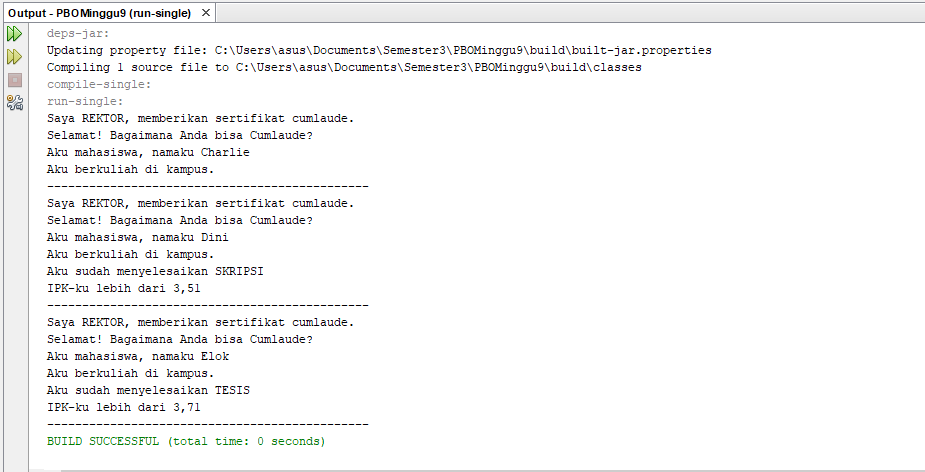

# Laporan Praktikum #9 - Abstract Class dan Interface

## Kompetensi

Setelah menyelesaikan lembar kerja ini mahasiswa diharapkan mampu: 
1. Menjelaskan maksud dan tujuan penggunaan Abstract Class; 
2. Menjelaskan maksud dan tujuan penggunaan Interface; 
3. Menerapkan Abstract Class dan Interface di dalam pembuatan program. 

## Ringkasan Materi
Abstract Class Abstract Class adalah class yang tidak dapat diinstansiasi namun dapat di-extend. Abstract class baru dapat dimanfaatkan ketika ia di-extend. 
Karakteristik: 
a. Dapat memiliki properties dan methods seperti class biasa. 
b. Selalu memiliki methods yang tidak memiliki tubuh (hanya deklarasinya saja), disebut juga abstract method. 
c. Selalu dideklarasikan dengan menggunakan kata kunci abstract class. 

Interface Interface adalah struktur data yang hanya berisi abstract methods. Tidak ada apa-apa selain method abstract pada interface, termasuk atribut getter dan setter.  
 
Karakteristik: 
a. Tidak ada apa-apa di dalamnya selain abstract methods. 
b. Di konvensi bahasa pemrograman Java, namanya dianjurkan untuk selalu diawali dengan huruf kapital ‘I’. 
c. Selalu dideklarasikan dengan menggunakan kata kunci interface. 
d. Diimplementasikan dengan menggunakan kata kunci implements

## <h2>Percobaan</h2>

### PERCOBAAN 1 (ABSTRACT CLASS)

ini adalah contoh untuk membuat class Hewan 
[ini adalah link ke Hewan](../../src/9_Abstract_Class_dan_Interface/Hewan1841720061Faizin.java)

ini adalah contoh untuk membuat class ikanr 
[ini adalah link ke ikan](../../src/9_Abstract_Class_dan_Interface/Ikan1841720061Faizin.java)

ini adalah contoh untuk membuat class kucing 
[ini adalah link ke kucingf](../../src/9_Abstract_Class_dan_Interface/Kucing1841720061Faizin.java)

ini adalah contoh untuk membuat class orang 
[ini adalah link ke orang](../../src/9_Abstract_Class_dan_Interface/Orang1841720061Faizin.java)

ini adalah contoh untuk membuat class program 
[ini adalah link ke program](../../src/9_Abstract_Class_dan_Interface/Program1841720061Faizin.java)

ini adalah contoh untuk hasil dari percobaan 1 

 Pertanyaan diskusi: Bolehkah apabila sebuah class yang meng-extend suatu abstract class tidak mengimplementasikan method abstract yang ada di class induknya? Buktikan! 
 Jawab: Tidak Bisa dan akan terdapat eror 
 

### PERCOBAAN 2 (INTERFACE)

ini adalah contoh untuk membuat class icumlaude 
[ini adalah link ke icumlaude](../../src/9_Abstract_Class_dan_Interface/ICumlaude1841720061Faizin.java)

ini adalah contoh untuk membuat class mahasiswa 
[ini adalah link ke mahasiswa](../../src/9_Abstract_Class_dan_Interface/Mahasiswa1841720061Faizin.java)

ini adalah contoh untuk membuat class pasca sarjana 
[ini adalah link ke pasca sarjana](../../src/9_Abstract_Class_dan_Interface/PascaSarjana1841720061Faizin.java)

ini adalah contoh untuk membuat class sarjana 
[ini adalah link ke sarjana](../../src/9_Abstract_Class_dan_Interface/Sarjana1841720061Faizin.java)

ini adalah contoh untuk membuat class rektor 
[ini adalah link ke rektor](../../src/9_Abstract_Class_dan_Interface/Rektor1841720061Faizin.java)

ini adalah contoh untuk membuat class rektor 
[ini adalah link ke rektor](../../src/9_Abstract_Class_dan_Interface/Program2job1841720061Faizin.java)

ini adalah contoh untuk hasil dari percobaan 1 

## Pertanyaan 
a. Mengapa pada langkah nomor 9 terjadi error? Jelaskan! 
Jawab:
Karena pada class Mahasiswa tidak ada override nya

b. Dapatkah method kuliahDiKampus() dipanggil dari objek sarjanaCumlaude di class Program? Mengapa demikian? 
jawab: 
Tidak bisa karena pada class interface ICumlaude tidak terdapat method kuliahDikampus() yang seharusnya di abstract terlebih dahulu

c. Dapatkah method kuliahDiKampus() dipanggil dari parameter mahasiswa di method beriSertifikatCumlaude() pada class Rektor? Mengapa demikian?
jawab:
Tidak bisa karena pada class interface ICumlaude tidak terdapat method kuliahDikampus() yang seharusnya di abstract terlebih dahulu

d. Modifikasilah method beriSertifikatCumlaude() pada class Rektor agar hasil eksekusi class Program menjadi seperti berikut ini:

ini adalah contoh untuk hasil dari percobaan 1 

ini adalah contoh untuk membuat class rektor 
[ini adalah link ke rektor](../../src/9_Abstract_Class_dan_Interface/Rektor1841720061Faizin.java)

ini adalah contoh untuk membuat class icumlaude 
[ini adalah link ke icumlaude](../../src/9_Abstract_Class_dan_Interface/ICumlaude1841720061Faizin.java)

### PERCOBAAN 3 (Multiple Interfaces Implementation)

ini adalah contoh untuk membuat class iberprestasi 
[ini adalah link ke iberprestasi](../../src/9_Abstract_Class_dan_Interface/IBerprestasi2prak1841720061Faizin.java)

ini adalah contoh untuk membuat class icumlaude 
[ini adalah link ke icumlaude](../../src/9_Abstract_Class_dan_Interface/ICumlaude2prak1841720061Faizin.java)

ini adalah contoh untuk membuat class mahasiswa 
[ini adalah link ke mahasiswa](../../src/9_Abstract_Class_dan_Interface/Mahasiswa2prak1841720061Faizin.java)

ini adalah contoh untuk membuat class pasca sarjana 
[ini adalah link ke pasca sarjana](../../src/9_Abstract_Class_dan_Interface/PascaSarjana2prak1841720061Faizin.java)

ini adalah contoh untuk membuat class sarjana 
[ini adalah link ke sarjana](../../src/9_Abstract_Class_dan_Interface/Sarjana2prak1841720061Faizin.java)

ini adalah contoh untuk membuat class rektor 
[ini adalah link ke rektor](../../src/9_Abstract_Class_dan_Interface/Rektor2prak1841720061Faizin.java)

ini adalah contoh untuk membuat class rektor 
[ini adalah link ke rektor](../../src/9_Abstract_Class_dan_Interface/Program3job1841720061Faizin.java)

ini adalah contoh untuk hasil dari percobaan 1 

## Pertanyaan

### Kesimpulan 
Karakteristikdari abstract class: 
a. Dapat memiliki properties dan methods seperti class biasa. 
b. Selalu memiliki methods yang tidak memiliki tubuh (hanya deklarasinya saja), disebut juga abstract method. 
c. Selalu dideklarasikan dengan menggunakan kata kunci abstract class. 
 
Karakteristik dari interface: 
a. Tidak ada apa-apa di dalamnya selain abstract methods. 
b. Di konvensi bahasa pemrograman Java, namanya dianjurkan untuk selalu diawali dengan huruf kapital ‘I’. 
c. Selalu dideklarasikan dengan menggunakan kata kunci interface. 
d. Diimplementasikan dengan menggunakan kata kunci implements.
 

## Pernyataan Diri

Saya menyatakan isi tugas, kode program, dan laporan praktikum ini dibuat oleh saya sendiri. Saya tidak melakukan plagiasi, kecurangan, menyalin/menggandakan milik orang lain.

Jika saya melakukan plagiasi, kecurangan, atau melanggar hak kekayaan intelektual, saya siap untuk mendapat sanksi atau hukuman sesuai peraturan perundang-undangan yang berlaku.

Ttd,

***(MUHAMMAD NUR FAIZIN)***
